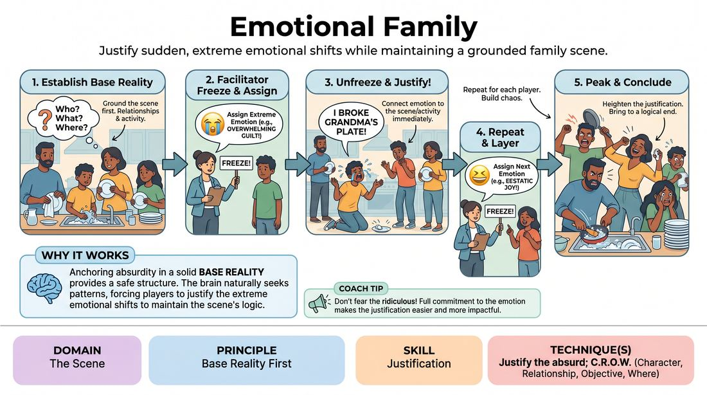

# Emotional Family

{ .game-hero }

> Justify sudden, extreme emotional shifts while maintaining a grounded family scene.

## Overview
Players begin a grounded scene as a family unit engaged in a mundane household activity. One by one, the facilitator freezes the action to inject extreme, contrasting emotions into individual characters, challenging the cast to justify these absurd emotional states while keeping the scene's base reality intact.

## What It Trains
- **Domain:** D3 — The Scene
- **Principle(s):** Base Reality First; Commit 100%; Yes, And
- **Skill(s):** Justification; World-Building; Emotional Fluidity; Offer Reception
- **Technique(s):** Justify the absurd; C.R.O.W. (Character, Relationship, Objective, Where); The Emotional Dial (1→10); Endowment-acceptance
- **Focus:** mixed

**Objective:** To develop the skill of justification by finding logical, character-driven reasons for sudden emotional shifts, while preserving a strong base reality and practicing emotional commitment.

## Setup
Four to six players stand in the performance space. The facilitator asks the audience or remaining players for a mundane household chore or family activity (such as folding laundry, assembling flat-pack furniture, or preparing a holiday meal). No physical props are used; players rely entirely on object work.

## How to Play
1. Begin the scene with all players entering as members of a single family, immediately establishing their relationships and engaging in the suggested household activity.
2. Focus the first minute entirely on building a solid base reality: define who is who, what the activity is, and the physical environment through clear object work.
3. Once the base reality is firmly established, the facilitator calls 'Freeze!' and assigns a specific, intense emotion (such as overwhelming guilt, ecstatic joy, or deep paranoia) to one player.
4. On 'Unfreeze,' the scene resumes. The chosen player must immediately embody that extreme emotion at a high intensity, while the other players react naturally to this sudden shift.
5. The affected player must quickly justify why they are feeling this way, linking their emotion directly to the established family dynamic or the activity at hand.
6. After a short period of play, the facilitator freezes the scene again and assigns a different, contrasting emotion to a second player.
7. Repeat this process until every player in the scene has been assigned a unique, extreme emotion, resulting in a highly charged, chaotic, yet fully justified family dynamic.
8. Continue the scene for a brief period with all players operating at their peak emotional states, working together to bring the family activity to a logical or hilarious conclusion.

## Facilitation Notes
- Side-coach players to avoid immediate denial. If a character suddenly becomes terrified, the others shouldn't say 'You're acting crazy'; instead, they should ask 'Are you worried about the basement mold again?' to help justify it.
- Ensure the base reality is truly established before introducing the first emotion. If the relationships or activity are vague, the emotional shifts will feel ungrounded and chaotic.
- Encourage physical commitment. An emotion like 'grief' should affect how a player folds a towel or holds a spoon, integrating the emotion directly into their object work.
- Pitfall: Players dropping their assigned emotion when another player gets theirs. Remind them that emotions are cumulative; once assigned, you must maintain that state until the end of the scene.

## Variations
- Audience Choice: Instead of the facilitator choosing the emotions, the audience shouts out the emotions during the freeze moments.
- Emotional Contagion: When a player is assigned an emotion, it slowly 'infects' any player they make direct physical contact with, forcing the second player to justify their new shared state.
- Secret Triggers: Instead of a freeze, players are given secret emotional triggers beforehand (e.g., 'Become furious whenever someone mentions the word "plates"'), requiring them to justify the sudden shift mid-scene.

## Debrief
- How did establishing a strong base reality at the beginning help you justify the extreme emotions later on?
- What strategies did you use to make an absurd or sudden emotion feel logical within the context of the family dynamic?
- How did your physical object work change once your character was overcome by their assigned emotion?

## Safety & Inclusion
Ensure players establish physical boundaries before the scene starts, especially since high-intensity emotions can sometimes lead to accidental physical escalation. Remind players that high emotional intensity does not require shouting or physical invasion of space; quiet intensity can be incredibly powerful.

## Why It Works
By anchoring the scene in a mundane, relatable base reality first, the game creates a safe structure for absurdity. When extreme emotions are introduced, the brain naturally seeks patterns and logic; forcing players to justify these shifts on the fly strengthens their narrative agility and teaches them to treat every offer—no matter how bizarre—as a gift.
