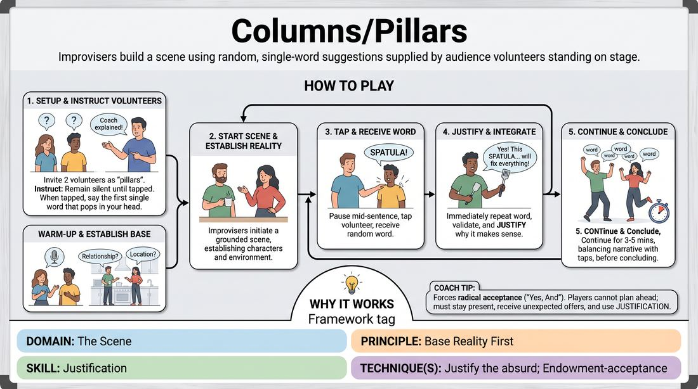

# Pillars

{ .game-hero }

> Improvisers build a scene using random, single-word suggestions supplied by audience volunteers standing on stage.

## Overview
Two improvisers perform a scene while flanked by two audience volunteers who act as physical 'pillars.' Whenever an improviser needs a word, they tap a volunteer's shoulder, receive a random word, and must instantly integrate and justify it within the narrative. The result is a high-energy comedy game that tests active listening and rapid justification.

## What It Trains
- **Domain:** D3 — The Scene
- **Principle(s):** Yes, And; Base Reality First; The Audience Is the Final Scene Partner
- **Skill(s):** Offer Reception; Justification; Stage Presence & Clarity
- **Technique(s):** Endowment-acceptance; Justify the absurd
- **Focus:** comedy_game

**Objective:** To develop the skill of instant justification by accepting absurd, random inputs and seamlessly weaving them into a grounded base reality.

## Setup
Two improvisers stand center stage. Two audience volunteers are invited up to stand on either side of the playing area, acting as the 'pillars.' No props are required. The facilitator briefs the volunteers on their role before the scene begins.

## How to Play
1. Invite two volunteers from the audience to stand on stage, one on the left side and one on the right side of the playing space.
2. Instruct the volunteers that they are 'pillars' and will remain silent until an improviser physically taps them on the shoulder.
3. Explain to the volunteers that when tapped, they must immediately say the very first single word that pops into their head, without filtering or trying to be funny.
4. Warm up the volunteers with a quick practice run (e.g., asking them what they had for breakfast) to get them comfortable speaking into the space.
5. Ask the audience for a simple, grounded relationship and location to establish a clear base reality for the two improvisers.
6. Begin the scene. The two improvisers initiate a normal, grounded scene, establishing their characters and environment.
7. At any point, an improviser can pause mid-sentence, walk over to a volunteer, tap them on the shoulder, and receive a random word.
8. The improviser must immediately repeat the word out loud to validate the offer, and then justify why that word makes perfect sense in the context of the scene.
9. Continue the scene for approximately 3 to 5 minutes, balancing narrative progression with regular taps of both pillars, before bringing the scene to a high-energy edit.

## Facilitation Notes
- Side-coaching cue: 'Repeat the word immediately!' This gives the improviser a second to process and ensures the audience hears it clearly.
- Pitfall: Improvisers tapping the pillars too frequently, turning the scene into a rapid-fire word association game. Fix: Remind players to establish a strong base reality first before seeking external inputs.
- Side-coaching cue: 'Justify it, don't just ignore it!' If a pillar says 'banana' during a space mission, the player must explain why a banana is critical to the rocket's engine.
- Ensure the volunteers feel safe and successful. Always thank them warmly and lead the audience in applause when they return to their seats.

## Variations
- Emotional Pillars: Instead of random words, the volunteers provide an emotion or attitude that the improviser must immediately adopt.
- Sound Effect Pillars: The volunteers must make a random sound effect when tapped, which the improvisers must identify and justify.
- Foreign Language Pillars: If volunteers speak other languages, they can provide words in that language, forcing the improvisers to translate and justify.

## Debrief
- How did establishing a strong base reality early on make it easier to justify the absurd words later?
- What strategies did you use to make a completely random word sound logical in your character's world?
- How did repeating the volunteer's word help you buy time and validate their contribution?

## Safety & Inclusion
Ensure volunteers are comfortable standing for 5 minutes. If physical mobility is an issue, provide chairs for the volunteers to sit as 'seated pillars.' Clearly explain the shoulder-tap mechanic beforehand, and ask the volunteers for consent regarding the light physical touch on the shoulder; alternatively, players can wave or point to trigger the word.

## Why It Works
This game works because it forces players to practice radical acceptance ('Yes, And'). By outsourcing key vocabulary to non-improvisers, players cannot plan ahead. They must stay entirely present, receive the unexpected offer, and use justification to bridge the gap between a grounded reality and an absurd intrusion, which is the core engine of comedic improv.
