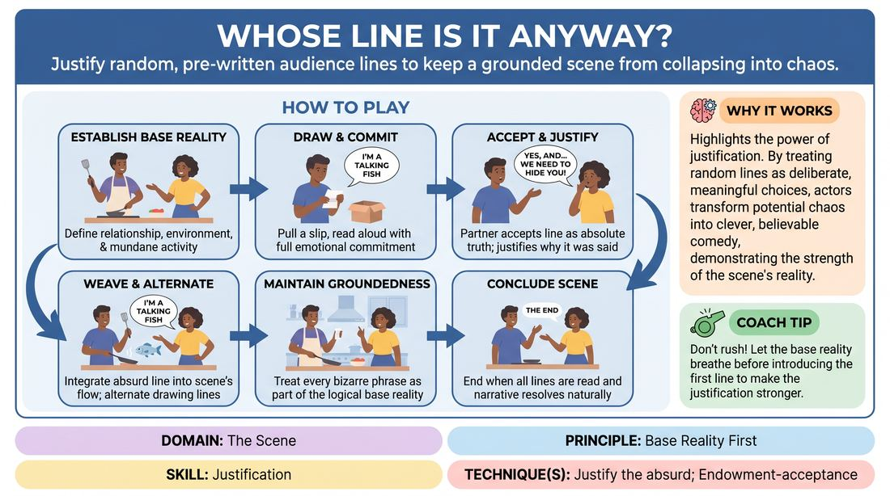

# Lines in Pocket

{ .game-hero }

> Justify random, pre-written audience lines to keep a grounded scene from collapsing into chaos.

## Overview
Two to four players perform a grounded scene while periodically drawing random, pre-written lines of dialogue submitted by the audience. The challenge is to seamlessly integrate these non-sequiturs into the scene's reality, treating every bizarre phrase as absolute truth. The resulting comedy comes from the clever justification of absurd statements within an otherwise logical base reality.

## What It Trains
- **Domain:** D3 — The Scene
- **Principle(s):** Base Reality First; Yes, And; The Audience Is the Final Scene Partner
- **Skill(s):** Justification; Offer Reception; Room Reading
- **Technique(s):** Justify the absurd; Endowment-acceptance
- **Focus:** comedy_game

**Objective:** To develop advanced justification skills by forcing players to establish a strong base reality first, and then immediately rationalize unexpected, absurd dialogue offers as logical character choices.

## Setup
Before the scene begins, ask the audience to write down random, distinct sentences, clichés, or song lyrics on slips of paper. Fold these slips and place them in a basket or scatter them face-down on the stage floor. Two to four players step forward, each taking two to three folded slips of paper and placing them in their pockets without looking at them. Get a simple, grounded suggestion for a relationship and location to start the scene.

## How to Play
1. Begin the scene by establishing a clear, grounded base reality: define the relationship, the physical environment, and a mundane activity.
2. Once the base reality is stable, a player may choose a moment to pull out one of their folded slips of paper.
3. The player must read the line on the slip aloud, exactly as written, delivering it with full emotional commitment as their next line of dialogue.
4. The receiving partner must immediately accept this line as an absolute truth within the scene, using Yes-And to justify why their partner said it.
5. The players must continue the scene, weaving the absurd line into their ongoing relationship and objective rather than ignoring it or treating it as a joke.
6. Alternate drawing and reading lines between the players, ensuring that each new line is fully justified and integrated before the next one is introduced.
7. Conclude the scene once all lines have been read and the narrative reaches a natural, satisfying resolution based on the justified reality.

## Facilitation Notes
- Side-coaching cue: Don't just say the line and move on—explain why you said it or how it makes sense in this moment!
- Common Pitfall: Players reading lines in rapid succession without justifying them. Fix: Instruct players to pause, breathe, and fully digest the previous line before drawing a new one.
- Side-coaching cue: Keep the base reality strong. If you are two mechanics fixing a car, stay focused on the car even when someone quotes Shakespeare.
- Common Pitfall: Treating the line as a mistake or a crazy outburst. Fix: Coach the receiver to react to the line as if it was a perfectly reasonable, albeit surprising, thing for their partner to say.

## Variations
- Blind Draw: Instead of keeping slips in pockets, the slips are scattered face-down on the floor, and players must physically pick one up only when they are ready to speak it.
- Emotional Delivery: The player must read the line using the exact emotional state they were in right before they drew the paper, forcing a juxtaposition of tone and content.
- Genre Integration: Perform the scene in a specific genre, requiring the random lines to be justified within that specific stylistic universe.

## Debrief
- How did establishing a strong base reality early on help you justify the weirdest lines?
- What strategies did you use to make a completely unrelated sentence sound logical in your character's mouth?
- How did the audience's reaction to the random lines affect your pacing and justification?

## Safety & Inclusion
Ensure the audience is instructed to write lines that are PG-13 and free of hate speech or highly offensive content. If a player draws a line that makes them uncomfortable or violates safety boundaries, they are fully permitted to discard it silently, draw another, or simply improvise a line instead.

## Why It Works
This game works because it highlights the power of justification. When an audience hears a completely random line, they expect the scene to break. When the actors instead treat the line as a deliberate, meaningful choice and seamlessly weave it into the scene's logic, it creates a highly satisfying comedic payoff. It trains players to listen deeply and prioritize the reality of the scene over easy jokes.
