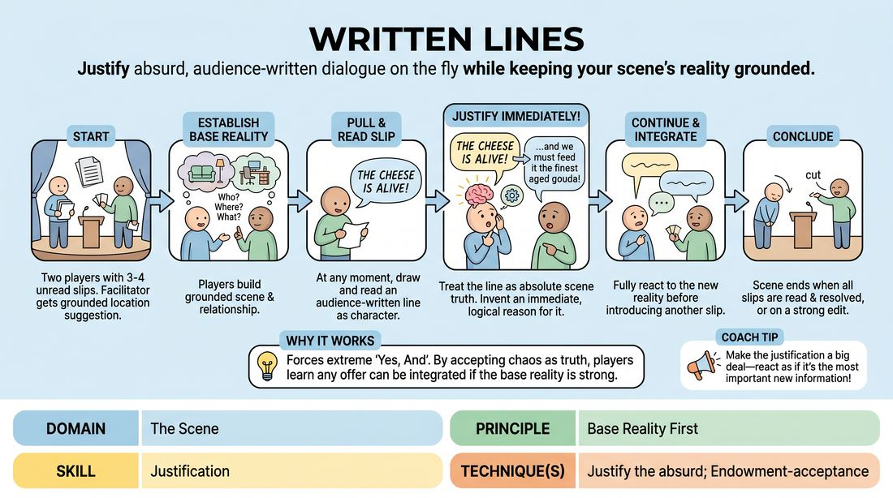

# Pocket Lines

{ .game-hero }

> Justify absurd, audience-written dialogue on the fly while keeping your scene's reality grounded.

## Overview
Two players perform a grounded scene based on an audience suggestion, periodically drawing and reading aloud random, pre-written lines of dialogue submitted by the audience. The challenge lies in seamlessly integrating these bizarre, out-of-context statements into the scene's established reality. Players must immediately justify why their character said the line, transforming a potential disruption into a logical plot point.

## What It Trains
- **Domain:** D3 — The Scene
- **Principle(s):** Base Reality First; Yes, And; The Audience Is the Final Scene Partner
- **Skill(s):** Justification; Offer Reception; Unfiltered Spontaneity
- **Technique(s):** Justify the absurd; Endowment-acceptance; First Thought drills
- **Focus:** comedy_game

**Objective:** To develop advanced justification skills (specifically justifying the absurd) and reinforce the importance of establishing a strong base reality before introducing chaotic elements.

## Setup
Before the session or show, ask the audience (or non-playing participants) to write down random, single sentences of dialogue on slips of paper. Fold the slips and place them in a container. Each of the active players draws 3 to 4 slips without looking at them, placing them in their pockets or holding them face-down. The facilitator obtains a simple location suggestion from the audience to start the scene.

## How to Play
1. Two players take the stage, each holding 3 to 4 unread slips of paper in their pockets or face-down in their hands.
2. The facilitator gets a suggestion of a grounded location to establish the scene.
3. Players begin the scene by establishing a clear base reality: who they are, where they are, and what they are doing.
4. Once the base reality is stable, either player can choose a moment to pull out one of their slips of paper and read it aloud as their character's next line of dialogue.
5. The reading player, or their scene partner, must immediately justify why that specific line was said, treating it as absolute truth within the scene's universe.
6. Players continue the scene, alternating or spacing out the reading of their slips, ensuring they fully react to and integrate each line before introducing a new one.
7. The scene concludes naturally once all slips have been read and resolved, or when the facilitator calls edit.

## Facilitation Notes
- Side-coaching cue: 'Don't just say the line and move on—explain why you said it!' Encourage players to find the emotional or situational logic behind the absurd statement.
- Pitfall: Players rush through all their slips like a checklist. Fix: Instruct players to leave at least 3-4 lines of normal dialogue between each slip to let the scene breathe and allow the justification to land.
- Side-coaching cue: 'Keep the base reality strong.' If the slip is 'I am a space alien,' the character doesn't actually have to become an alien; they could be quoting a movie, expressing how isolated they feel, or playing a prank.
- Pitfall: Ignoring the partner's slip. Fix: Remind the non-reading partner that they must react to the bizarre line as if it was a deliberate, meaningful choice by the other character.

## Variations
- Themed Slips: Restrict the audience's written lines to a specific genre, such as soap opera quotes, text messages from their own phones, or famous movie lines.
- The Truth Is...: Every slip must begin with the phrase 'The truth is...' to force high-stakes, relationship-driven confessions.
- Emotional Shift: The player must adopt the exact emotional tone implied by the written line, shifting their character's state instantly upon reading it.

## Debrief
- How did establishing a strong base reality early on help you justify the bizarre lines later?
- What strategies did you use to make an absurd line sound completely logical in the context of your character's relationship?
- How did it feel to receive an unexpected line from your partner, and how did your reaction shape the scene's direction?

## Safety & Inclusion
Ensure the audience is instructed to write lines that are PG-13 and free of hate speech or highly sensitive triggers. If a player draws a slip that makes them uncomfortable or violates personal boundaries, they have full permission to quietly discard it and draw another, or simply ignore it without penalty.

## Why It Works
This game works because it forces players to practice 'Yes, And' at an extreme level. By treating an external, chaotic input as an absolute truth, players learn that any offer—no matter how absurd—can be integrated if the base reality is treated with respect. It trains the brain to look for context and subtext, turning a random disruption into a tool for deep character development and narrative progression.
