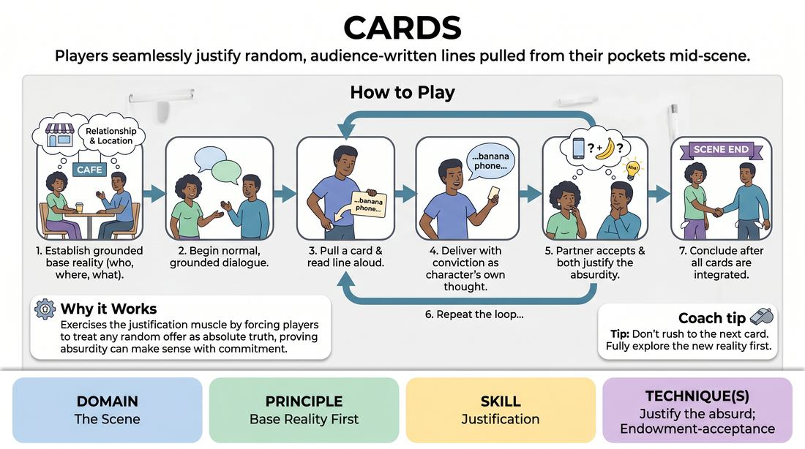

# Pocket Lines

{ .game-hero }

> Players seamlessly justify random, audience-written lines pulled from their pockets mid-scene.

## Overview
Two players perform a grounded scene while holding several slips of paper containing random sentences written by the audience. At key moments, players must pull out a slip and read the line aloud as their next line of dialogue, immediately integrating and justifying the bizarre statement within their established reality.

## What It Trains
- **Domain:** D3 — The Scene
- **Principle(s):** Yes, And; Base Reality First; The Audience Is the Final Scene Partner
- **Skill(s):** Unfiltered Spontaneity; Offer Reception; Justification; Stage Presence & Clarity
- **Technique(s):** Endowment-acceptance; Justify the absurd
- **Focus:** comedy_game

**Objective:** Develops the skill of justification, active listening, and maintaining a strong base reality even when unexpected, disruptive information is introduced.

## Setup
Distribute index cards and pens to the audience before the session. Ask them to write single, complete, mundane, or slightly unusual sentences. Collect these cards. Give two players three to four random cards each, which they must place in their pockets or hold face-down without looking at them.

## How to Play
1. Ask the audience for a simple, grounded relationship and location to establish a clear base reality.
2. The two players begin a normal, grounded scene, establishing who they are, where they are, and what they are doing.
3. Once the scene's context is stable, either player can choose a moment to reach into their pocket, pull out a card, and read the written line aloud with confidence.
4. The reading player must deliver the line as if it is a natural, intentional thought of their character, matching the emotional tone of the scene.
5. The partner must immediately accept this line as absolute truth and work with the reader to justify why that specific statement was made in this context.
6. Players continue the scene, alternating between natural dialogue and pulling new cards, ensuring every single card line is fully integrated before the next one is drawn.
7. The scene concludes once all cards have been read and their contents successfully justified, ending on a resolved beat.

## Facilitation Notes
- Coaching cue: 'Don't just read it—feel it! Deliver the line with emotional commitment, then figure out why you said it.'
- Pitfall: Players pulling cards too rapidly without letting the scene breathe. Fix: Coach them to establish a solid 30-45 seconds of normal conversation before the first card is drawn, and to have at least 3-4 exchanges of normal dialogue between card pulls.
- Pitfall: Treating the card line as a joke or breaking character. Fix: Remind players that their characters do not know they are playing a game; the character must genuinely mean what they say.
- Coaching cue: 'Justify the why. If you say "I love the smell of wet cardboard," explain your history with packaging materials.'

## Variations
- Blind Exchange: Players hold a stack of cards face down and hand them to each other to read, so they do not choose when their own lines are read.
- Emotional Shift: The player must read the card in the exact opposite emotional state of the current scene, forcing a sudden but justified emotional pivot.

## Debrief
- How did establishing a strong base reality early on make it easier to justify the weird lines later?
- What strategies did you use to make an absurd line sound completely logical for your character?
- How does this game train us to treat our partner's unexpected offers as gifts rather than mistakes?

## Safety & Inclusion
Ensure audience suggestions are vetted briefly by the facilitator to remove any offensive, highly inappropriate, or unsafe content before handing them to the players.

## Why It Works
By forcing players to treat completely random, disconnected text as absolute truth, the game exercises the justification muscle. It proves that any offer, no matter how absurd, can make perfect sense if the players commit to finding the logical bridge back to their base reality.
