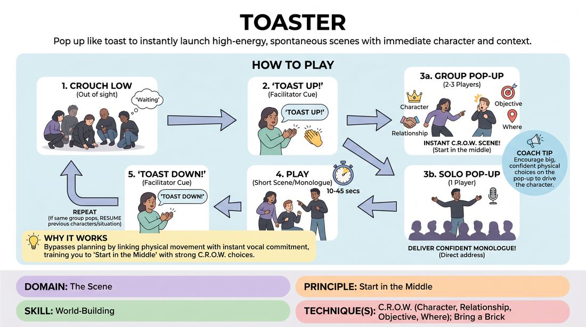

# Toaster

{ .game-hero }

> Pop up like toast to instantly launch high-energy, spontaneous scenes with immediate character and context.

## Overview
Toaster is a fast-paced, high-energy scene-generation game where players crouch out of sight and pop up dynamically to initiate rapid-fire scenes. Guided by a facilitator's cue, players must instantly establish their Character, Relationship, Objective, and Where (C.R.O.W.) the moment they stand, training them to start scenes in the middle of the action.

## What It Trains
- **Domain:** D3 — The Scene
- **Principle(s):** Start in the Middle; The First Thought Is a Gift; Group Mind
- **Skill(s):** World-Building; Unfiltered Spontaneity; Pacing & Rhythm
- **Technique(s):** C.R.O.W. (Character, Relationship, Objective, Where); Bring a Brick; Edits (Sweep, Tag-Out, Sound/Light)
- **Focus:** mixed

**Objective:** To develop rapid world-building (C.R.O.W.) and the ability to start scenes in the middle of an active moment, bypassing overthinking and embracing immediate physical and verbal choices.

## Setup
Players stand in a semi-circle or line at the back of the playing space. They all crouch down low, out of the active stage view, as if hidden inside a toaster. No physical props or chairs are needed, but a clear performance area in front of the crouched players is required.

## How to Play
1. All players begin by crouching down low to the ground, out of the active performance space.
2. The facilitator calls out 'Toast Up!' or claps their hands to trigger a pop-up.
3. An organic, unplanned number of players (usually 1 to 3) instantly spring up to a standing position.
4. The standing players must immediately initiate a scene, starting in the middle of an action or conversation with strong physical and verbal choices that establish C.R.O.W. within the first five seconds.
5. If only one player pops up, they must immediately deliver a confident solo monologue or direct-address character piece.
6. After a short duration (ranging from 10 to 45 seconds), the facilitator claps or calls 'Toast Down!', and the active players immediately crouch back down, ending the scene mid-sentence.
7. The facilitator triggers the next pop-up. If the exact same configuration of players pops up again, they must instantly resume their previous characters and situation; if a new configuration pops up, they start a brand-new scene.

## Facilitation Notes
- Side-coaching cue: 'Start speaking before your knees are fully straight!' This prevents players from standing up, looking at each other, and planning.
- Vary the rhythm of the toaster. Some 'toasts' should be quick 10-second flashes, while others can run for a minute to let a relationship develop.
- Pitfall: Players hesitating to pop up because they are waiting to see who else goes. Fix: Encourage players to commit to their own impulse to jump up, trusting that the group mind will balance the numbers.
- Pitfall: Players standing up and asking 'Who are we?' or 'Where are we?'. Fix: Side-coach them to make an active physical statement or a declarative line of dialogue immediately.

## Variations
- Single-Universe Toaster: All popped-up scenes must take place in the same overarching location (e.g., a department store, a cruise ship) but feature different characters and rooms.
- Player-Driven Claps: Instead of a facilitator, any player crouching down can clap to trigger the transition, giving the ensemble control over the edit and pacing.
- Tag-Team Toaster: Players can tap out active players to take their place mid-scene, maintaining the character but changing the physical performer.

## Debrief
- How did launching into the scene physically before thinking affect your character choices?
- What strategies did you use to instantly establish C.R.O.W. when you popped up with a random partner?
- How did the pressure of the quick 'Toast Down' cue change your pacing and urgency in the scene?

## Safety & Inclusion
Since this game requires rapid crouching and springing up, offer physical modifications: players who cannot easily crouch can sit in chairs and simply raise their hands, stand up from a seated position, or step forward/backward to indicate entering and exiting the toaster.

## Why It Works
By forcing physical movement (springing up) simultaneously with vocal initiation, Toaster bypasses the analytical brain's tendency to plan. It relies on the 'First Thought Is a Gift' principle, demanding immediate commitment to C.R.O.W. and teaching players that a scene is most exciting when it starts in the middle of an existing dynamic.
