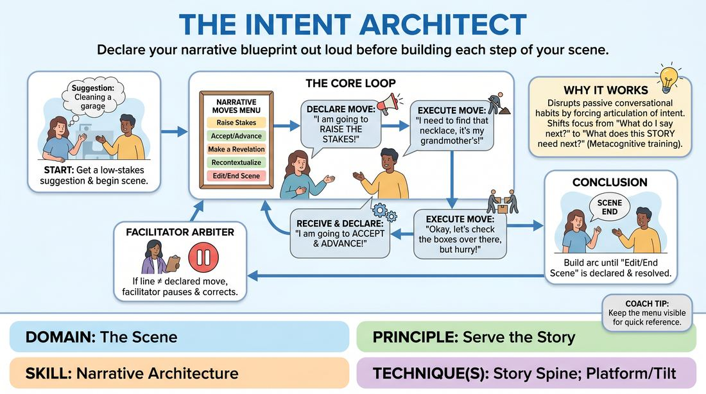

# The Story Architect

{ .game-hero }

> Declare your narrative blueprint out loud before building each step of your scene.

## Overview
A structured, meta-cognitive training game where players must explicitly state the narrative function of their next line before speaking it. By pausing to choose from a menu of strategic moves, players learn to construct scenes with deliberate narrative progression rather than relying on aimless dialogue. The resulting experience is highly analytical, transforming intuitive storytelling into a conscious, collaborative craft.

## What It Trains
- **Domain:** D3 — The Scene
- **Principle(s):** Serve the Story; Base Reality First; Make Your Partner a Genius
- **Skill(s):** Narrative Architecture; Stakes / The 'Want'; Justification; Offer Reception
- **Technique(s):** Story Spine; Platform/Tilt; What do they stand to lose? reps; Justify the absurd
- **Focus:** skill_drill

**Objective:** To develop a conscious mastery of narrative architecture and story progression. Players learn to identify the structural needs of a scene in real-time, deliberately applying stakes, obstacles, and relationship shifts to serve the overall story.

## Setup
For a virtual classroom: Share a digital slide, whiteboard, or paste a list of 'Narrative Moves' into the video-conferencing chat. Ensure all players can see the menu throughout the exercise. No physical props are required, but players should have their cameras on and be ready to perform in pairs.

## How to Play
1. Display the 'Narrative Moves' menu on a shared screen or pin it in the virtual chat so it remains visible to all participants.
2. Select two players to initiate a scene and obtain a simple, low-stakes suggestion (e.g., 'cleaning a garage' or 'waiting for a bus') to establish the initial platform.
3. Before delivering any line that changes or advances the scene, the active player must verbally declare their intended move from the menu (e.g., 'I am going to Reveal Core Want').
4. Immediately after the declaration, the player delivers their line of dialogue or performs the physical action that executes that specific move (e.g., 'I need to find my grandfather's old watch in these boxes before the movers arrive').
5. The receiving partner must actively listen, accept the offer, and then select their own move from the menu, declaring it aloud before responding (e.g., 'I am going to Introduce Obstacle' followed by 'I threw that box out yesterday').
6. The facilitator acts as an active structural arbiter; if a player's spoken line does not match their declared move, the facilitator gently pauses the scene and asks them to either rephrase the line or select a more accurate move.
7. Continue the scene with players alternating declarations and lines, consciously building a narrative arc with a clear beginning, middle, and end.
8. The scene concludes when a player declares 'Edit/End Scene' and delivers a final, resolving line, or when the facilitator calls edit after a satisfying narrative resolution.

## Facilitation Notes
- The 'Labeling' Pitfall: Players may get bogged down trying to find the 'perfect' move. Side-coach them to make a fast choice; any deliberate move is better than stalling. Remind them that there are no wrong moves, only different narrative directions.
- Gentle Arbitration: When correcting a mismatch between declaration and execution, keep it light and educational. Say: 'I love that line, but it felt more like raising the stakes than introducing an obstacle. Would you like to change your declaration to Raise Stakes, or rephrase the line to block their goal?'
- Avoid Narrative Whiplash: Ensure players don't jump straight to 'Raise Stakes' or 'Introduce Obstacle' before establishing a solid base reality. Side-coach: 'Let's see one more Establish Base Reality move before we complicate things.'
- Virtual Flow: In a virtual space, lag can disrupt timing. Encourage players to leave a clear beat after their partner's line before declaring their move, ensuring everyone hears the transition clearly.

## Variations
- Hidden Blueprints: The facilitator privately messages each player a secret sequence of 3-4 moves they must execute in order. The audience must guess their sequence based on their performance.
- The Silent Architect: Players do not declare their moves aloud. Instead, after each line, the observing players must type in the virtual chat what move they believe was just executed, testing the clarity of the offers.
- Restricted Menu: Limit the menu to only three moves (e.g., Establish Base Reality, Introduce Obstacle, Raise Stakes) to force deep focus on a specific narrative engine.

## Debrief
- How did having to declare your intent out loud change the speed and focus of your decision-making?
- Did you find yourself listening differently to your partner when you knew they were executing a specific, named structural move?
- Which narrative moves felt the most natural to execute, and which ones felt like a stretch for you?
- How can we bring this sense of deliberate narrative architecture into our regular, unconstrained scenes?

## Safety & Inclusion
Because this game requires analytical focus, players with cognitive processing differences or performance anxiety may feel pressured. Emphasize that pauses are welcome and that the facilitator's arbitration is a collaborative coaching tool, not a penalty. Allow players to pass or play with a co-architect who can help them select their moves.

## Why It Works
By forcing players to articulate their narrative intent before speaking, the game disrupts the habit of making passive, conversational responses. It shifts the brain from 'What do I say next?' to 'What does this story need next?' This metacognitive pause builds a strong internal map of narrative cause-and-effect, training players to serve the story over individual cleverness.
