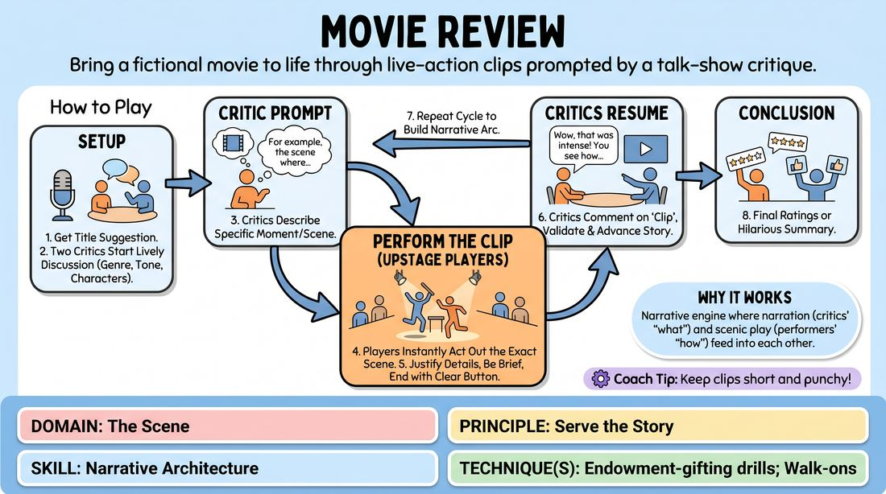

# The Film Review

{ .game-hero }

> Bring a fictional movie to life through live-action clips prompted by a talk-show critique.

## Overview
Two players act as talk-show hosts or film critics discussing a newly released, completely fabricated movie. The remaining players stand ready in the background to instantly step forward and act out the specific scenes, flashbacks, or clips described by the reviewers.

## What It Trains
- **Domain:** D3 — The Scene
- **Principle(s):** Serve the Story; Make Your Partner a Genius; Group Mind
- **Skill(s):** Narrative Architecture; Active Gifting; Support Work; Justification
- **Technique(s):** Endowment-gifting drills; Walk-ons; Justify the absurd
- **Focus:** narrative

**Objective:** Develops narrative architecture, active gifting, and justification by training players to seamlessly transition between narration and scenic action.

## Setup
Place two chairs downstage facing the audience for the critics. The remaining players (the ensemble) stand in a line upstage, ready to jump into the playing space.

## How to Play
1. Obtain a suggestion from the group for the title of a movie that does not exist.
2. The two downstage critics begin a lively discussion about this fictional film, establishing its genre, tone, and main characters.
3. When a critic describes a specific moment or scene from the movie, they pause their conversation to let the audience 'see' the clip.
4. Immediately, players from the upstage line step into the center space and physically act out that exact scene, bringing the critic's description to life.
5. The performing players must justify and expand upon the details given by the critics, keeping the clip brief and ending on a clear physical or verbal button.
6. The critics resume their discussion, commenting on what was just 'shown' on screen, thereby validating the performers' choices and driving the narrative forward.
7. Repeat this cycle of review-to-clip several times to build a cohesive narrative arc of the film.
8. Conclude the game with the critics giving their final ratings or a hilarious summary of the movie.

## Facilitation Notes
- Coaching cue: 'Give specific gifts!' Encourage critics to name characters, settings, and specific actions rather than vague concepts.
- Coaching cue: 'Edit cleanly!' The critics should clearly signal the end of a clip by speaking back up, and the performers should immediately freeze or clear the stage.
- Pitfall: Performers ignoring the details established by the critics. Fix: Remind performers that their job is to make the critics look like geniuses by precisely physicalizing and justifying their verbal prompts.
- Pitfall: Clips running too long. Fix: Side-coach the critics to cut in with their commentary as soon as the clip establishes its comedic or narrative point.

## Variations
- Director's Commentary: One player is the director and others are actors, pausing a 'live' screening to discuss behind-the-scenes drama which is then played out.
- Genre Swap: The host randomly changes the genre of the film mid-review, forcing the next clip to adapt instantly (e.g., turning a gritty noir into a musical).
- Foreign Film: The clips must be performed in gibberish with high physical expression, which the critics then translate or critique for the audience.

## Debrief
- How did the specific details provided by the critics make it easier for the performers to start their scenes?
- What strategies did the performers use to justify unexpected or bizarre prompts from the critics?
- How did the back-and-forth structure help build a cohesive story without any single person planning it?

## Safety & Inclusion
Ensure physical safety during high-energy clips. Remind players to be mindful of physical boundaries when rushing on stage to form quick tableaus or action sequences.

## Why It Works
This game establishes a perfect narrative engine where narration and scenic play feed into each other. The critics provide the structural scaffolding (the 'what'), while the performers provide the emotional and physical reality (the 'how'), training active listening and mutual support.
