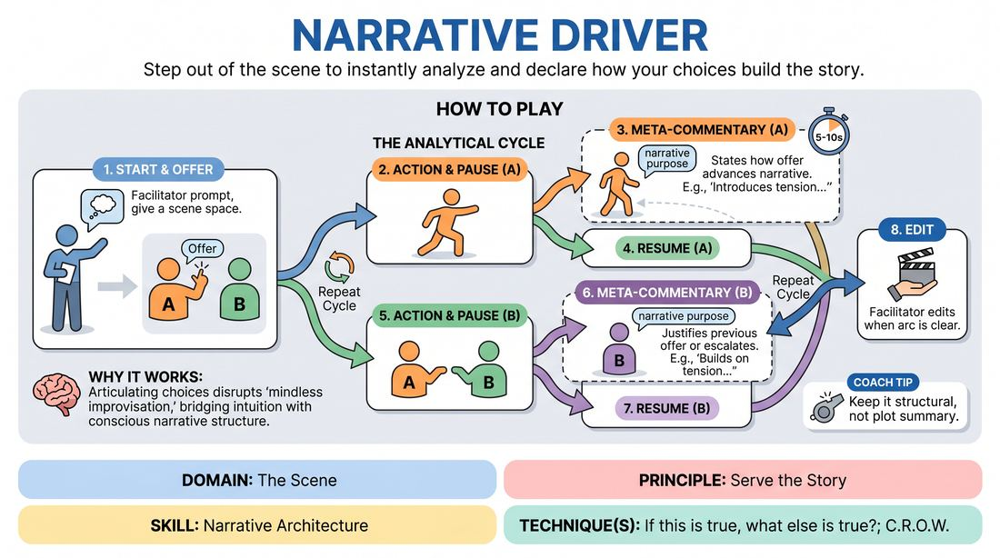

# Narrative Drivers

{ .game-hero }

> Step out of the scene to instantly analyze and declare how your choices build the story.

## Overview
In this meta-cognitive scene-work exercise, players alternate between acting in a scene and stepping out of character to deliver rapid, real-time commentary on their narrative choices. By explicitly stating how each offer advances the plot, character dynamics, or stakes, players develop a conscious, structural approach to storytelling. The experience balances active performance with sharp, analytical reflection, transforming passive reactions into deliberate narrative construction.

## What It Trains
- **Domain:** D3 — The Scene
- **Principle(s):** Serve the Story; Yes, And
- **Skill(s):** Narrative Architecture; Justification; Stakes / The 'Want'; World-Building; Offer Reception
- **Technique(s):** If this is true, what else is true?; C.R.O.W. (Character, Relationship, Objective, Where)
- **Focus:** narrative

**Objective:** To cultivate a deep, real-time awareness of narrative architecture, training players to make purposeful offers that establish stakes, justify previous choices, and actively drive the story forward.

## Setup
Two players stand in the performance space, while the remaining players sit as active observers. No props or special staging are required. The facilitator prepares a list of simple relationship or situational prompts.

## How to Play
1. The facilitator provides a simple scene prompt, such as a relationship dynamic or a shared task.
2. Player A initiates the scene by making a clear verbal, physical, or emotional offer.
3. Immediately after making the offer, Player A pauses the scene, takes a physical step backward to break the fourth wall, and delivers a brief, out-of-character commentary.
4. The commentary must be strictly limited to 5-10 seconds, stating exactly how the offer advances the narrative (e.g., 'By entering with a limp, I am introducing a physical obstacle that raises the stakes of our hike').
5. Player A steps back into the scene, resuming their character and physical position.
6. Player B receives the offer, responds in character with a new offer that builds on the established reality, and then immediately steps back to deliver their own out-of-character commentary.
7. Player B's commentary must also adhere to the 5-10 second limit, explaining how their response justifies the previous offer or escalates the scene's tension.
8. The players continue this alternating cycle of action and commentary, keeping the out-of-character explanations concise to maintain momentum.
9. The facilitator edits the scene after several exchanges once a clear narrative arc has been established.

## Facilitation Notes
- Enforce the 5-10 Second Rule: Strictly limit the out-of-character commentary. If a player starts to over-analyze or ramble, gently call out 'Time' or 'Keep it brief' to maintain the scene's momentum.
- Challenge Vague Explanations: If a player says, 'This moves the story forward,' pause them and ask, 'How specifically? What new truth or conflict does it introduce?'
- Watch for Passive Offers: Ensure players are making active choices that can actually be analyzed, rather than safe, neutral statements that stall the narrative.
- Physicalize the Transition: Encourage a clear, consistent physical cue (like a step back or a hand gesture) to cleanly separate the in-character scene from the analytical commentary.
- Online Adaptation: For virtual platforms, players can step closer to the camera or use a specific hand gesture (like framing their face) to signal the out-of-character commentary, ensuring a clear visual boundary.

## Variations
- Targeted Commentary: Restrict the commentary to a single narrative element per round, such as focusing exclusively on how the offer defines the relationship, raises the stakes, or establishes the environment.
- Audience Validation: The observing players can call out 'Agree' or 'Disagree' with the player's commentary, forcing the player to re-evaluate and adjust their narrative justification on the fly.
- Silent Driver: Play the entire scene physically with no dialogue, using the out-of-character commentary as the only spoken words to explain the physical storytelling.
- Online Zoom-In: In virtual play, players turn their cameras off when not speaking, and turn them on to 'step in' to the scene, using a physical gesture to indicate the commentary phase.

## Debrief
- How did having to explain your choices in real-time change the types of offers you made?
- Did you find it easier to justify your partner's offers once they explicitly stated their narrative intent?
- How can we bring this level of narrative mindfulness into a regular scene without stepping out of character?

## Safety & Inclusion
Because this game requires players to step out of character and analyze their choices, it provides an excellent built-in safety valve. If a scene begins to head into uncomfortable territory, players can use their out-of-character commentary to consciously steer the narrative away from sensitive themes or explicitly negotiate boundaries in real-time. For players with limited mobility, the physical 'step back' can be replaced with a simple verbal cue (e.g., saying 'Meta-commentary') or a hand gesture to ensure full accessibility.

## Why It Works
By forcing players to articulate the structural purpose of their choices, the game disrupts the habit of mindless improvisation. It bridges the gap between intuitive play and structural analysis, teaching players to view their offers not just as dialogue, but as functional building blocks of a larger narrative engine.
