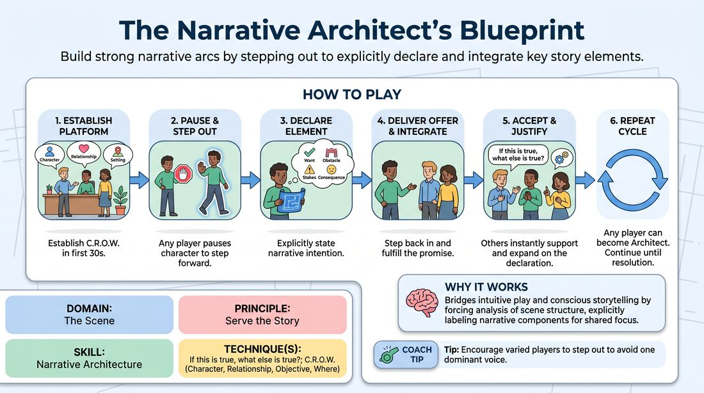

# The Story Architect

{ .game-hero }

> Build strong narrative arcs by stepping out to explicitly declare and integrate key story elements.

## Overview
A collaborative scene-building exercise where players take turns stepping into a meta-role to explicitly declare the narrative structural elements they are introducing. By calling out wants, obstacles, stakes, and consequences, players learn to consciously shape a scene's trajectory rather than wandering aimlessly. The remaining players immediately integrate these declarations using logical justification, ensuring a cohesive and satisfying story arc.

## What It Trains
- **Domain:** D3 — The Scene
- **Principle(s):** Serve the Story; Yes, And; Make Your Partner a Genius
- **Skill(s):** Narrative Architecture; Stakes / The 'Want'; Justification; Raising the Stakes; Active Listening; Offer Reception
- **Technique(s):** If this is true, what else is true?; C.R.O.W. (Character, Relationship, Objective, Where); Stakes-escalation reps; Endowment-acceptance
- **Focus:** narrative

**Objective:** To develop conscious narrative architecture and active story-building skills by explicitly identifying, introducing, and justifying core dramatic elements in real-time.

## Setup
An open playing space for 2-3 active players, with the remaining group observing as an active audience. No props or special materials are required. The facilitator secures a simple suggestion (e.g., a location or a relationship) to initiate the scene.

## How to Play
1. Begin a standard scene with two or three players, establishing a clear platform of character, relationship, and setting within the first thirty seconds.
2. At any point during the scene—especially when the narrative plateaus or needs direction—any active player can pause their character work and step slightly forward to become the 'Architect'.
3. As the Architect, the player addresses the room and explicitly declares the narrative element they are about to introduce (e.g., 'I am going to establish my character's core Want,' 'I am going to introduce a major Obstacle,' 'I am going to raise the Stakes,' or 'I am going to show a Consequence').
4. Immediately after making the declaration, the Architect steps back into the scene and delivers an offer that fulfills that specific narrative promise.
5. The other players must instantly accept this new reality, using the principle of 'If this is true, what else is true?' to justify and expand upon the Architect's offer.
6. The role of the Architect is fluid; any player in the scene can step out and make a declaration at any point to steer the narrative engine.
7. Continue this cycle of declaration, execution, and collaborative integration until the scene reaches a natural, satisfying resolution or the facilitator calls edit.

## Facilitation Notes
- Side-coach players to keep their meta-declarations brief and punchy; the focus should remain on the scene, not long-winded explanations.
- If a scene is stalling and no player is stepping up, the facilitator can call out a player's name and prompt them: 'Architect, give us an Obstacle!'
- Watch out for players who make a declaration but fail to execute it in their next line. Remind them to immediately show, not just tell, what they declared.
- Ensure the non-Architect players are actively building on the new information rather than ignoring it or resetting the scene's reality.

## Variations
- The Director's Cut: An off-stage player acts as the sole Architect, calling out narrative prompts for the active players to immediately execute.
- Blind Architecture: The facilitator secretly assigns one specific narrative element to each player before the scene starts, which they must declare and execute at some point during the run.
- Genre Blueprint: Apply the game to specific genres (e.g., Film Noir, Shakespearean Tragedy), requiring the Architect's declarations to match the structural tropes of that style.

## Debrief
- How did explicitly naming the narrative elements change your awareness of the scene's structure?
- What was the difference between reacting to an organic offer versus reacting to a declared narrative offer?
- How did the 'If true, what else is true?' principle help justify sudden shifts in the story?
- Did you find it difficult to transition between the meta-commentary of the Architect and the emotional reality of your character?

## Safety & Inclusion
Because this game involves sudden shifts in stakes and consequences, players should establish clear boundaries regarding physical contact or intense emotional themes during the setup. Ensure players feel empowered to declare narrative elements that de-escalate tension or introduce comedic relief if the scene becomes too intense.

## Why It Works
By forcing players to step out of the immediate action and analyze the scene structurally, this game bridges the gap between intuitive play and conscious storytelling. Explicitly labeling narrative components like wants, obstacles, and consequences demystifies story structure, while the immediate requirement to justify these elements using 'If true, what else is true?' ensures that the scene remains grounded, collaborative, and logically sound.
