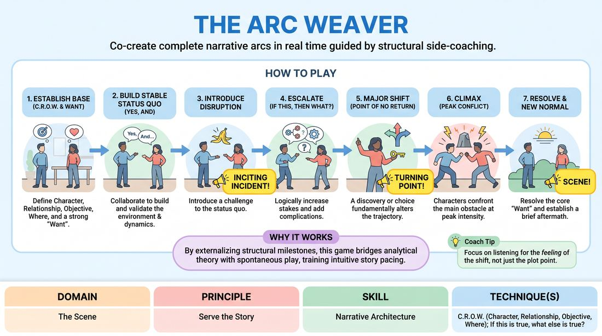

# The Arc Weaver

{ .game-hero }

> Co-create complete narrative arcs in real time guided by structural side-coaching.

## Overview
A structured scene-work exercise where players improvise a continuous story while a facilitator calls out key narrative milestones as they organically manifest. By labeling structural beats like the inciting incident and turning point in real time, players develop a shared vocabulary and an intuitive sense of story pacing. The experience transforms abstract narrative theory into a physical, felt rhythm on stage.

## What It Trains
- **Domain:** D3 — The Scene
- **Principle(s):** Serve the Story; Base Reality First; Yes, And
- **Skill(s):** Narrative Architecture; Stakes / The 'Want'; World-Building; Justification; Active Listening
- **Technique(s):** C.R.O.W. (Character, Relationship, Objective, Where); If this is true, what else is true?; Platform/Tilt
- **Focus:** narrative

**Objective:** To cultivate a deep, instinctual understanding of narrative architecture, helping competent players recognize, justify, and escalate story beats while maintaining a strong base reality and clear character motivations.

## Setup
An open performance space. Two to three players stand on stage, while the rest of the group sits as active observers. The facilitator stands near the stage, ready to side-coach. No props or materials are required. A simple, mundane suggestion is gathered to start.

## How to Play
1. Begin the scene by establishing a clear base reality (Character, Relationship, Objective, Where) and a strong, relatable 'Want' for at least one character.
2. Collaborate using 'Yes, And' to build a stable status quo, ensuring both players actively listen and validate the physical environment and relationship dynamics.
3. Introduce a minor disruption or opportunity that challenges the established status quo; the facilitator will call out 'INCITING INCIDENT!' the moment this disruption is clearly defined.
4. Transition into rising action, using the principle of 'if this is true, what else is true?' to logically escalate the stakes and introduce complications that block the character's 'Want'.
5. Discover a major revelation, choice, or point of no return that fundamentally shifts the characters' trajectory; the facilitator will call out 'TURNING POINT!' to mark this shift.
6. Drive the scene toward its climax, where the central conflict reaches its peak intensity and the characters must directly confront the main obstacle.
7. Resolve the climax by either achieving, losing, or transforming the core 'Want', establishing a brief 'New Normal' or aftermath that shows how the world has changed.
8. The facilitator calls 'SCENE!' once the new status quo is settled, bringing the narrative arc to a satisfying close.

## Facilitation Notes
- Acknowledge, Don't Command: Ensure your calls ('Inciting Incident!', 'Turning Point!') are observations of what the players have already initiated, rather than directives of what they must do next.
- Handling Narrative Stalls: If players get stuck in circular dialogue without a disruption, gently side-coach with questions like, 'What does your character want right now?' or 'What is the unexpected news?'
- Pitfall - Rushing the Beats: Players may try to force a turning point immediately after the inciting incident. Remind them to explore the immediate consequences first using 'if true, what else is true?' to build solid middle-ground stakes.
- Pitfall - Denying the Disruption: If a player ignores or minimizes the inciting incident, side-coach them to 'Yes, And' the gravity of the situation, making the stakes matter to their character.

## Variations
- The Silent Weaver: Run the same structure, but instead of the facilitator calling out the beats, the off-stage players clap once to collectively signal the Inciting Incident and twice for the Turning Point, shifting narrative responsibility to the ensemble.
- Engine Select: Before starting, the facilitator designates a specific narrative engine (e.g., character-driven vs. plot-driven), forcing players to prioritize internal emotional shifts or external environmental obstacles to trigger the beats.
- The Aftermath Extension: Add a mandatory two-line epilogue after the 'Scene!' call, where characters fast-forward in time to explicitly state how their lives look under the new normal.

## Debrief
- How did labeling the beats in real time change your awareness of the scene's pacing?
- What specific choice or line of dialogue solidified the Turning Point for both the players and the audience?
- How did applying 'if true, what else is true?' help you escalate the stakes without introducing random, disconnected details?
- In what ways did establishing a strong base reality in the first minute make the resolution more satisfying?

## Safety & Inclusion
Since this game focuses on escalating stakes and conflict, remind players that high stakes do not require high volume or physical aggression. Encourage emotional intensity and high personal stakes over physical threats or unsafe physical contact. Ensure players have the agency to de-escalate or pause if the narrative touches on sensitive personal boundaries.

## Why It Works
By externalizing the structural milestones of a story, this game bridges the gap between analytical narrative theory and spontaneous play. The real-time labeling acts as an auditory anchor, training players to recognize the exact moments their choices shift the narrative gears. This builds a shared muscle for pacing, ensuring that complications are justified logically rather than forced arbitrarily.
