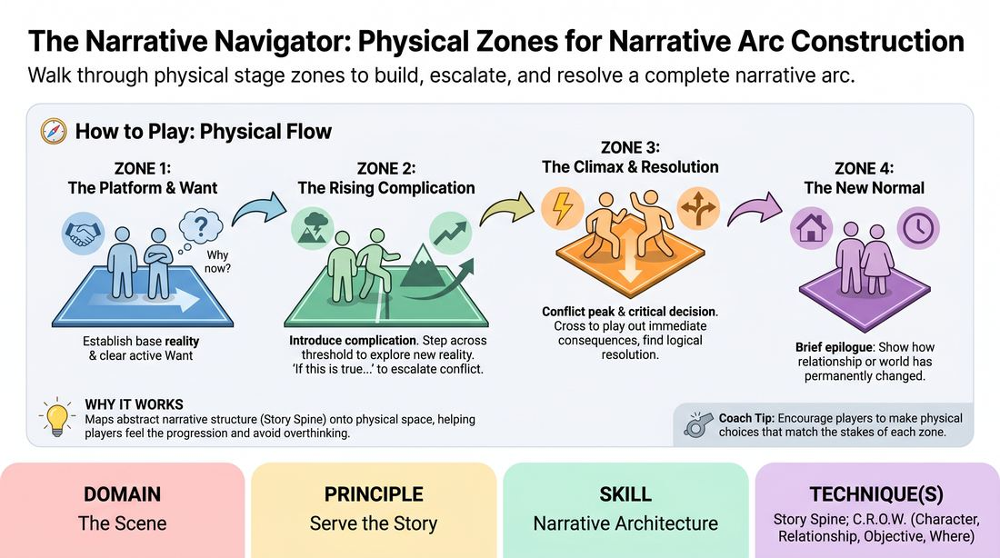

# Narrative Thresholds

{ .game-hero }

> Walk through physical stage zones to build, escalate, and resolve a complete narrative arc.

## Overview
A physicalized staging exercise where players navigate a series of marked floor zones representing the structural beats of a story. By tying physical movement to narrative progression, players learn to consciously build stakes, introduce complications, and drive a scene to a satisfying resolution. The physical boundaries act as a tangible roadmap, transforming abstract story structure into an active, spatial experience.

## What It Trains
- **Domain:** D3 — The Scene
- **Principle(s):** Serve the Story; Base Reality First; Yes, And
- **Skill(s):** Narrative Architecture; Stakes / The 'Want'; World-Building; Justification; Active Listening
- **Technique(s):** Story Spine; C.R.O.W. (Character, Relationship, Objective, Where); If this is true, what else is true?
- **Focus:** narrative

**Objective:** To master narrative architecture by physically mapping the classic story spine onto the stage, training players to recognize when to establish a platform, when to escalate conflict, and how to execute a justified climax and resolution.

## Setup
Use tape, chalk, or colored mats to divide the playing area into three distinct, adjacent horizontal lanes or zones from stage-left to stage-right. Label these zones: Zone 1 (The Platform & Want), Zone 2 (The Rising Complication), and Zone 3 (The Climax & Resolution). Optionally, mark a small, distinct circle off to the side as Zone 4 (The New Normal).

## How to Play
1. Two players step into Zone 1 (The Platform & Want) and receive a simple suggestion of a relationship or location to initiate the scene.
2. In Zone 1, players must establish a stable base reality (C.R.O.W.) and answer the question 'Why now?' by introducing a clear, active 'Want' and its initial stakes.
3. Once a clear complication or obstacle to that 'Want' is introduced, one player must physically step across the threshold into Zone 2 (The Rising Complication), justifying the movement through their dialogue or action.
4. The second player must actively listen and, recognizing the shift in stakes, cross the threshold to join their partner in Zone 2 to explore the new reality.
5. In Zone 2, players apply the principle of 'if this is true, what else is true?' to escalate the conflict, introducing further complications and raising the emotional or situational stakes.
6. When the conflict reaches its absolute peak and a critical decision or point of no return is reached, one player crosses into Zone 3 (The Climax & Resolution) to deliver or trigger the climax.
7. The other player immediately joins them in Zone 3, and together they play out the immediate consequences of the climax, finding a logical resolution rather than just stopping the scene.
8. Both players step into the small Zone 4 (The New Normal) to play a brief, ten-second epilogue showing how their relationship or world has permanently changed.

## Facilitation Notes
- Side-coaching for Zone 1: 'Establish the routine first! What is their normal day-to-day before this moment?' and 'Why is today different from any other day?'
- Side-coaching for Transitions: 'Don't just walk over the line; let the weight of the new information pull you across!' or 'If they stepped forward, something major just changed—how does it affect you?'
- Pitfall - Rushing the Gates: Players often jump to Zone 2 or 3 before establishing a solid base reality. Fix: Freeze the scene and ask, 'Who are you to each other?' before letting them cross.
- Pitfall - Arbitrary Movement: Moving physically without a narrative trigger. Fix: Have the player step back and ask, 'What happened in the story that forced your body to move?'
- Pitfall - Confusing Ending with Resolution: Stopping the scene abruptly in Zone 3. Fix: Coach them to show the 'after-effects' of the climax—how does the relationship settle now?

## Variations
- The Silent Threshold: Players cannot speak while crossing a boundary; the transition must be communicated entirely through physical action or a shift in body language.
- Multi-Player Ensemble: Run the game with 3-4 players. Only one player needs to cross to pull the narrative forward, but others must justify their entry into the new zone based on their character's relationship to the stakes.
- The Reverse Arc: Start in Zone 3 (the climax) and work backward to Zone 1 to discover how the characters arrived at such an extreme situation (flashback style).

## Debrief
- How did physically crossing a line change your mental commitment to escalating the scene's stakes?
- What was the difference between a transition that felt earned versus one that felt rushed or arbitrary?
- How does establishing a strong 'Why Now?' in the first zone make the complications in the second zone easier to discover?
- How did the resolution in Zone 3 feel different from simply ending or cutting a scene?

## Safety & Inclusion
Ensure the physical boundaries are clearly marked and free of tripping hazards. Since physical movement is a core mechanic, players with mobility considerations can use verbal cues (e.g., declaring 'I am stepping into the conflict') or simple hand gestures to signal zone transitions instead of physical stepping.

## Why It Works
This game works because it maps the abstract, cognitive steps of narrative structure (the Story Spine) onto physical space. By spatializing the narrative arc, it bypasses intellectual overthinking; players physically feel the progression of stakes. The requirement to justify crossing a boundary forces active listening and ensures that every plot point is a direct consequence of the previous action, reinforcing logical narrative flow.
