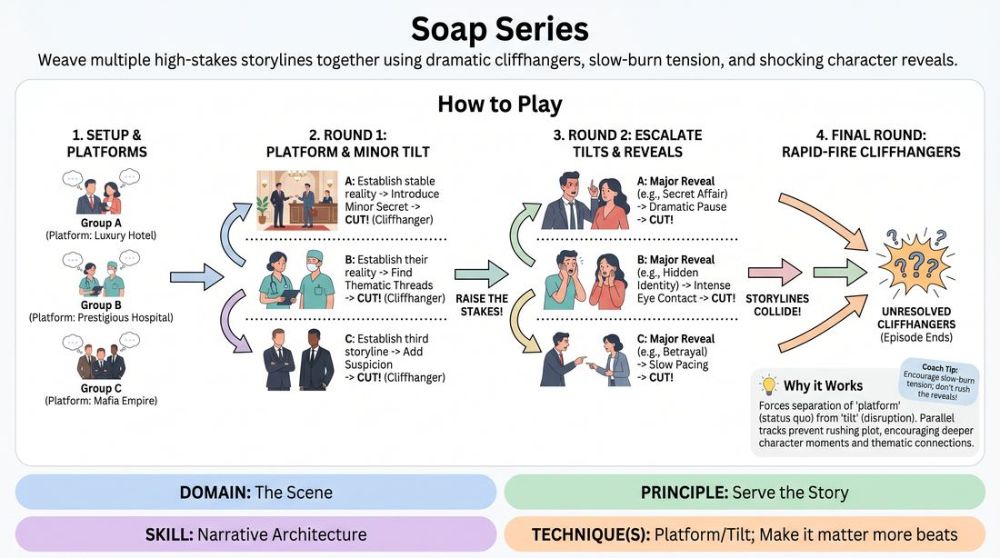

# The Serialized Saga

{ .game-hero }

> Weave multiple high-stakes storylines together using dramatic cliffhangers, slow-burn tension, and shocking character reveals.

## Overview
In this game, players collaborate to perform a multi-threaded, melodramatic episode of a serialized drama. By cutting between three distinct storylines, players practice establishing a stable platform, introducing dramatic tilts, and synthesizing thematic connections across scenes.

## What It Trains
- **Domain:** D3 — The Scene
- **Principle(s):** Serve the Story; Serve the Piece
- **Skill(s):** Narrative Architecture; Raising the Stakes; Pacing & Rhythm; Thematic Synthesis
- **Technique(s):** Platform/Tilt; Make it matter more beats; Edits (Sweep, Tag-Out, Sound/Light); Weave the threads
- **Focus:** narrative

**Objective:** To master narrative architecture and the platform/tilt technique by managing slow-tempo story progression, raising stakes through dramatic reveals, and editing scenes at high-tension cliffhangers.

## Setup
An in-person playing space with a clear stage area and a backstage/off-stage area where players can wait. No props are needed. The facilitator divides the group of 6-10 players into three distinct pairs or trios, each representing a different storyline branch (e.g., a high-stakes family business, a medical crisis, or a secret romance).

## How to Play
1. Divide the players into three small groups (pairs or trios) and establish a shared, melodramatic setting or theme (e.g., a luxury hotel empire, a prestigious research hospital, or a small town with dark secrets).
2. Have each group quickly define their initial 'platform': who they are, their close relationship, and the mundane or high-status routine they are engaged in.
3. Begin Scene A (Group 1). They establish their platform for 1-2 minutes, building a stable reality before introducing a minor 'tilt' (a secret, a suspicion, or a sudden change in circumstance).
4. The facilitator or an off-stage player calls 'Cut!' or sweeps the scene at a moment of rising tension, leaving the audience on a minor cliffhanger.
5. Immediately transition to Scene B (Group 2), who establish their own platform and tilt, ideally finding thematic or narrative threads that subtly connect to Scene A.
6. Transition to Scene C (Group 3) to complete the first round of platforms and tilts, establishing the third storyline.
7. Begin the second round of scenes. In this round, players must 'raise the stakes' by escalating the tilts into major, melodramatic reveals (e.g., secret affairs, hidden wills, or long-lost relatives).
8. Encourage players to use slow, deliberate pacing, dramatic pauses, and intense eye contact to milk the melodrama of each reveal.
9. Run a final round of quick, rapid-fire scenes where the storylines begin to collide, culminating in a series of unresolved cliffhangers that leave the 'episode' open-ended.

## Facilitation Notes
- Side-coach players to avoid rushing the plot. Soap operas thrive on slow-burn tension; let the silence between lines carry weight.
- If players struggle to connect the storylines, prompt them to share a common off-stage character, location, or looming event (e.g., 'The annual gala is tonight').
- Pitfall: Players resolving conflicts too quickly. Fix: Remind them that in serialized drama, conflicts are rarely resolved; they are only complicated or postponed.
- Encourage physical choices like dramatic turns, staring into the distance, or sudden gasps to heighten the genre's style.

## Variations
- The Commercial Break: Have off-stage players jump in to perform absurd, high-energy commercials that contrast with the heavy drama of the main scenes.
- The Monologue Voiceover: Allow players to step forward and deliver a dramatic inner monologue directly to the audience while the other players freeze in place.
- The Recast: Mid-scene, the facilitator announces that an actor has been recast, and a new player must step in to play the exact same character with a slightly different energy.

## Debrief
- How did slowing down the pacing affect your ability to discover new narrative details?
- What strategies did you use to build a stable platform before introducing the dramatic tilt?
- How did the edits/cliffhangers help build tension across the different storylines?
- In what ways did the separate storylines begin to influence or mirror each other?

## Safety & Inclusion
Because melodrama often touches on intense interpersonal relationships, betrayal, and family secrets, establish clear boundaries before playing. Remind players to avoid sensitive real-world traumas and focus instead on heightened, theatrical stakes (e.g., corporate espionage, secret twins, or dramatic business rivalries).

## Why It Works
This game works because it forces players to separate the 'platform' (the status quo) from the 'tilt' (the disruption). By dividing the narrative into three parallel tracks, players cannot rely on rapid-fire plot progression; instead, they must savor the tension, raise the stakes incrementally, and trust their partners to carry the thematic weight of the overarching piece.
