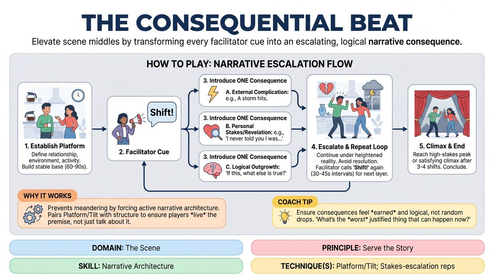

# Consequential Beats

{ .game-hero }

> Elevate scene middles by transforming every facilitator cue into an escalating, logical narrative consequence.

## Overview
A dynamic scene-work exercise designed to cure meandering middles by forcing active narrative escalation. Two players establish a stable base reality, after which the facilitator periodically calls out a shift cue, prompting the players to immediately introduce a major, justified consequence that raises the stakes or complicates their world.

## What It Trains
- **Domain:** D3 — The Scene
- **Principle(s):** Serve the Story; Base Reality First; Yes, And
- **Skill(s):** Narrative Architecture; Raising the Stakes; World-Building; Game Identification; Justification; Offer Reception
- **Technique(s):** Platform/Tilt; Stakes-escalation reps; C.R.O.W. (Character, Relationship, Objective, Where); If this is true, what else is true?; Reincorporation-as-justification
- **Focus:** narrative

**Objective:** To master narrative architecture by practicing the Platform/Tilt technique, ensuring that scenes build progressively through cause-and-effect rather than stalling or resolving too quickly.

## Setup
Two active players stand in the performance space (or on screen for virtual play). The remaining participants act as active observers. No props or special staging are required.

## How to Play
1. Begin a standard two-person scene by establishing a clear, grounded platform: define the relationship, the physical environment, and the immediate activity within the first few lines.
2. Once a stable base reality is established (typically after 60 to 90 seconds), the facilitator calls out 'Shift!' to signal the first narrative turn.
3. Immediately following the cue, one of the active players must introduce a single, significant consequence that directly builds on the established reality.
4. This consequence must take one of three forms: a new external complication, an escalation of personal stakes, or a deep character revelation that justifies past behavior.
5. Apply the 'if this is true, what else is true' principle to ensure the new development is a logical, justified outgrowth of the scene rather than a random, disconnected event.
6. Continue the scene under this heightened reality, avoiding any attempts to quickly resolve the new conflict or wrap up the story prematurely.
7. The facilitator will call 'Shift!' at irregular intervals (every 30 to 45 seconds), prompting subsequent layers of escalation and deeper commitment from the players.
8. Conclude the scene once it reaches a high-stakes peak or a satisfying dramatic climax, usually after three or four shifts.

## Facilitation Notes
- Side-coaching cue: If players hesitate after a shift, call out: 'What is the immediate cost of that?' or 'How does this make your goal harder to reach?'
- Pitfall: Players often introduce random, wacky elements (e.g., 'An alien lands!') instead of logical consequences. Fix: Remind them that the shift must be a direct, believable result of what was just said or done.
- Pitfall: Rushing to solve the problem. Fix: Coach players to sit in the discomfort of the complication and explore its emotional impact before trying to fix it.
- Pacing tip: Keep the intervals between shifts unpredictable. This prevents players from planning their next move and forces them to stay highly present.

## Variations
- Player-Triggered Shifts: Instead of the facilitator calling the shift, off-stage players can clap or call 'Shift!' when they feel the scene is ready for a narrative leap.
- Silent Physical Shifts: The facilitator uses a non-verbal cue (like a hand raise or a bell) to trigger the shift, requiring players to keep their focus entirely on the physical and emotional space.
- Genre-Specific Escalation: Restrict the consequences to fit a specific genre, such as melodrama (heightened emotional stakes) or film noir (darker character revelations).

## Debrief
- How did the pressure of the 'Shift!' cue change your approach to listening and accepting your partner's offers?
- What was the difference in the scene's energy when you escalated the stakes versus when you introduced an external complication?
- How did avoiding early resolution help you discover deeper aspects of your character's relationship?

## Safety & Inclusion
Because escalating stakes can sometimes lead to high-intensity emotional scenarios, remind players that they can raise stakes through comedy, absurdity, or positive passion, rather than relying solely on trauma or conflict. Establish a clear 'cut' signal if anyone needs to reset.

## Why It Works
By pairing the Platform/Tilt technique with a structured trigger, this game prevents the common trap of talking about the scene's premise instead of living it. It forces players to practice active narrative architecture, demonstrating that a scene's momentum relies on the compounding weight of consequences rather than the introduction of new, unrelated ideas.
