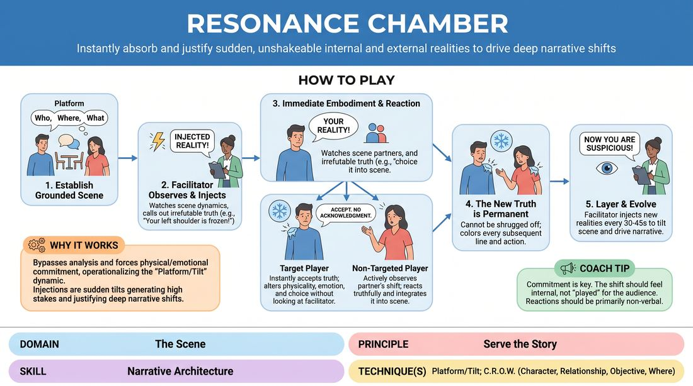

# Resonance Chamber

{ .game-hero }

> Instantly absorb and justify sudden, unshakeable internal and external realities to drive deep narrative shifts.

## Overview
In this exercise, two players establish a grounded scene while a facilitator periodically introduces absolute, unshakeable facts directly into their characters' realities. Players must instantly and seamlessly embody these physical, mental, or emotional shifts without ever acknowledging the facilitator, using them as a powerful engine to evolve the narrative.

## What It Trains
- **Domain:** D3 — The Scene
- **Principle(s):** Serve the Story; Base Reality First; Commit 100%; Yes, And
- **Skill(s):** Narrative Architecture; Justification; World-Building; Stakes / The 'Want'; Emotional Fluidity; Physicality & Space Work; Active Listening; Offer Reception
- **Technique(s):** Platform/Tilt; C.R.O.W. (Character, Relationship, Objective, Where); Justify the absurd; Endowment-acceptance
- **Focus:** narrative

**Objective:** To develop narrative architecture and mastery of the platform/tilt technique by training players to treat sudden, externally imposed changes as deep, permanent internal truths that must be physically and emotionally justified.

## Setup
An open performance space with two chairs (optional). The rest of the group sits as an active audience. The facilitator stands close to the stage area to deliver prompts clearly without disrupting the performance energy.

## How to Play
1. Select two players to step into the performance space and begin a standard, grounded scene, establishing a clear platform (who they are, where they are, and their relationship).
2. The facilitator stands nearby, closely observing the physical, emotional, and narrative dynamics of the scene.
3. Once a stable base reality is established, the facilitator calls out an 'Injected Reality' directed at one or both players (e.g., 'Your left shoulder is suddenly in intense pain' or 'You just realized you don't trust your partner's smile').
4. The targeted player must instantly and silently accept this injection as an absolute, irrefutable truth, immediately letting it alter their physicality, emotional state, and subtext.
5. Players must never break character, look at, or verbally acknowledge the facilitator; the new truth must appear to arise entirely from within the world of the scene.
6. The non-targeted player must actively observe their partner's sudden shift and react truthfully to the physical or emotional change, integrating it into their own understanding of the relationship.
7. The injected truth is permanent; it cannot be shrugged off or treated as a temporary joke, and must continue to color every subsequent line and action.
8. The facilitator continues to inject new realities every 30-45 seconds, layering physical, mental, and emotional shifts to tilt the scene and drive the narrative to a natural climax before calling 'scene'.

## Facilitation Notes
- Ensure the initial platform is fully established before injecting the first truth; introducing shifts too early prevents the audience and players from feeling the impact of the tilt.
- Vary the types of injections: alternate between physical sensations (e.g., 'the room is freezing'), internal thoughts (e.g., 'you suspect they are about to fire you'), and emotional states (e.g., 'you feel a sudden wave of profound gratitude').
- Pitfall: Players treating the injection as a temporary gag or acknowledging it verbally right away ('Oh, my leg is asleep!'). Fix: Side-coach them to show it physically first, letting the partner discover the change.
- Pitfall: Facilitator over-injecting and overwhelming the players. Fix: Give each injection at least 3-4 lines of dialogue to breathe and settle into the scene's architecture before introducing another.

## Variations
- Focus Rounds: Run rounds where the facilitator only injects physical/sensory truths, then emotional truths, to build specific muscle groups before mixing them.
- Three-Way Resonance: Run the scene with three players, injecting truths that complicate the triadic relationship or create secret alliances.
- Silent Resonance: Play the entire scene in silence, relying purely on physical and spatial justification of the injected sensory and emotional truths.

## Debrief
- How did incorporating an absolute truth change your character's immediate objective or 'want'?
- What was the difference between verbally explaining a shift versus letting it live in your body first?
- How did the 'Injected Realities' help move the story forward when the scene felt like it was plateauing?
- As the non-targeted partner, how did you balance supporting your partner's new reality while maintaining your own integrity?

## Safety & Inclusion
Because injections can introduce sudden physical or emotional states, establish beforehand that players can non-verbally signal a boundary if an injection touches on a sensitive personal topic, in which case the facilitator will immediately offer an alternative injection.

## Why It Works
By bypassing the analytical mind and forcing immediate physical and emotional commitment, this game operationalizes the 'Platform/Tilt' dynamic. The injections act as sudden tilts that players must justify, instantly generating high stakes and complex narrative architecture. It teaches that plot is not planned, but rather discovered through deep, responsive justification of the present moment.
