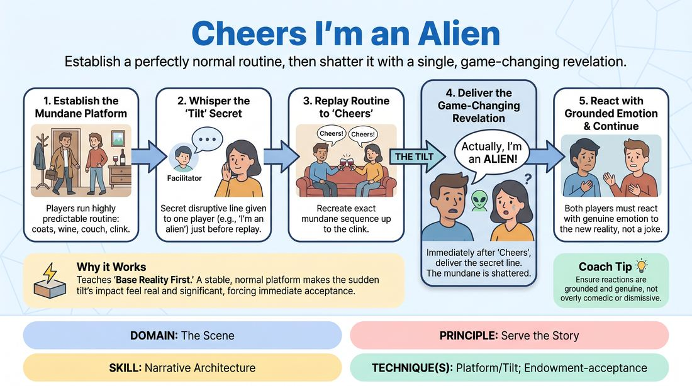

# The Cheers Tilt

{ .game-hero }

> Establish a perfectly normal routine, then shatter it with a single, game-changing revelation.

## Overview
Two players perform a highly predictable, mundane sequence of actions to establish a solid base reality. Once this platform is set, the scene is replayed, but one player is secretly given a disruptive line to deliver at the climax of the routine, forcing both players to navigate the sudden narrative shift with realistic reactions.

## What It Trains
- **Domain:** D3 — The Scene
- **Principle(s):** Yes, And; Base Reality First; Serve the Story
- **Skill(s):** Offer Reception; Narrative Architecture; Justification
- **Technique(s):** Endowment-acceptance; Platform/Tilt; Justify the absurd
- **Focus:** narrative

**Objective:** To master the 'Platform and Tilt' technique by building a stable base reality first, and then introducing a narrative disruption that must be justified and integrated realistically.

## Setup
Two chairs placed side-by-side to represent a couch. The rest of the playing space is clear. The facilitator prepares a few disruptive, high-stakes lines to whisper to one of the players before the second run.

## How to Play
1. Select two players to step into the performance space and explain the basic scenario: they are returning to one of their homes after a pleasant first date.
2. Instruct the players to run a brief, highly predictable scene: they enter the house, hang up coats, offer and accept a glass of wine, sit on the couch, clink glasses, say 'cheers', and freeze.
3. Have the players run this exact sequence once to establish a clean, mundane 'platform' with clear physical environment work.
4. Before running it a second time, pull one player aside and whisper a secret, disruptive line (the 'tilt') that they must deliver immediately after saying 'cheers' (e.g., 'I am an alien' or 'I only have one minute to live').
5. Begin the second run of the scene. The players must recreate the exact same mundane platform up to the 'cheers' moment.
6. Immediately after the clink and 'cheers', the designated player delivers their secret tilt line.
7. The scene continues past the freeze point. Both players must react to the revelation with genuine, grounded emotion, treating the tilt as absolute reality rather than a joke.

## Facilitation Notes
- Side-coach players to keep the initial platform as normal and detailed as possible; the bigger the contrast, the more impactful the tilt.
- Pitfall: The non-tilted player laughs off the revelation or treats it as a joke. Fix: Side-coach them to react with high stakes and genuine belief. If someone says they are an alien, demand proof or react with fear/wonder.
- Encourage the player delivering the tilt to say it with absolute sincerity rather than a comedic wink to the audience.
- Ensure the physical environment (the glasses, the couch) remains consistent even after the narrative chaos begins.

## Variations
- Varying the Tilt: Use different prompts such as 'I'm actually your long-lost sibling,' 'This is a simulation,' or 'I stole this house.'
- The Silent Tilt: Instead of a spoken line, the tilted player introduces a physical tilt (e.g., they suddenly start floating, or they reveal a third arm using object work).
- The Double Blind: Whisper different, conflicting secrets to both players that they must reveal simultaneously after the toast.

## Debrief
- How did establishing a highly detailed, mundane platform make the sudden disruption more satisfying to play?
- For the receiving player, what was the balance between initial disbelief and eventual acceptance of the new reality?
- How does treating an absurd tilt with absolute sincerity change the comedic and dramatic quality of the scene?

## Safety & Inclusion
Since the scenario involves a date returning to a home, explicitly establish that this is a platonic or low-stakes social interaction. Players can opt out of romantic framing entirely, treating the characters as roommates, business partners, or friends returning from an event.

## Why It Works
By separating the scene into a distinct platform phase and a tilt phase, players learn the value of 'Base Reality First.' Without a stable, normal platform, a bizarre revelation has no weight. The sudden tilt forces immediate offer reception and rapid justification, which are core to narrative architecture.
