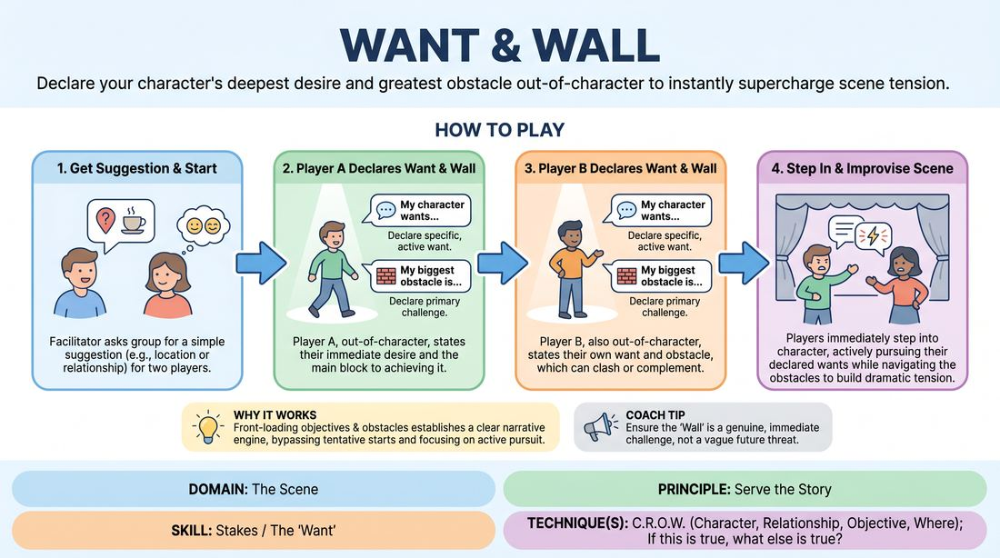

# Want and Wall

{ .game-hero }

> Declare your character's deepest desire and greatest obstacle out-of-character to instantly supercharge scene tension.

## Overview
A structured scene-initiation exercise where players step out of character to explicitly state their character's immediate goal and the primary obstacle blocking them. Once both players have declared their parameters, they step into the scene to actively pursue their objectives, creating immediate dramatic tension and clear narrative architecture.

## What It Trains
- **Domain:** D3 — The Scene
- **Principle(s):** Serve the Story; Make Your Partner a Genius
- **Skill(s):** Stakes / The 'Want'; Narrative Architecture; World-Building; Offer Reception; Active Gifting
- **Technique(s):** C.R.O.W. (Character, Relationship, Objective, Where); If this is true, what else is true?
- **Focus:** narrative

**Objective:** To develop the ability to rapidly identify, articulate, and commit to high-stakes character desires and immediate obstacles, establishing a robust narrative engine from the very first line.

## Setup
An open playing space for two players, with the remaining group acting as observers. No props or special materials are required. The facilitator secures a simple suggestion of a location or a relationship to inspire the scene.

## How to Play
1. Select two players to step up to the stage and obtain a simple suggestion from the group, such as a location or a relationship.
2. Before the scene begins, Player A steps forward out-of-character and declares their character's specific, active want for the scene using the formula: 'My character wants to [active goal].'
3. Player A immediately follows this by declaring their primary obstacle: 'My character's biggest obstacle right now is [specific challenge].'
4. Player B then steps forward out-of-character and makes their own two declarations using the same formula, choosing a want and an obstacle that can either clash with or complement Player A's choices.
5. As soon as Player B finishes their declaration, both players physically step into the performance space, instantly adopting their characters and initiating the scene.
6. Players improvise the scene, prioritizing the active pursuit of their declared wants while navigating the friction of their declared obstacles.
7. The scene continues until the conflict reaches a natural climax, resolution, or a shift in stakes, at which point the facilitator edits the scene.

## Facilitation Notes
- Ensure wants are active and specific. Coach players away from passive states like 'I want to be happy' toward active goals like 'I want to convince my partner to sign the lease.'
- Encourage relational obstacles. An obstacle that is directly tied to the other character's presence or actions creates immediate, productive dramatic tension.
- If players drift from their declared objectives during the scene, gently side-coach them by asking: 'How does this action serve your declared want?'
- Watch out for polite negotiation. Remind players that obstacles are meant to be struggled against, not immediately compromised away.

## Variations
- Secret Desires: Players write down their wants and obstacles on slips of paper and hand them to the facilitator, playing the scene with these objectives hidden from their partner.
- The Relational Pivot: Players must make their want entirely about changing the other character's mind or behavior, and their obstacle must be a specific trait of that character.
- Three-Way Friction: Introduce a third player who must declare a want and obstacle that directly intersects with or disrupts the existing dynamic of the first two players.

## Debrief
- How did explicitly knowing your partner's want and obstacle change how you received their offers?
- What tactics did you find yourself using to bypass your obstacle, and how did those tactics evolve?
- Did declaring your objectives beforehand make it easier or harder to maintain consistent character choices?
- How did the collision of your wants naturally build the narrative structure without needing to plan the plot?

## Safety & Inclusion
Since players explicitly declare their wants and obstacles out-of-character, this phase can be used to establish boundaries. Players should avoid declaring wants or obstacles that touch on personal triggers or non-consensual physical contact, ensuring a safe and collaborative playing environment.

## Why It Works
By front-loading the 'Objective' and 'Obstacle' elements of dramatic structure, this game bypasses the tentative 'seeking' phase of scene starts. It establishes a clear narrative engine where every line of dialogue and physical action becomes a tactic to achieve a goal, naturally generating high stakes and compelling storytelling.
