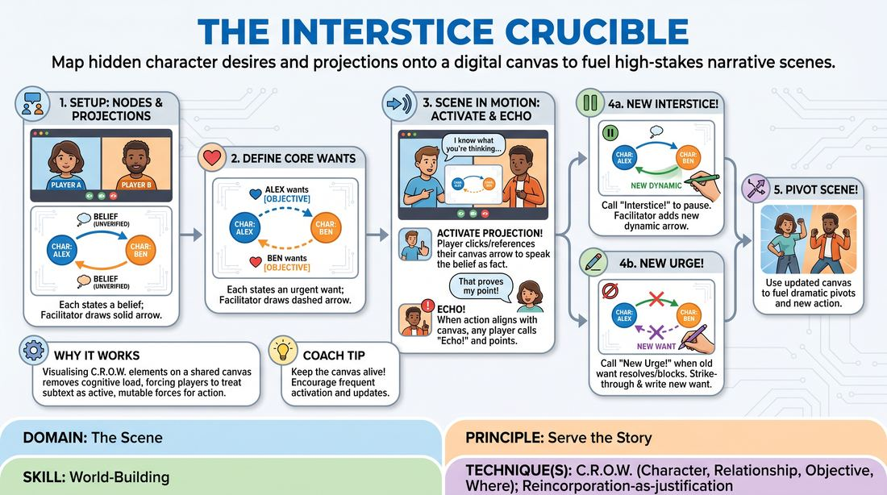

# The Relational Crucible

{ .game-hero }

> Map hidden character desires and projections onto a digital canvas to fuel high-stakes narrative scenes.

## Overview
A structured narrative game where players map their characters' unspoken assumptions and core desires onto a shared digital whiteboard before and during a scene. By actively activating, echoing, and updating these visual relationship lines, players transform subtext into an explicit, dynamic engine for dramatic action.

## What It Trains
- **Domain:** D3 — The Scene
- **Principle(s):** Serve the Story; Make Your Partner a Genius; Vulnerability
- **Skill(s):** World-Building; Narrative Architecture; Stakes / The 'Want'; Justification; Active Gifting; Active Listening; Emotional Fluidity
- **Technique(s):** C.R.O.W. (Character, Relationship, Objective, Where); Reincorporation-as-justification; Endowment-gifting drills
- **Focus:** narrative

**Objective:** To master C.R.O.W. (Character, Relationship, Objective, Where) and narrative architecture by externalizing subtext, forcing players to actively justify their actions based on established relational stakes and evolving character wants.

## Setup
Designed for a virtual platform with a shared digital whiteboard. Three to five players join the virtual space. The facilitator prepares a blank canvas with space to draw nodes for each player. The group establishes a single, high-stakes location and circumstance without defining specific character details yet.

## How to Play
1. Establish Character Nodes: Each player chooses a character name and a basic archetype, which the facilitator writes as a node on the shared digital canvas.
2. Map Initial Projections: In turn, each player states one unverified belief or judgment they hold about another character. The facilitator draws a solid arrow from the perceiver to the target, labeling it with this projection.
3. Define Core Wants: Next, each player states one urgent objective they desperately want from another character. The facilitator draws a dashed arrow representing this want between the characters.
4. Begin the Scene: Players start improvising the scene in the established virtual setting, using their video feeds to perform while keeping the shared digital canvas visible.
5. Activate Projections: At any point, a player can verbally reference or click a projection arrow connected to them on the canvas, immediately using that belief as the direct, internal justification for their next dramatic choice.
6. Trigger an Echo: If a player's action strongly aligns with or contradicts a mapped projection or want, any player can call out 'Echo!' and point to that canvas line. The active player must instantly justify their behavior in relation to that truth.
7. Map New Interstices: When a new relationship dynamic naturally emerges, any player can call 'Interstice!' to briefly pause the scene. The facilitator adds a new labeled arrow to the canvas, and play immediately resumes.
8. Pivot with New Urges: If a character's core want is fully resolved or permanently blocked, the player declares 'New Urge!', strikes through the old want on the canvas, and establishes a new, higher-stakes objective directed at another character.

## Facilitation Notes
- As the virtual facilitator, keep your digital drawing tool active and responsive. Quickly sketch arrows and type labels so the visual map updates in real-time without stalling the players' momentum.
- Side-coach players to avoid intellectualizing. If a player pauses too long when an 'Echo' is called, coach them with: 'Don't think, react from your character's gut!'
- Watch out for players ignoring the canvas. If the scene becomes a generic conversation, gently prompt: 'Look at the canvas—what does your character want from them right now?'
- Ensure 'Interstice' pauses are lightning-fast. The player calling it should state the new dynamic in five words or less to keep the scene's heat alive.

## Variations
- Silent Subtext: Play the entire scene with players only communicating through physical actions and object work, relying entirely on the canvas updates to track the narrative progression.
- Secret Projections: The facilitator privately messages the projections and wants to players, mapping them on a canvas visible only to the audience, forcing players to discover the web of subtext purely through play.

## Debrief
- How did having your character's internal thoughts visually mapped change the way you listened and responded to your partner?
- What did it feel like to pivot to a 'New Urge' once your initial objective was met or defeated?
- How did the 'Echo' mechanic help you justify unexpected choices and deepen the scene's narrative architecture?

## Safety & Inclusion
Since this game externalizes intense interpersonal dynamics and wants, establish a pre-scene boundary check. Players can designate specific emotional themes or relationship dynamics as 'off-limits' before mapping projections on the canvas.

## Why It Works
By visualising the C.R.O.W. elements on a shared canvas, the game removes the cognitive load of remembering complex subtext. It forces players to treat relationships and objectives as active, mutable forces. The 'Echo' and 'Urge' mechanics act as a narrative engine, ensuring that every line of dialogue is fueled by a clear want and justified by a deep relational history.
