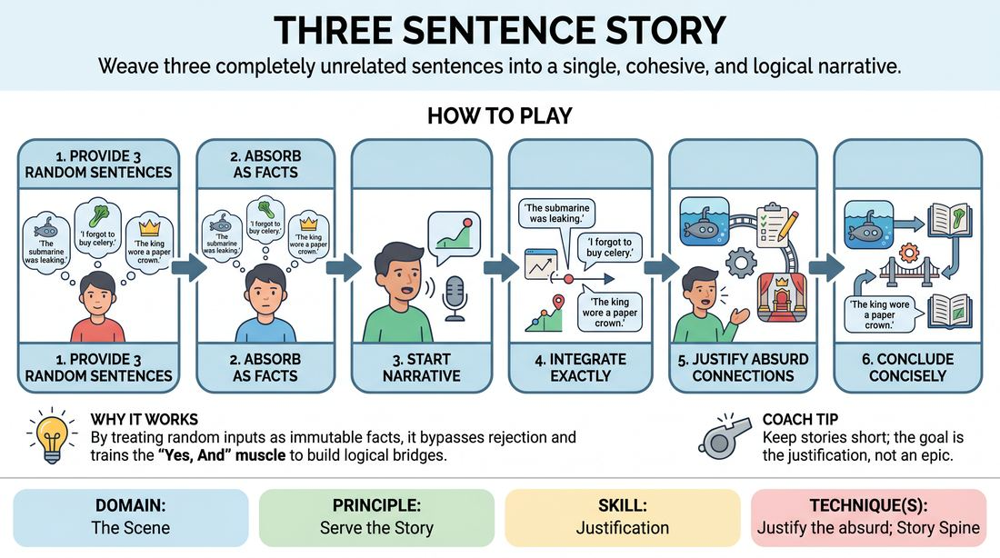

# Three-Sentence Synthesis

{ .game-hero }

> Weave three completely unrelated sentences into a single, cohesive, and logical narrative.

## Overview
Two players collaborate to build a bridge of logic between three wildly disparate statements. One player provides three random, unconnected sentences, and the other must construct a brief, coherent story that naturally incorporates all three. The challenge lies in making the transitions feel earned and logical, rather than forced.

## What It Trains
- **Domain:** D3 — The Scene
- **Principle(s):** Serve the Story; Yes, And
- **Skill(s):** Justification; Narrative Architecture; Offer Reception
- **Technique(s):** Justify the absurd; Story Spine; Endowment-acceptance
- **Focus:** narrative

**Objective:** To develop rapid justification skills, narrative architecture, and the ability to accept and integrate highly absurd or disparate offers seamlessly into a story.

## Setup
Two players stand facing each other in the performance space. No props or physical setups are required. The rest of the group acts as an active audience.

## How to Play
1. Player A generates three completely unrelated, distinct sentences (for example: 'The submarine was leaking,' 'I forgot to buy celery,' and 'The king wore a paper crown').
2. Player B takes a brief moment to absorb all three sentences, treating them as absolute truths within the upcoming narrative.
3. Player B begins telling a short, chronological story, aiming to use the three sentences as key plot points or dialogue within the narrative.
4. Player B must deliver the three sentences exactly as they were given, without altering their wording.
5. Player B focuses on 'justifying the absurd' by creating logical, cause-and-effect connections that explain why these three disparate events or statements coexist.
6. The story concludes as soon as the third sentence is successfully integrated and the narrative loop is closed, keeping the overall tale as concise as possible.
7. Players swap roles, with Player B now providing three new random sentences for Player A.

## Facilitation Notes
- Side-coach players to avoid 'and then' storytelling; encourage 'therefore' or 'because of this' to build strong narrative logic.
- Pitfall: Player B simply listing the sentences one after another without building a bridge. Fix: Pause the player and ask them to explain the connection between sentence one and sentence two before moving on.
- Encourage Player A to provide sentences with different emotional tones or contexts to stretch Player B's justification muscles.
- Remind players that the goal is the shortest possible coherent story, which forces them to find direct, elegant pathways of justification rather than rambling.

## Variations
- The Relay: Player A gives sentence one, Player B gives sentence two, and a third player must tell the story that connects them, ending with a third sentence provided by the audience.
- Blind Integration: Player B starts telling a story, and Player A injects the three random sentences at unexpected intervals, forcing Player B to justify them on the fly.
- Emotional Arc: The three sentences must represent three distinct emotional shifts (such as joy, fear, and triumph) that the storyteller must justify.

## Debrief
- What strategies did you use to find a logical connection between two completely unrelated ideas?
- How does justifying an absurd premise help ground a scene and make it more engaging for an audience?
- Did you find yourself planning the whole story first, or discovering the connections sentence-by-sentence?

## Safety & Inclusion
Ensure that the initial sentences provided do not contain triggering, offensive, or highly sensitive topics, keeping the creative space safe and accessible for all participants.

## Why It Works
By forcing the storyteller to treat three random inputs as immutable facts, the game bypasses the analytical mind's tendency to reject weird ideas. It trains the 'Yes, And' muscle at a structural level, proving that any two points can be connected if the improviser commits to finding the human logic behind the absurdity.
