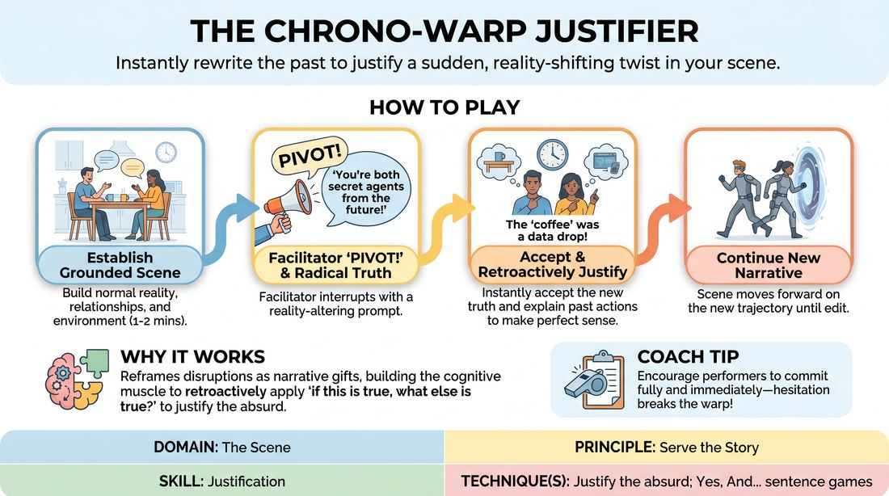

# Retroactive Reality

{ .game-hero }

> Instantly rewrite the past to justify a sudden, reality-shifting twist in your scene.

## Overview
In this high-agility exercise, players initiate a grounded scene only to have a facilitator interject with a radical, reality-altering truth. The performers must immediately accept this disruption and retroactively justify everything that previously occurred so it perfectly aligns with the new premise. The experience is highly cerebral, demanding rapid cognitive shifts to transform apparent contradictions into a seamless, unified story.

## What It Trains
- **Domain:** D3 — The Scene
- **Principle(s):** Yes, And; Base Reality First; Serve the Story
- **Skill(s):** Active Listening; Offer Reception; Game Identification; Narrative Architecture; Stakes / The 'Want'; Justification
- **Technique(s):** Yes, And… sentence games; If this is true, what else is true?; Platform/Tilt; Justify the absurd; Reincorporation-as-justification
- **Focus:** narrative

**Objective:** Develops advanced narrative justification and adaptability. It trains players to treat disruptive, absurd, or contradictory information not as a mistake, but as a hidden truth that explains and elevates all prior actions, thereby serving the integrity of the story.

## Setup
Players stand in a semi-circle facing the performance space. No props or special materials are required. One person acts as the Facilitator, while two or three players step forward to begin the scene.

## How to Play
1. Two players enter the performance space and begin a standard, grounded scene, establishing a clear base reality with defined characters, relationships, and environments.
2. The players build a normal narrative trajectory for one to two minutes, establishing clear relationships, physical object work, and a central conflict.
3. At a pivotal moment, the Facilitator calls out 'Pivot!' followed by a reality-altering prompt that fundamentally redefines an established element of the scene, such as a character's identity, the location, or the true nature of an object.
4. The players must instantly accept this new prompt as absolute truth without pausing, breaking character, or showing frustration.
5. The players immediately begin retroactively justifying their previous actions, dialogue, and emotions, explaining how those prior events make perfect sense under this new, warped reality.
6. The players adjust their characters' immediate motivations, stakes, and relationships to align with the newly established truth.
7. The scene continues along this new narrative trajectory, building on the justified premise until the Facilitator calls an edit.

## Facilitation Notes
- Side-coaching cue: 'Don't ignore the past! Explain why what you did five seconds ago was actually a perfect reaction to this new truth.'
- Pitfall: Players treating the prompt as a joke or a dream. Fix: Coach them to play the new reality with high stakes and absolute sincerity; dreams and jokes deflate the narrative tension.
- Pitfall: Facilitator giving prompts that are too minor or purely additive. Fix: Ensure prompts are structural shifts that redefine relationships, environments, or core motivations.
- Side-coaching cue: 'Find the logic in the absurd. If you were arguing over a pen, and the pen is now a detonator, why were you arguing so casually?'

## Variations
- Double Pivot: Introduce two successive prompts over the course of a single scene, forcing players to layer their justifications.
- Audience Pivots: Have the non-performing players call out the reality-altering prompts instead of the facilitator, training the ensemble's narrative eye.

## Debrief
- How did it feel to have the history of your scene rewritten mid-stream?
- What strategies did you use to make your past actions fit the new reality without discarding them?
- How does retroactively justifying an absurd twist help keep a scene grounded and cohesive?

## Safety & Inclusion
Ensure that reality-altering prompts do not introduce sensitive personal trauma, non-consensual physical touch, or identity-based stereotypes. Players should feel empowered to use a standard pass or pause signal if a prompt crosses a personal boundary.

## Why It Works
This game works because it reframes disruptions as narrative gifts. By forcing players to apply the 'if this is true, what else is true' principle retroactively, it builds the cognitive muscle of justification. Instead of fighting a sudden change, players learn to serve the story by weaving disparate threads into a single, surprisingly logical tapestry.
