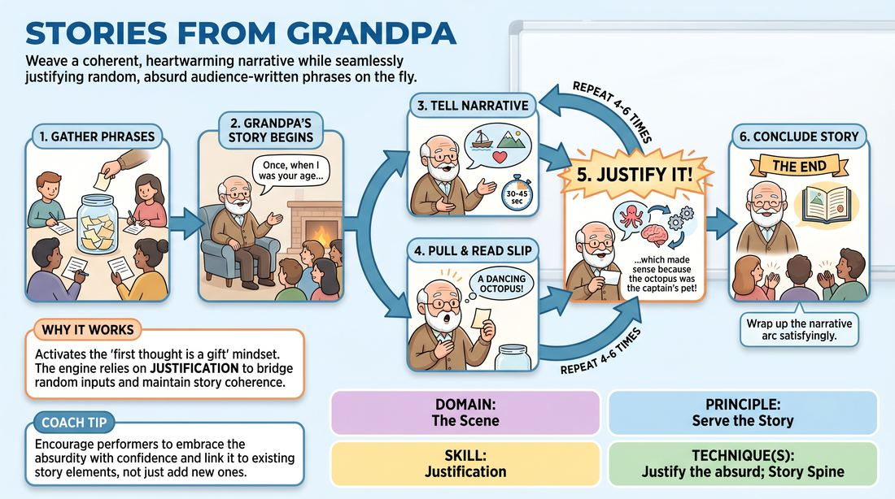

# Grandpa's Tall Tales

{ .game-hero }

> Weave a coherent, heartwarming narrative while seamlessly justifying random, absurd audience-written phrases on the fly.

## Overview
A solo performer takes the stage as an eccentric elder sharing a life story with their grandchildren (the audience). Throughout the monologue, the performer pulls random, pre-written audience phrases from a container and must instantly integrate and justify them as logical parts of the narrative.

## What It Trains
- **Domain:** D3 — The Scene
- **Principle(s):** Serve the Story; The First Thought Is a Gift; The Audience Is the Final Scene Partner
- **Skill(s):** Justification; Narrative Architecture; Unfiltered Spontaneity; Audience-Energy Management
- **Technique(s):** Justify the absurd; Story Spine; First Thought drills; Breaking the 4th Wall / Direct Address
- **Focus:** narrative

**Objective:** This game develops rapid justification skills, narrative flexibility, and the ability to treat unexpected inputs as gifts. It trains performers to maintain a consistent character voice and story arc while seamlessly incorporating absurd, non-sequitur details.

## Setup
Before the performance, audience members write down random phrases, idioms, or bizarre sentences on slips of paper. These slips are folded and placed in a hat or bowl on stage. A single chair is placed center stage for the performer, who acts as the storyteller.

## How to Play
1. The facilitator or performer invites the audience to write down random, out-of-context phrases on slips of paper and place them in a central container.
2. A single performer takes the stage, adopting the persona of an elderly storyteller addressing the audience as their descendants or apprentices.
3. The performer begins telling a narrative, establishing a clear setting, relationship, and initial premise.
4. Every 30 to 45 seconds, or whenever the narrative reaches a natural beat, the performer reaches into the container and pulls out a random slip of paper.
5. The performer reads the phrase aloud to the audience, delivering it as the next line of their story with absolute confidence.
6. Immediately after reading the phrase, the performer must justify why that phrase makes perfect sense within the context of the story, bridging the gap between the established narrative and the new, absurd element.
7. The performer continues this cycle of storytelling, drawing slips, and justifying the contents, ensuring they build toward a satisfying narrative conclusion rather than just a series of disconnected jokes.
8. The story concludes once a natural narrative arc is completed, typically after 4 to 6 slips have been successfully integrated.

## Facilitation Notes
- Encourage the performer to slow down; the magic is in the transition, so let the audience digest the drawn phrase before justifying it.
- If the performer ignores the established story to start a completely new thread for each slip, side-coach them to keep the original thread alive and explain how the new detail fits the current adventure.
- Remind the performer to maintain the physical and vocal characteristics of the elder persona, as this grounded character helps sell the absurdity.
- If the performer gets stuck trying to think of the perfect justification, coach them to speak first and let the first words out of their mouth guide the explanation.

## Variations
- The Multi-Generational Relay: Two performers play a couple or two old friends co-telling the story, taking turns drawing slips and justifying each other's additions.
- The Genre Shift: Instead of an elder, the performer plays a specific genre archetype, such as a hardboiled detective recounting a case or a sci-fi captain logging a mission.

## Debrief
- How did maintaining a strong character voice help you justify the highly absurd phrases?
- What strategies did you use to bridge the gap between the story's reality and the random text on the paper?
- How did the audience's reaction to the drawn phrase influence your pacing and justification?

## Safety & Inclusion
Ensure the container is placed at an accessible height. If a performer has visual impairments, a designated assistant can sit nearby and read the slips aloud to them as if they are reading from an old family journal.

## Why It Works
By forcing the performer to treat random, external inputs as absolute truth, the game activates the first thought is a gift mindset. The narrative engine relies on justification to maintain coherence; when the performer successfully rationalizes an absurd phrase, it satisfies the audience's desire for narrative order, turning potential disruptions into satisfying plot points.
