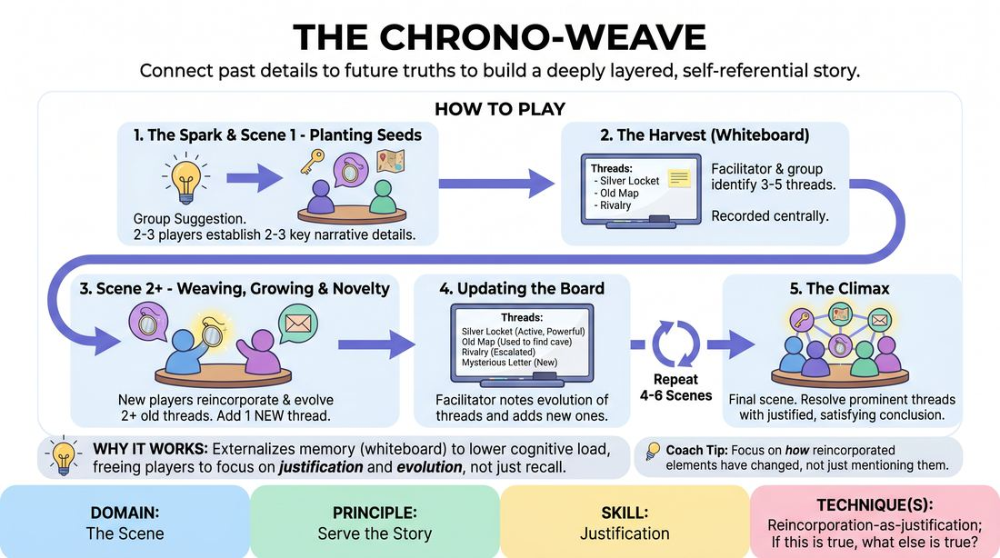

# The Thread Weaver

{ .game-hero }

> Connect past details to future truths to build a deeply layered, self-referential story.

## Overview
A multi-scene narrative game where players systematically track, reincorporate, and evolve story elements across interconnected scenes. Using a shared digital whiteboard, the group builds a collective memory bank of characters, objects, and conflicts, transforming simple callbacks into deep, justified narrative progression.

## What It Trains
- **Domain:** D3 — The Scene
- **Principle(s):** Serve the Story; Group Mind; Serve the Piece
- **Skill(s):** Game Identification; Narrative Architecture; World-Building; Justification; Thematic Synthesis
- **Technique(s):** If this is true, what else is true?; C.R.O.W. (Character, Relationship, Objective, Where); Reincorporation-as-justification; Weave the threads
- **Focus:** narrative

**Objective:** To develop advanced narrative architecture and justification skills, specifically training players to reincorporate established details not as mere jokes, but as evolving story engines that deepen character relationships and world-building.

## Setup
Played virtually. The facilitator shares a digital whiteboard screen (such as Zoom Whiteboard or Miro) visible to all participants. Players keep their cameras on when performing and off when in the audience. No physical props are needed.

## How to Play
1. The Spark: The facilitator gathers a single, open-ended suggestion from the group (e.g., an unusual location or an unresolved relationship dynamic) to inspire the first scene.
2. Scene 1 - Planting Seeds: Two to three players turn on their cameras and improvise a 2-3 minute scene based on the suggestion, focusing on establishing at least three distinct, memorable 'Narrative Threads' (e.g., a physical habit, a mysterious object, a recurring phrase, or an emotional tension).
3. The Harvest: At the end of Scene 1, the facilitator pauses the action and, with input from the players, identifies 3-5 key threads. The facilitator writes these clearly on the digital whiteboard.
4. Scene 2 - Weaving and Growing: Two or three different players step up. Before starting, they select at least two threads from the whiteboard. They must organically integrate these threads into their new scene, evolving their meaning rather than just repeating them.
5. Adding Novelty: During Scene 2, the active players must also introduce at least one brand-new narrative thread.
6. Updating the Board: After Scene 2, the facilitator pauses the action, updates the whiteboard by noting how the selected threads evolved (e.g., 'The silver locket' becomes 'The silver locket containing a map'), and adds the new thread to the list.
7. The Tapestry Expands: Repeat this cycle for 4 to 6 scenes. Players can mix and match, returning to previous characters or playing new ones who are affected by the same threads.
8. The Climax: In the final scene, the remaining players attempt to bring the most prominent threads to a satisfying, justified resolution, tying the overarching narrative together.

## Facilitation Notes
- Coaching Cue: 'Evolve, don't just repeat.' Remind players that if an object or trait reappears, its significance or state should change (e.g., a pristine watch is now broken, or a character's nervous tic is now a sign of courage).
- Pitfall & Fix: Players treat the whiteboard as a rigid checklist, forcing threads in awkwardly. Fix: Side-coach players to let the scene establish its natural platform first, then let the thread enter organically when it makes sense for the character's motivation.
- Coaching Cue: 'If this is true, what else is true?' Encourage players to justify why a thread from a previous scene is appearing in this new context.
- Pitfall & Fix: The whiteboard becomes cluttered with too many minor details. Fix: The facilitator must act as an editor, only listing threads that have high emotional weight or clear potential for development.

## Variations
- Time Jump: Each scene takes place in a different era (e.g., 50 years in the past, present day, 100 years in the future), forcing players to justify how the threads survived or changed over generations.
- Blind Selection: The facilitator assigns specific threads to players privately via chat before their scene starts, forcing them to find surprising ways to weave them in.
- Perspective Shift: Each scene explores the same event or thread from the perspective of a different character, building a multi-faceted view of a single mystery.

## Debrief
- How did having a visible list of threads change your cognitive load compared to normal long-form reincorporation?
- What is the difference between a simple 'callback' and an 'evolving thread' that drives the story forward?
- How did justifying the reappearance of an old thread help you discover new details about your character or relationship?
- How did we balance serving our individual scenes with serving the larger, overarching story?

## Safety & Inclusion
Since this game relies on a shared digital whiteboard and rapid narrative building, ensure players feel comfortable passing on a thread if it touches on personal boundaries. Establish a clear digital 'stop' signal (like typing 'pause' in the chat or using a hand gesture) if a narrative thread evolves into uncomfortable territory, allowing the facilitator to instantly edit or remove that thread from the board.

## Why It Works
By externalizing the group's memory onto a digital whiteboard, the game lowers the cognitive burden of remembering details in long-form improv. This allows players to focus their mental energy on justification and evolution rather than simple recall. It directly trains the 'if true, what else is true' principle by forcing players to find logical, character-driven reasons for why disparate elements are connected, resulting in a highly cohesive narrative engine.
