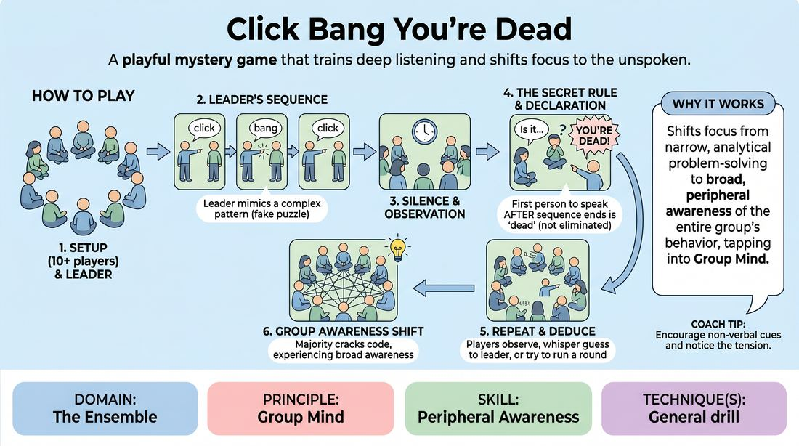

# Click, Bang, Dead

{ .game-hero }

> A playful mystery game that trains deep listening and shifts focus to the unspoken.

## Overview
Players sit in a circle while a leader points and makes sounds, seemingly following a complex pattern. In reality, the game's secret rule relies entirely on who speaks first after the sequence ends. It creates a playful atmosphere of mystery, hyper-focus, and collective observation.

## What It Trains
- **Domain:** D4 — The Ensemble
- **Principle(s):** Group Mind
- **Skill(s):** Peripheral Awareness; Active Listening
- **Focus:** connection

**Objective:** Develops peripheral awareness, active listening, and group mind by training players to look beyond the obvious focal point and tune into the entire room's subtle behaviors.

## Setup
Players sit or stand in a circle. The facilitator (or one designated player) knows the secret rule beforehand. No props are needed.

## How to Play
1. Arrange the group of 10 or more players in a circle.
2. The facilitator, acting as the initial Leader, begins pointing at various players in a sequence.
3. With each point, the Leader says either 'click' or 'bang', deliberately making it look like they are following a complex mathematical or spatial pattern.
4. After a short sequence of points, the Leader stops talking and pointing, creating a moment of silence.
5. The very first person in the circle to speak, ask a question, or make an intentional vocalization after the sequence ends is declared 'dead' by the Leader.
6. The 'dead' player is not eliminated; they remain in the circle and continue playing as normal.
7. The Leader repeats the process, pointing, making sounds, and declaring the first speaker 'dead' each round, allowing the group to try to deduce the secret rule.
8. If a player believes they have figured out the secret, they can whisper it to the Leader or offer to run the next round to prove they understand the mechanic without spoiling it for others.
9. The game continues until the majority of the group has cracked the code and experienced the shift in awareness.

## Facilitation Notes
- Coaching cue: 'Expand your awareness. Don't just watch the pointer; listen to the whole room.'
- Pitfall: Players spoiling the secret. Fix: Instruct players who figure it out to keep it a secret and show they know it by successfully running a round rather than shouting out the answer.
- Pitfall: The silence stretching too long because everyone is afraid to speak. Fix: The leader can prompt the group with a casual question like 'Does anyone have a guess?' to trigger the first speaker.
- Coaching cue: 'Notice where your attention is drawn versus where the actual action is happening.'

## Variations
- Physical Trigger: Instead of speaking, the trigger is the first person to make a specific physical movement, like crossing their arms or shifting their weight.
- The Whisperer: The leader uses different words to add more misdirection, or passes the leadership silently to another player who knows the secret.

## Debrief
- How did your focus shift once you realized the pointing and sounds were a distraction?
- What does this game teach us about where we place our attention during an improv scene?
- How does hyper-focusing on one 'obvious' element prevent us from seeing the bigger picture of the ensemble?

## Safety & Inclusion
Ensure the phrase 'You're dead' is used playfully, or substitute it with a gentler phrase like 'You're caught' or 'Gotcha' if the group is sensitive to violent language. Ensure players with hearing or speech differences are accommodated by allowing non-verbal sounds or clear physical gestures to count as the trigger.

## Why It Works
It forces a shift from narrow, analytical focus (trying to solve a fake puzzle) to broad, peripheral awareness (noticing the behavior of the entire group). This mirrors the transition from overthinking in improv to tapping into the 'group mind' and responding to the actual reality of the moment.
