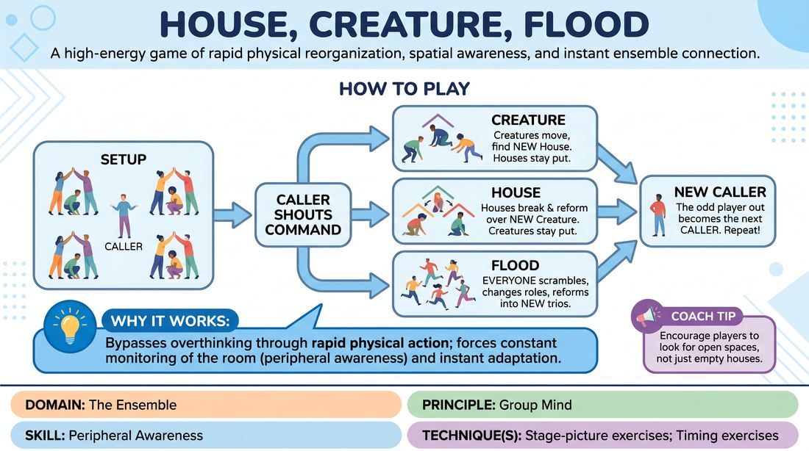

# House, Creature, Flood

{ .game-hero }

> A high-energy game of rapid physical reorganization, spatial awareness, and instant ensemble connection.

## Overview
Players form trios consisting of a two-person 'house' sheltering a single 'creature' inside. When different commands are called, players must instantly dissolve their structures and scramble to form new physical configurations. It is a fast-paced warm-up that demands sharp peripheral vision, quick decision-making, and total physical commitment.

## What It Trains
- **Domain:** D4 — The Ensemble
- **Principle(s):** Commit 100%; Group Mind
- **Skill(s):** Physicality & Space Work; Peripheral Awareness; Pacing & Rhythm
- **Technique(s):** Stage-picture exercises; Timing exercises
- **Focus:** connection

**Objective:** To develop peripheral awareness, rapid physical adaptability, and group mind by forcing players to constantly read the stage picture and fill spatial gaps under pressure.

## Setup
An open, obstacle-free room. Players stand scattered across the space. No props are required.

## How to Play
1. Divide the group into trios, leaving one player in the center without a group to act as the first Caller.
2. Within each trio, two players face each other and raise their arms, touching hands to form the roof of a 'House'.
3. The third player in each trio stands underneath the arched arms, representing the 'Creature'.
4. The Caller stands in the center of the room and calls out one of three commands: 'Creature', 'House', or 'Flood'.
5. If 'Creature' is called, all Creatures must leave their current House and find a new House to stand inside, while Houses must remain stationary.
6. If 'House' is called, all Creatures must stand still while the players forming the Houses must break apart, find a new partner, and build a new House over a different Creature.
7. If 'Flood' is called, all structures dissolve completely and every player must scramble, change roles if they wish, and reform into new trios of two-person Houses sheltering one Creature.
8. Because there is an odd number of players, the Caller also scrambles to find a spot during any command, leaving a new player without a group to become the next Caller.

## Facilitation Notes
- Encourage players to make eye contact and use non-verbal cues to quickly coordinate who is partnering with whom.
- If players hesitate or wait for others to move first, side-coach: 'Commit immediately! Run to the first open space you see!'
- To prevent physical collisions, remind players: 'Keep your eyes up and use your peripheral vision to navigate the space safely.'
- Remind players that they can change roles during a 'Flood'—a former Creature can become part of a House, and vice versa, which keeps the energy dynamic.

## Variations
- Silent Storm: Play the entire game in complete silence, requiring players to rely entirely on visual cues and physical awareness to coordinate.
- Architectural Evolution: Allow players to design unique physical shapes for the 'House' and 'Creature' to increase physical commitment and stage-picture variety.
- The Glitch: Introduce a fourth command, 'Glitch', where everyone must freeze in their current physical shape, creating a sudden, static stage picture.

## Debrief
- How did you use your peripheral vision to find open spaces and partners quickly?
- What did it feel like when you had to instantly let go of your previous group and adapt to a new one?
- How does this game mirror the way we need to support each other and fill gaps during an active improv scene?

## Safety & Inclusion
Since this game involves rapid running and physical proximity, remind players to maintain safe speeds, keep their heads up, and respect personal boundaries. Offer a low-impact option where players walk briskly instead of running, or allow players with mobility limitations to act as permanent 'Creatures' who only need to step to an adjacent house.

## Why It Works
This game works because it bypasses intellectual overthinking through rapid physical action. By forcing players to constantly monitor the entire room (peripheral awareness) and instantly adapt to changing structures, it builds a shared 'group mind' where the ensemble functions as a single, self-organizing organism.
