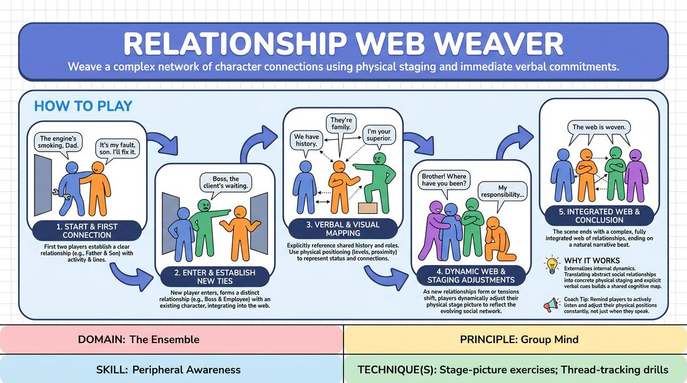

# The Relationship Web

{ .game-hero }

> Weave a complex network of character connections using physical staging and immediate verbal commitments.

## Overview
In this physical and verbal ensemble exercise, players enter a scene one by one to construct an intricate social network. Each new player immediately establishes a distinct relationship with an existing character, while the entire group dynamically adjusts their physical positions to visually map out the evolving web of connections.

## What It Trains
- **Domain:** D4 — The Ensemble
- **Principle(s):** Group Mind; Follow the Follower; Serve the Piece; Yes, And; Make Your Partner a Genius
- **Skill(s):** Peripheral Awareness; Support Work; Suggestion Deconstruction (A-to-C); Active Listening; Active Gifting; World-Building
- **Technique(s):** Stage-picture exercises; Thread-tracking drills; Walk-ons; Endowment-gifting drills; C.R.O.W. (Character, Relationship, Objective, Where)
- **Focus:** connection

**Objective:** To develop high-level peripheral awareness and group mind by training players to physically and verbally map out multi-character relationships in real-time.

## Setup
A moderate playing space with three to eight players standing offstage or in a neutral semi-circle. The facilitator obtains a simple, open-ended location suggestion with no pre-assigned characters or roles.

## How to Play
1. The first player enters the space, establishes a clear physical activity related to the suggested location, and delivers an opening line to set the initial context.
2. A second player enters and immediately establishes a clear, specific relationship with the first player within their first few lines or physical actions.
3. Subsequent players enter the scene one at a time, with each new entrant establishing a distinct relationship with at least one character already on stage.
4. The entering player must integrate their new relationship into the existing web, ensuring their character's presence respects and influences the pre-established dynamics.
5. Players use verbal mapping by explicitly referencing their shared history, roles, or feelings toward one another to keep the social network clear for the ensemble.
6. Players simultaneously use visual mapping by physically positioning themselves, adjusting proximity, and using body language to represent their character's status and emotional distance.
7. As relationships shift or new tensions are introduced, players dynamically adjust their physical staging to keep the visual stage picture reflective of the social web.
8. The scene continues until all players have entered and a complex, fully integrated web of relationships is established, ending on a natural narrative beat or facilitator freeze.

## Facilitation Notes
- Coaching Cue: 'Show us the distance!' Encourage players to use the entire stage space to physically represent emotional distance, tension, or intimacy.
- Pitfall: Players focus too much on plot or solving a problem. Fix: Remind them to focus entirely on how they feel about each other and how their physical proximity reflects those feelings.
- Coaching Cue: 'Find the third point.' When entering, look for how your relationship with Player A affects Player B, creating a triangle of tension rather than isolated duos.
- Pitfall: The stage becomes cluttered and static. Fix: Side-coach players to move dynamically when a new piece of information is revealed, changing the stage picture to reflect the new reality.

## Variations
- Silent Web: Run the entire exercise without any spoken dialogue, relying solely on physical touch, eye contact, proximity, and body language to establish and shift relationships.
- Status Dial: Assign each player a secret status number from 1 to 10 upon entry; players must physically map their relationships based on this hierarchy.
- Historical Layers: New entrants must establish a relationship based on a shared, implied past event, forcing the ensemble to justify a collective history.

## Debrief
- How did the physical distance between players change your understanding of their emotional relationship?
- What challenges did you face when trying to connect to an already complex web of characters?
- How did tracking the entire stage picture help you make your entry more impactful?

## Safety & Inclusion
Ensure players are mindful of physical boundaries when adjusting proximity. Encourage non-contact physical choices (like posture, eye contact, and spatial distance) to represent intimacy or hostility, allowing players to opt out of unwanted physical touch.

## Why It Works
This game works because it externalizes internal character dynamics. By forcing players to translate abstract social relationships into concrete physical staging (stage pictures) and explicit verbal cues, it builds a shared cognitive map. This collective tracking of spatial and emotional threads directly fosters Group Mind and sharpens peripheral awareness.
