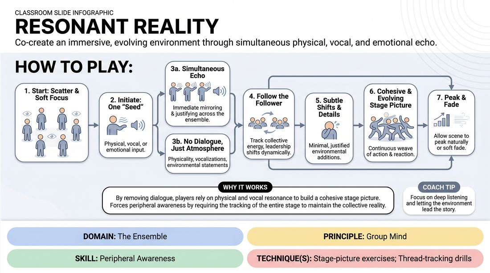

# Atmospheric Resonance

{ .game-hero }

> Co-create an immersive, evolving environment through simultaneous physical, vocal, and emotional echo.

## Overview
Atmospheric Resonance is an ensemble-building exercise where players collectively construct a rich, evolving environment without relying on traditional dialogue. Starting from a single physical or vocal seed, the group works in unison to echo, amplify, and subtly shift the shared reality. The result is a highly connected, physicalized stage picture that feels guided by a single, unified mind.

## What It Trains
- **Domain:** D4 — The Ensemble
- **Principle(s):** Group Mind; Follow the Follower; Base Reality First; Make Your Partner a Genius
- **Skill(s):** Peripheral Awareness; Support Work; Suggestion Deconstruction (A-to-C); Pacing & Rhythm; Thematic Synthesis; World-Building; Active Listening
- **Technique(s):** Stage-picture exercises; Thread-tracking drills; Weave the threads
- **Focus:** connection

**Objective:** To develop deep peripheral awareness and group mind by training players to process multiple simultaneous offers and co-create a physical and emotional landscape without a single designated leader.

## Setup
A group of 4 to 8 players stands in a loose, open circle or scattered throughout a moderate-sized playing space. No props or materials are required. The space should be clear of obstacles to allow for safe, fluid physical movement.

## How to Play
1. Begin with the ensemble standing in a scattered formation across the stage, maintaining soft focus and open physical stances.
2. One player initiates the exercise by offering a single, simple 'seed'—this can be a physical gesture, a non-verbal sound, a single word, or a clear emotional posture.
3. Immediately, without waiting for turns, all other players respond simultaneously by mirroring, amplifying, or justifying the seed's physical and emotional qualities.
4. Avoid direct, conversational dialogue; instead, use physical movement, vocalizations, and atmospheric statements to build the environment.
5. Practice 'Follow the Follower' by tracking the collective energy of the room, allowing leadership to shift dynamically to whoever makes the most resonant physical or vocal adjustment.
6. Introduce subtle shifts to the environment by adding minimal, justified details (e.g., if the group is shivering, one player might look up and shield their eyes, shifting the focus to a blinding blizzard).
7. Maintain a continuous, overlapping weave of action and reaction, ensuring that every movement contributes to a cohesive, evolving stage picture.
8. Allow the scene to naturally peak and fade as the collective energy reaches a logical conclusion, or have the facilitator call a soft fade to end the round.

## Facilitation Notes
- Coaching Cue: 'Expand your vision.' Remind players to use soft focus and peripheral vision to track the entire stage picture, not just their immediate neighbor.
- Pitfall: Players falling into rapid-fire, conversational dialogue. Fix: Side-coach them to strip away sentences and return to physical weight, breath, and environmental sounds.
- Coaching Cue: 'Amplify, don't overwrite.' Encourage players to heighten the existing physical reality (e.g., making a wind sound louder or a shiver more intense) before trying to introduce a brand-new element.
- Pitfall: One player dominating the space and directing the scene. Fix: Remind the group to 'Follow the Follower,' meaning everyone must yield to the collective momentum rather than pushing an individual agenda.

## Variations
- Soundscape Only: Restrict the ensemble entirely to non-verbal vocalizations and physical movement, building the entire environment without a single spoken word.
- Emotional Arc: Assign a starting and ending emotion to the group (e.g., starting in quiet awe and ending in frantic panic), requiring them to transition the atmosphere collectively.
- The Object Focus: Place an imaginary, central object in the space. The players must collectively define its weight, temperature, and danger purely through their physical reactions to it.

## Debrief
- How did it feel to build a scene without relying on conversational dialogue to explain what was happening?
- At what point did you feel the group mind take over, where leadership shifted without anyone speaking?
- How did keeping your physical focus wide alter your ability to support your scene partners' offers?

## Safety & Inclusion
Ensure the playing space is clear of physical hazards. Since players are moving with soft focus, encourage slow, deliberate movements to prevent accidental collisions. Players with limited mobility can participate fully by focusing on vocal resonance, facial expressions, and upper-body gestures.

## Why It Works
By removing conversational dialogue, the game forces players to rely on physical and vocal resonance, which naturally builds a cohesive stage picture. It exercises peripheral awareness because players must track the entire stage to keep the environment consistent. This shared physical commitment bypasses intellectual planning, allowing a true group mind to emerge as players follow the collective momentum rather than individual ideas.
