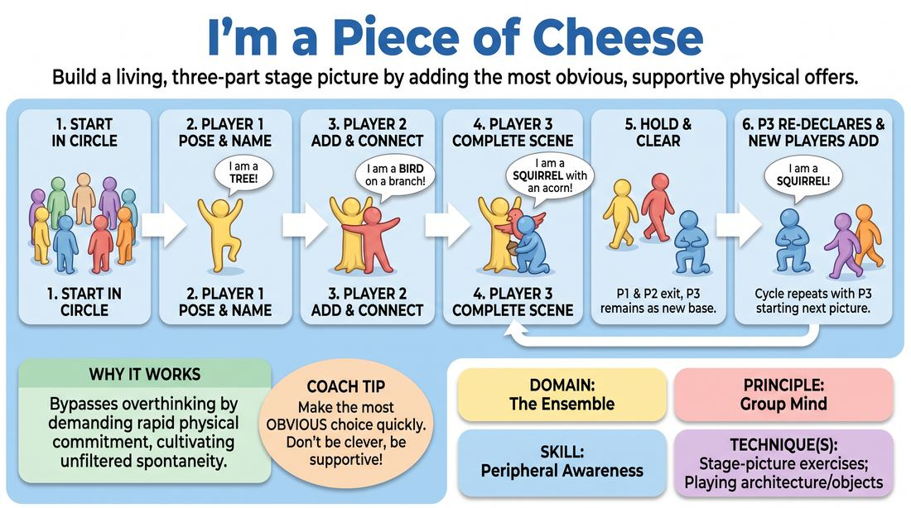

# Three-Part Picture

{ .game-hero }

> Build a living, three-part stage picture by adding the most obvious, supportive physical offers.

## Overview
In this physical ensemble game, players work in rapid succession to build collaborative, three-dimensional stage pictures. One player steps into the space to establish a base object, and two subsequent players quickly add complementary elements to complete the scene. The game emphasizes physical composition, immediate offer reception, and the joy of making the most obvious, supportive choice.

## What It Trains
- **Domain:** D4 — The Ensemble
- **Principle(s):** Group Mind; Follow the Follower; Yes, And; The First Thought Is a Gift
- **Skill(s):** Peripheral Awareness; Support Work; Unfiltered Spontaneity; Physicality & Space Work; Offer Reception
- **Technique(s):** Stage-picture exercises; Playing architecture/objects; First Thought drills; Object work; Endowment-acceptance
- **Focus:** connection

**Objective:** Develops peripheral awareness, physical commitment, and group mind. Players learn to read the stage space, receive physical offers instantly, and support their teammates by completing a visual story without overthinking.

## Setup
Have all players stand in a large circle with a clear open space in the center. No props or materials are required.

## How to Play
1. Begin with all players standing in a circle, facing inward.
2. One player spontaneously steps into the center of the circle, strikes a distinct physical pose, and declares what they are (e.g., 'I am a tree!').
3. A second player must immediately step into the center, strike a pose that physically connects to or complements the first player, and declare their identity (e.g., 'I am a branch on the tree!').
4. A third player steps in to complete the picture, striking a pose and declaring their identity (e.g., 'I am a squirrel sitting on the branch!').
5. Once the three-part picture is fully formed and held for a brief moment, the first two players step back into the circle.
6. The third player remains in the center, holding their pose, but re-declares their identity to start the next round (e.g., 'I am a squirrel!').
7. Two new players step in one by one to build a brand-new picture around this remaining element (e.g., adding an acorn and an oak tree, or a hunter and a dog).
8. Repeat the cycle, ensuring everyone has multiple opportunities to step in and contribute to the stage pictures.

## Facilitation Notes
- Encourage speed over cleverness: The best choices are the most obvious ones. If someone is a tree, be a leaf, a swing, or a bird.
- Focus on physical levels and spatial variety: Remind players to use high, medium, and low levels to make the stage picture visually dynamic.
- Pitfall: Players hesitating at the edge of the circle. Fix: Side-coach with 'First thought, best thought! Run in and commit before you even know what you are going to say.'
- Pitfall: Disconnecting physically. Fix: Encourage players to safely make physical contact (with consent) or use clear spatial proximity to show how the objects relate.

## Variations
- Whole-Group Build: Instead of stopping at three, have the entire group enter one by one to build a massive, complex machine or environment (e.g., a bustling kitchen or a spaceship launchpad).
- Emotional Pictures: Instead of physical objects, players must declare emotional states or abstract concepts (e.g., 'I am Anger,' 'I am Fear,' 'I am Peace') to build an abstract emotional landscape.
- Silent Build: Play the entire game in complete silence, relying purely on physical shapes, eye contact, and spatial relationships to communicate what the objects are.

## Debrief
- How did it feel to make the 'obvious' choice rather than trying to be clever or original?
- How did you use your peripheral vision and spatial awareness to decide where and how to pose?
- What made a stage picture feel cohesive and satisfying to look at?

## Safety & Inclusion
Since this game involves physical proximity and potential contact, establish a boundary rule before playing: players should ask for consent before touching another player, or default to close proximity without physical contact. Ensure the center space is clear of tripping hazards, and offer low-impact physical options (like sitting or standing) for players with mobility considerations.

## Why It Works
This game bypasses the analytical mind by demanding rapid physical commitment. By forcing players to physically enter the space before they have a fully formed idea, it cultivates unfiltered spontaneity. The three-part structure teaches players to look at the stage as a holistic composition, training their peripheral awareness to see what the 'stage picture' needs to feel balanced and complete.
