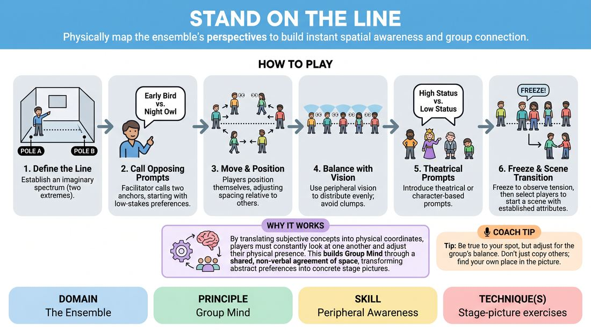

# The Opinion Axis

{ .game-hero }

> Physically map the ensemble's perspectives to build instant spatial awareness and group connection.

## Overview
In this highly visual exercise, players position themselves along an imaginary spectrum in the room based on opposing prompts. It builds immediate group connection and spatial awareness as players physically negotiate their place relative to others. By transitioning from personal preferences to theatrical qualities, it serves as a bridge to physical scene work.

## What It Trains
- **Domain:** D4 — The Ensemble
- **Principle(s):** Group Mind; Vulnerability
- **Skill(s):** Peripheral Awareness; Physicality & Space Work; Unfiltered Spontaneity
- **Technique(s):** Stage-picture exercises
- **Focus:** connection

**Objective:** To develop peripheral awareness, group mind, and stage-picture composition by having players physically organize themselves in space, translating abstract concepts into dynamic theatrical staging.

## Setup
An open room with a clear path from one side to the other. For virtual play, ensure players have their cameras on in gallery view and access to the rename or chat function.

## How to Play
1. Establish an imaginary straight line running from one end of the room to the other, defining the two extreme poles.
2. The facilitator calls out two opposing anchors, starting with low-stakes preferences (e.g., 'Early Bird' vs. 'Night Owl').
3. Players move to position themselves along the spectrum based on their personal preference, adjusting their physical spacing relative to others.
4. Encourage players to use their peripheral vision to distribute themselves evenly, avoiding crowded clumps and balancing the stage picture.
5. Introduce theatrical or character-based prompts (e.g., 'High Status' vs. 'Low Status', or 'High Physical Energy' vs. 'Stillness').
6. Once the line settles on a theatrical prompt, have players freeze and observe the resulting stage picture, noting the narrative tension created by the spacing.
7. Select two or three players from different points on the line to step forward and immediately begin a scene, carrying their established physical attributes and spatial relationship into the play.

## Facilitation Notes
- Side-coaching cue: 'Look at the whole room, not just your immediate neighbors. How does your position balance the overall stage picture?'
- Pitfall: Players rushing to the absolute extremes. Fix: Encourage players to find their precise nuance (e.g., 'Are you an 8 out of 10 or a 10?') to create a continuous, diverse line.
- Side-coaching cue: 'If this frozen line was the opening image of a play, what story does it tell the audience about power, connection, or isolation?'
- Keep the pacing brisk. Spend no more than 30-45 seconds per prompt to keep players out of their heads and moving spontaneously.

## Variations
- Silent Spectrum: Players must position themselves completely silently, relying purely on eye contact, physical intuition, and spatial awareness to negotiate their spots.
- Virtual Gallery Grid: In a remote setting, players use a scale of 1 to 10. They can rename themselves with their number, hold up numbered cards, or adjust their physical distance from their webcams to create a visual foreground/background spectrum.
- Status Line-Up: Players are secretly assigned a number from 1 to 10 representing their character's social status. Without speaking, they must organize themselves in order of status using only physical behavior and eye contact, then play a scene from that lineup.

## Debrief
- How did you use your peripheral vision to balance the space without crowding others?
- When we transitioned to character prompts like status, how did the physical distance between players change the feeling of the room?
- How can we use this awareness of spacing and stage pictures to make our scenic entrances and exits more meaningful?

## Safety & Inclusion
Ensure the physical path is clear of tripping hazards. For players with mobility constraints, the spectrum can be adapted to a seated circle where players use hand gestures (1-10 fingers) or point to indicate their position. Avoid highly sensitive, polarizing, or political prompts to maintain a safe, low-stakes environment for vulnerability.

## Why It Works
By translating subjective concepts into physical coordinates, players must constantly look at one another and adjust their physical presence. This builds Group Mind through a shared, non-verbal agreement of space, transforming abstract preferences into a tangible stage picture that directly informs theatrical staging and character relationships.
