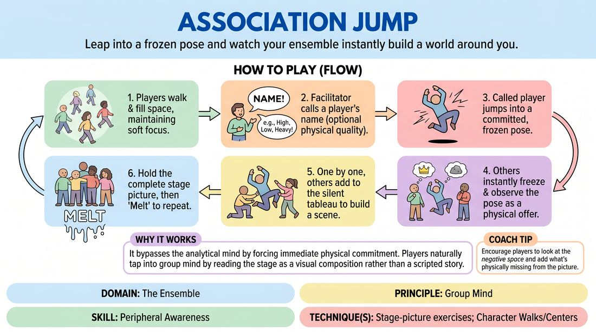

# Association Jump

{ .game-hero }

> Leap into a frozen pose and watch your ensemble instantly build a world around you.

## Overview
A dynamic physical warm-up where players move through the space until one is called to freeze in an expressive pose. The rest of the ensemble instantly reads the physical offer and adds themselves to the stage picture, creating a cohesive, silent tableau.

## What It Trains
- **Domain:** D4 — The Ensemble
- **Principle(s):** Commit 100%; Group Mind; Follow the Follower
- **Skill(s):** Physicality & Space Work; Peripheral Awareness; Support Work
- **Technique(s):** Character Walks/Centers; Stage-picture exercises; Playing architecture/objects
- **Focus:** connection

**Objective:** To develop peripheral awareness, physical commitment, and the ability to read and support a physical offer instantly without verbal planning.

## Setup
A clear, open room with enough space for 8 to 15 players to walk around safely. No props or chairs are needed.

## How to Play
1. Have all players walk around the room at a moderate pace, filling the space evenly and maintaining soft focus.
2. Explain that at any moment, the facilitator will call out one player's name.
3. Upon hearing their name, that player must immediately jump and land in a committed, frozen physical shape.
4. The facilitator may call out a physical quality (such as high, low, heavy, or sharp) just as the name is called to inspire the shape.
5. The rest of the players must instantly freeze in place, observe the main player's pose, and interpret the physical offer.
6. One by one, the remaining players step into the space to add themselves to the tableau, creating a unified stage picture that tells a silent story.
7. Once the entire group has joined the picture and held it for a moment, the facilitator calls melt, and players resume walking to start another round.

## Facilitation Notes
- Encourage immediate, impulsive movement: Tell players to let their bodies decide the shape before their brains can overthink it.
- Watch the negative space: Remind players to look at the overall stage picture and fill gaps to create visual balance.
- Avoid duplication: If the leader takes a high, reaching pose, encourage others to complement it by going low or reacting, rather than copying the pose.
- Keep the energy high: Call names in rapid succession once the group gets the hang of building the pictures quickly.

## Variations
- Silent Transition: Instead of the facilitator calling a name, any player can choose to jump and freeze at any time, triggering the rest of the group to build the picture.
- Soundscape: Once the tableau is complete, the facilitator taps players to make a repetitive sound or a single line of dialogue that fits their character in the picture.
- Emotional Theme: The facilitator calls out an emotion or theme (like betrayal or celebration) that the entire group must embody in the final tableau.

## Debrief
- How did it feel to jump into a pose without knowing what it meant yet?
- How did you decide where to place yourself in relation to the initial pose?
- What did you notice about the balance and story of the stage pictures we created?

## Safety & Inclusion
Ensure players are mindful of physical boundaries and avoid making physical contact unless explicitly agreed upon. Offer low-impact alternatives for the jump, such as stepping firmly into a pose, for players with mobility or joint considerations.

## Why It Works
It bypasses the analytical mind by forcing immediate physical commitment. By focusing on the physical relationship between bodies in space, players naturally tap into group mind and learn to read the stage as a visual composition rather than just a narrative space.
