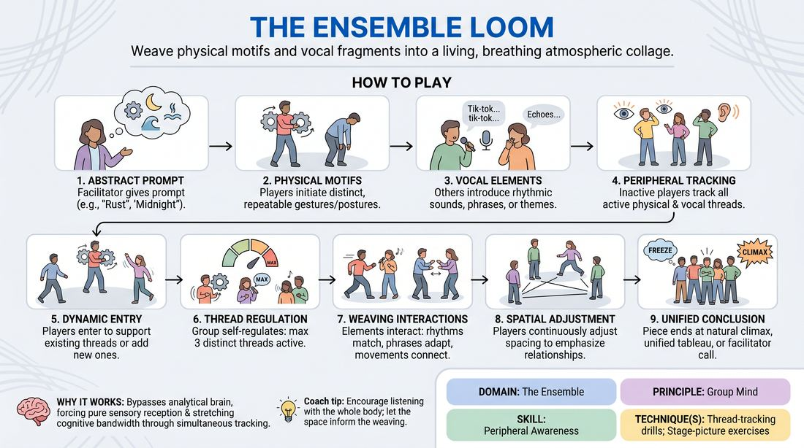

# The Sensory Loom

{ .game-hero }

> Weave physical motifs and vocal fragments into a living, breathing atmospheric collage.

## Overview
A high-focus ensemble exercise where players collaboratively construct a multi-layered performance piece from a single abstract prompt. By layering repetitive physical gestures and vocal fragments, the group builds a complex, non-linear collage that demands deep peripheral awareness and spontaneous cross-modal connection.

## What It Trains
- **Domain:** D4 — The Ensemble
- **Principle(s):** Group Mind; Follow the Follower; Serve the Piece
- **Skill(s):** Physicality & Space Work; Vocal Craft; Peripheral Awareness; Support Work; Pacing & Rhythm; Thematic Synthesis
- **Technique(s):** Stage-picture exercises; Thread-tracking drills
- **Focus:** connection

**Objective:** To develop advanced group mind and peripheral awareness by training players to track, support, and synthesize simultaneous physical and vocal threads into a unified, cohesive stage picture.

## Setup
An open, neutral playing space with clear sightlines. 4 to 8 players stand in a semi-circle, with the facilitator positioned off-stage to observe and offer minimal side-coaching.

## How to Play
1. The facilitator provides an abstract prompt, such as a mood, atmosphere, or concept (e.g., 'Rust', 'Velocity', or 'Midnight').
2. Immediately, one or two players step into the space to initiate distinct, repeatable physical motifs (gestures, movements, or postures) that embody the prompt.
3. Simultaneously, one or two other players step forward to introduce repetitive vocal elements, such as a rhythmic sound, a whispered phrase, or a recurring thematic statement.
4. The remaining players stand on the periphery, using intense peripheral vision and active listening to track all active physical and vocal threads.
5. Inactive players dynamically enter the space to either replicate and support an existing thread (strengthening its presence) or introduce a new, complementary thread into an open gap.
6. To maintain clarity, the group self-regulates to ensure no more than three distinct physical or vocal threads are active at any given time.
7. Active players begin 'weaving' by letting their elements interact: physical movements may speed up to match a vocal rhythm, or a spoken phrase might adapt to mirror a physical gesture.
8. Players continuously adjust their spatial positioning, creating a dynamic visual composition that emphasizes the relationships between the different threads.
9. The piece concludes when the ensemble reaches a natural, unified climax or tableau, or when the facilitator calls 'freeze' to resolve the tapestry.

## Facilitation Notes
- Side-coaching cue: 'Look with your ears and listen with your eyes.' Encourage players to let physical movement inspire vocal shifts and vice versa.
- Pitfall: Players introducing too many new ideas, leading to sensory chaos. Fix: Remind the group to 'follow the follower' and spend more time duplicating and supporting existing threads rather than inventing new ones.
- Side-coaching cue: 'Find the negative space.' Guide players to physically position themselves where they can balance the stage picture, or to speak only during the silences of other vocal loops.
- Pitfall: The piece becoming a linear scene with dialogue. Fix: Intervene early to remind players that this is an abstract, atmospheric collage, not a narrative scene; keep vocalizations to short, repeating loops.

## Variations
- Sensory Deprivation Start: Players begin the first 60 seconds of the exercise with their eyes closed, relying entirely on sound and physical proximity before opening their eyes to weave the visual elements.
- Architectural Anchor: Instead of an abstract word, the facilitator points to a physical feature of the room (e.g., a radiator, a corner, a shadow) to serve as the structural inspiration for all motifs.
- Dynamic Dial: The facilitator calls out 'Sound Only' (all physical movement freezes, and vocalizations swell) or 'Motion Only' (all voices drop to silence, and physical motifs expand) to shift the ensemble's focus.
- Minimalist Constraint: Restrict the entire group to a maximum of two active threads at any time, forcing deep commitment to repetition, slow evolution, and precise duplication.

## Debrief
- How did it feel to shift your focus from creating your own content to supporting and mirroring someone else's thread?
- At what point did you feel the individual elements merge into a single, cohesive 'group mind' piece?
- How did tracking both physical and vocal threads simultaneously challenge your peripheral awareness?
- What cues did you use to communicate transitions or changes in rhythm without speaking out of character?

## Safety & Inclusion
Ensure the physical space is clear of obstacles. Players should be mindful of physical boundaries and avoid making direct, unconsented physical contact during movement. Offer low-impact physical options for players with mobility constraints, emphasizing that small, subtle gestures are just as powerful as large movements.

## Why It Works
This game works because it bypasses the analytical, narrative-driven brain and forces players into a state of pure sensory reception. By requiring simultaneous tracking of physical and vocal loops, it stretches the players' cognitive bandwidth, making peripheral awareness a necessity rather than an afterthought. The repetitive nature of the motifs allows players to safely look outward, find patterns, and practice 'follow the follower' dynamics in real-time.
