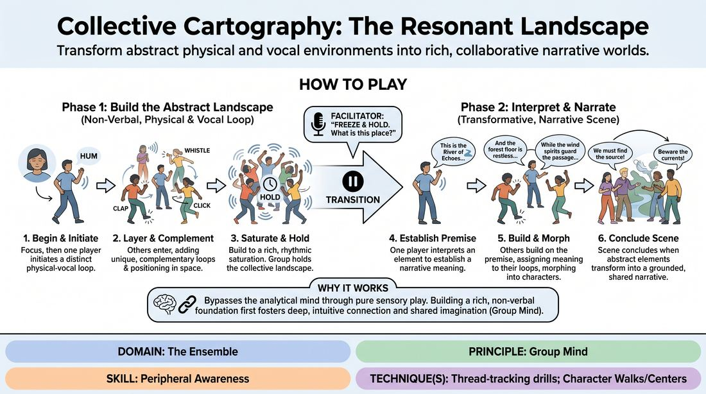

# Resonant Landscapes

{ .game-hero }

> Transform abstract physical and vocal environments into rich, collaborative narrative worlds.

## Overview
Players collaboratively build a dynamic, non-verbal environment using repetitive physical movements and abstract vocalizations. Once this sensory landscape is fully established, the ensemble collectively interprets its elements to unveil a cohesive, emergent story, transforming abstract physical offers into concrete characters and scenes.

## What It Trains
- **Domain:** D4 — The Ensemble
- **Principle(s):** Commit 100%; Serve the Story; Group Mind; Follow the Follower; Serve the Piece
- **Skill(s):** Physicality & Space Work; Vocal Craft; Narrative Architecture; World-Building; Peripheral Awareness; Support Work; Suggestion Deconstruction (A-to-C); Thematic Synthesis
- **Technique(s):** Character Walks/Centers; Vocal characterization; Platform/Tilt; Stage-picture exercises; Thread-tracking drills; Playing architecture/objects; A-to-C drills
- **Focus:** mixed

**Objective:** To develop Group Mind and Peripheral Awareness by tracking multiple physical and vocal threads, ultimately practicing Suggestion Deconstruction (A-to-C) to ground narrative scenes in abstract physical environments.

## Setup
An open, moderate-sized playing space free of obstacles. Players stand in a loose circle or scattered formation. No props or materials are required.

## How to Play
1. Begin with all players standing in a scattered formation. Have everyone close their eyes for 20 seconds to focus on the ambient sounds of the room, then open them to establish soft-focus eye contact.
2. One player initiates the landscape by stepping into the space and performing a single, distinct, and repeatable physical movement paired with a repetitive, non-linguistic sound (e.g., a rhythmic clicking, a low hum, or a sweeping arm gesture).
3. One by one, other players enter the space to add their own unique, repeatable physical and vocal contributions. Each new layer must complement, contrast, or texturize the existing elements rather than copy them.
4. As players add their elements, they must consciously position themselves in the space to define physical relationships, creating a dynamic, multi-sensory map of movement and sound.
5. Continue this non-verbal layering until all players are active and the environment reaches a point of rich, rhythmic saturation. The group holds this collective, looping landscape for several cycles.
6. The facilitator pauses the soundscape by calling 'Freeze and Hold.' Players maintain their physical postures and prepare to transition to the narrative phase.
7. The facilitator offers an open-ended prompt such as, 'What is this place?' or 'What story is trapped in these patterns?'
8. One player speaks first, keeping their physical posture but interpreting a specific element of the landscape (their own or someone else's) to establish a narrative premise.
9. Other players verbally build upon this premise, assigning narrative meaning to their own physical/vocal loops, gradually morphing their abstract movements into concrete characters, objects, or environmental features within the emerging scene.
10. The game concludes when the abstract landscape has fully transformed into a grounded, active scene with clear characters and a shared narrative arc.

## Facilitation Notes
- Coaching Cue: Encourage players to use 'soft focus' to track the entire room's movement and sound, rather than hyper-focusing on just their immediate neighbor.
- Pitfall: Players sometimes make their sounds too loud or movements too frantic, drowning out others. Fix: Remind the group to leave 'sonic space' and physical gaps for others to inhabit.
- Coaching Cue: During the transition to Phase 2, remind players to treat the abstract movements as literal clues. A repetitive hand wave can become a ticking clock, a leaking pipe, or a nervous habit.
- Pitfall: Players completely drop their physical posture when they start speaking. Fix: Side-coach them to 'speak from the movement' and let the physical shape dictate the character's voice and attitude.

## Variations
- Thematic Anchors: Before starting, the facilitator provides an emotional or atmospheric prompt (e.g., 'a place of forgotten memories' or 'a high-tech hive') to guide the abstract phase.
- Silent Mapping: Restrict Phase 1 entirely to physical movement with zero vocalization, forcing players to rely solely on visual tracking and spatial relationships.
- Solo Perspective: Once the landscape is established, one player steps out to perform a monologue as a character visiting this space, treating the remaining players as the living environment.

## Debrief
- How did it feel to transition from a purely abstract physical state into a logical, spoken narrative?
- What strategies did you use to track multiple physical and vocal threads simultaneously during the first phase?
- How did the physical shape you held influence the character or narrative element you eventually voiced?

## Safety & Inclusion
Ensure players are mindful of physical boundaries and personal space when moving dynamically. Offer low-impact physical alternatives (such as seated or micro-movements) for players with mobility constraints, ensuring their vocal and physical contributions remain equally valued in the landscape.

## Why It Works
This game works because it bypasses the analytical mind by starting with pure physical and vocal play. By establishing a rich, non-verbal foundation first, players build a deep, intuitive connection (Group Mind). When the narrative phase begins, the brain naturally seeks patterns and meaning, allowing a complex, cohesive story to emerge effortlessly from the physical architecture already present in the room.
