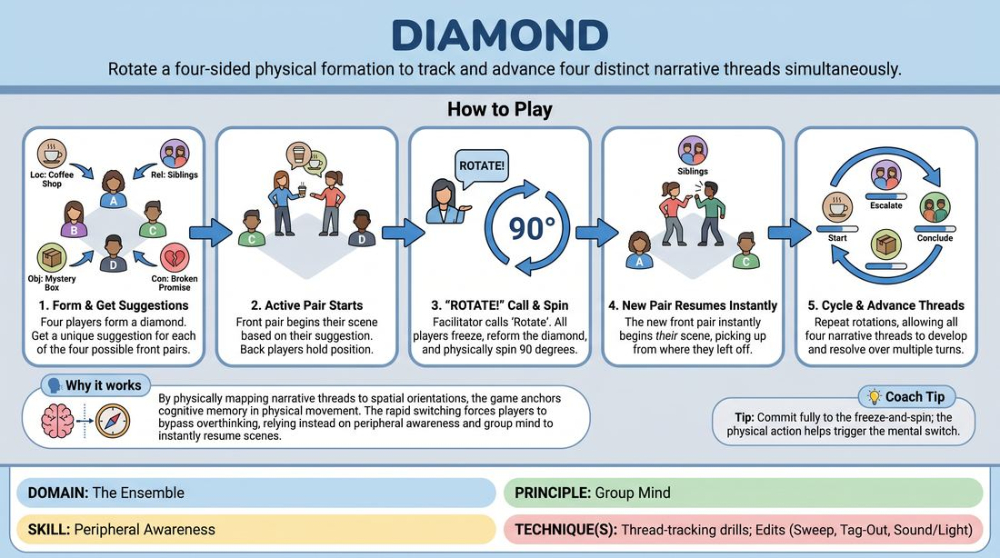

# Diamond Carousel

{ .game-hero }

> Rotate a four-sided physical formation to track and advance four distinct narrative threads simultaneously.

## Overview
Four players stand in a diamond formation, with each of the four physical orientations representing a unique scene. As the facilitator calls for rotations, players physically spin the diamond to bring a new pair to the front, requiring the ensemble to instantly resume and advance their specific storyline. This high-focus exercise challenges players to track multiple narrative arcs, character relationships, and physical states simultaneously.

## What It Trains
- **Domain:** D4 — The Ensemble
- **Principle(s):** Group Mind; Serve the Piece; Serve the Story
- **Skill(s):** Peripheral Awareness; Pacing & Rhythm; Narrative Architecture
- **Technique(s):** Thread-tracking drills; Edits (Sweep, Tag-Out, Sound/Light); Platform/Tilt
- **Focus:** mixed

**Objective:** Develops advanced thread-tracking, narrative architecture, and group mind by forcing players to hold multiple distinct storylines in their active memory and transition between them seamlessly.

## Setup
Four players stand in a diamond formation in the center of the playing space: one at the front (apex), one at the back, one on the left, and one on the right. The remaining workshop participants act as the audience. No props or chairs are needed, but clear floor space is required for rotation.

## How to Play
1. Position four players in a diamond shape: Player A at the front, Player B on the left, Player C on the right, and Player D at the back.
2. Identify the active pair as the two players currently closest to the front (e.g., Player A at the apex and either Player B or C, or simply the front-most pair depending on the exact angle; traditionally, the diamond is oriented so there is a clear 'front two' and 'back two'—let's clarify this: orient the diamond so two players are in the front row and two are in the back row, forming a square rotated 45 degrees).
3. Obtain a unique suggestion (e.g., a location, relationship, or object) for the starting front pair, then rotate the entire formation 90 degrees to the left to bring a new pair to the front and get a second suggestion. Repeat this rotation and suggestion process until all four orientations have a distinct starting prompt.
4. Rotate the formation back to the starting position. The front two players begin an active, fully realized scene based on their suggestion, while the back two players step slightly outward to clear the playing space while maintaining their relative positions.
5. When the facilitator calls 'Rotate Left' or 'Rotate Right', all players must immediately freeze, step back into the diamond formation, and rotate 90 degrees in the designated direction.
6. The new pair now at the front immediately begins their scene based on their original suggestion, establishing characters, setting, and conflict.
7. As the game progresses and the facilitator continues to call rotations, players must instantly resume their previous scenes exactly where they left off, or jump forward in time (e.g., 'one day later') while maintaining narrative continuity, character dynamics, and physical offers.
8. Continue rotating through the four scenes, allowing each narrative thread to develop, escalate, and eventually reach a satisfying conclusion or intersection.

## Facilitation Notes
- Side-coaching cue: 'Track the physical state!' Remind players to resume the exact physical postures and spatial relationships they had when their scene was last frozen.
- Common pitfall: Players forget which scene belongs to which orientation. Fix: Have the facilitator or audience keep a light mental log, but encourage the players to rely on their collective group mind to rescue each other.
- Side-coaching cue: 'Advance the story, don't just loop!' Encourage players to make significant narrative leaps or time jumps (e.g., 'Ten years later...') to keep the scenes dynamic rather than repeating the same beat.
- Ensure the transitions are snappy. The rotation itself should take no more than two seconds, with the new scene starting instantly on the rotation's completion.

## Variations
- Self-Directed Rotation: Instead of the facilitator calling the rotations, any player within the active scene can trigger a rotation by physically initiating the turn or using a verbal narrative cue.
- The Fifth Wheel: Introduce a fifth player who stands in the center of the diamond. When a rotation occurs, the center player must swap out with one of the rotating players, introducing a new character or element to the incoming scene.
- Cross-Pollination: Allow characters or plot elements from one scene to bleed into or influence the adjacent scenes, creating a shared universe.

## Debrief
- How did keeping track of the other three scenes affect your focus and presence in your active scene?
- What strategies did you use to instantly recall your character's physical and emotional state upon rotating back?
- How did the pressure of the rotation help you make bolder narrative choices and edits?

## Safety & Inclusion
Ensure the physical rotation is conducted at a safe, controlled pace to prevent tripping or collisions, especially when players are stepping back into the formation. Modify the physical rotation to simple verbal cues or hand gestures if any player has mobility limitations.

## Why It Works
By physically mapping narrative threads to spatial orientations, the game anchors cognitive memory in physical movement. The rapid switching forces players to bypass overthinking, relying instead on peripheral awareness and group mind to instantly support their partner and maintain narrative integrity across multiple parallel storylines.
