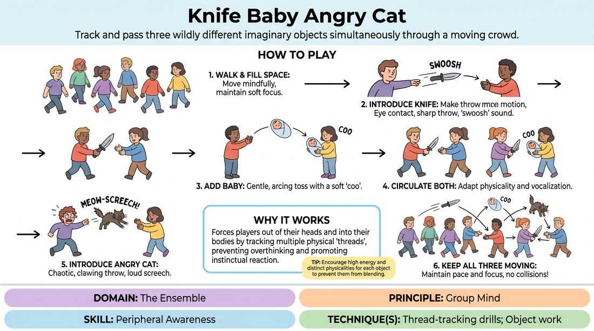

# Knife, Baby, Angry Cat

{ .game-hero }

> Track and pass three wildly different imaginary objects simultaneously through a moving crowd.

## Overview
Players move dynamically through the space while passing multiple imaginary objects—a sharp knife, a delicate baby, and a chaotic angry cat—using distinct physical gestures and vocalizations. As more objects enter the space, players must expand their peripheral vision and maintain absolute focus to keep all threads active without collision. It is a high-energy, focus-shifting warm-up that instantly builds group cohesion.

## What It Trains
- **Domain:** D4 — The Ensemble
- **Principle(s):** Group Mind; Make Your Partner a Genius
- **Skill(s):** Peripheral Awareness; Physicality & Space Work; Active Listening; Offer Reception
- **Technique(s):** Thread-tracking drills; Object work; Endowment-acceptance
- **Focus:** connection

**Objective:** To develop peripheral awareness, multi-thread tracking, and non-verbal connection by demanding high physical commitment and split-second eye contact.

## Setup
An open room free of physical obstacles. Players stand in a loose circle to start, then begin walking around the space at a moderate pace, filling the gaps.

## How to Play
1. Instruct all players to walk around the room at a moderate, mindful pace, constantly filling empty spaces and maintaining soft focus on the entire group.
2. Introduce the first object: an imaginary, heavy throwing knife. Demonstrate throwing it with a sharp, linear motion and a distinct 'swoosh' sound.
3. Explain the rule of engagement: a player must make direct eye contact with a target player, throw the knife, and the target must physically catch it before throwing it to someone else.
4. Once the knife is moving smoothly through the space, introduce the second object: a delicate baby. This must be tossed gently in an arc with a soft, cooing sound ('aww').
5. Allow both the knife and the baby to circulate simultaneously, requiring players to adapt their physical catches and vocalizations to match the specific object received.
6. Introduce the third object: an angry cat. This is thrown with a chaotic, clawing motion and a loud, screeching hiss ('meow-screech!').
7. Challenge the group to keep all three objects moving continuously through the space while maintaining their walking pace and avoiding collisions.

## Facilitation Notes
- Side-coach eye contact: Ensure players do not throw an object until they have locked eyes with the receiver and confirmed they are ready.
- Pitfall: Players dropping their physical commitment and treating all objects with the same generic catch. Fix: Remind them to feel the weight and danger of each specific object (e.g., cradling the baby vs. dodging the cat).
- Side-coach pacing: If the room becomes chaotic, call out 'half-speed movement' to help players rebuild their peripheral awareness before returning to normal speed.
- Pitfall: Hoarding or targeting the same people. Fix: Encourage players to seek out those who haven't received an object recently, expanding their field of vision.

## Variations
- Silent Mode: Remove all vocalizations, forcing players to rely entirely on physical posture, gesture, and intense eye contact to track the objects.
- Object Evolution: Allow the group to invent their own three objects with unique physical weights, trajectories, and sounds.
- Speed Shift: Gradually increase the walking speed of the players from a slow walk to a brisk power-walk while keeping the objects in play.

## Debrief
- How did your field of vision change as we added the second and third objects?
- What non-verbal cues let you know your partner was ready to receive, even from across the room?
- How does this level of split-focus and awareness translate to supporting your scene partners on stage?

## Safety & Inclusion
Ensure the walking pace remains safe for all physical abilities. Players can participate standing still or moving at a slower pace if needed; the group must adapt their throws to meet each player's physical comfort level and mobility.

## Why It Works
This game works because it forces players out of their analytical minds and into their bodies. By tracking multiple distinct physical 'threads' (the knife, baby, and cat), the brain cannot overthink dialogue or narrative; instead, it must rely on pure instinct, peripheral vision, and deep connection with the ensemble to keep the system from collapsing.
