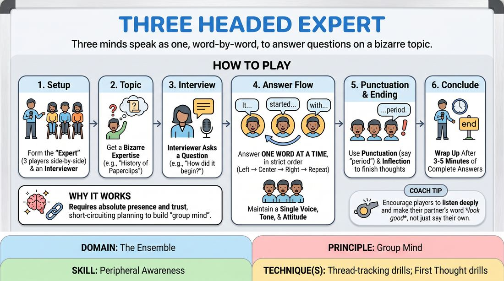

# The Three-Headed Expert

{ .game-hero }

> Three minds speak as one, word-by-word, to answer questions on a bizarre topic.

## Overview
In this classic comedy game, three players sit shoulder-to-shoulder to portray a single, highly specialized expert. Interviewed by a host, the trio must construct answers one word at a time, blending their individual thoughts into a singular, cohesive voice. The result is a hilarious exercise in deep listening, shared control, and spontaneous sentence construction.

## What It Trains
- **Domain:** D4 — The Ensemble
- **Principle(s):** The First Thought Is a Gift; Yes, And; Make Your Partner a Genius; Group Mind; Follow the Follower
- **Skill(s):** Unfiltered Spontaneity; Active Listening; Offer Reception; Peripheral Awareness; Pacing & Rhythm
- **Technique(s):** First Thought drills; Last Word Response; Yes, And… sentence games; Thread-tracking drills; Timing exercises
- **Focus:** comedy_game

**Objective:** To develop group mind, peripheral awareness, and thread-tracking skills by forcing players to surrender individual control and build a single linguistic train of thought together.

## Setup
Arrange four chairs at the front of the playing space. Three chairs are placed side-by-side for the 'Expert,' and one chair is placed slightly offset for the 'Interviewer.' No props or materials are required.

## How to Play
1. Assign one player to be the Interviewer and three players to sit side-by-side as the Three-Headed Expert.
2. The Interviewer asks the group for a highly specific, unusual, or absurd field of expertise, such as 'the world's leading authority on the history of the paperclip.'
3. The Interviewer begins the talk-show style segment by introducing the Expert and asking an opening question about their field.
4. The three players representing the Expert must answer the question by speaking exactly one word at a time, rotating in physical order from left to right, then looping back to the start.
5. Players must maintain a consistent physical posture, vocal tone, and emotional attitude to sell the illusion of being a single person.
6. The Interviewer listens actively, reacting to the Expert's bizarre answers as if they make perfect sense, and asks follow-up questions to probe deeper into the absurd details.
7. The Expert players must use punctuation naturally by saying words like 'period' or 'question mark' to end sentences, or by using vocal inflection to signal the end of a thought.
8. The game concludes after three to five minutes, once the Expert has delivered a few memorable, complete answers and the Interviewer wraps up the segment.

## Facilitation Notes
- Side-coach players to focus on grammar and syntax rather than trying to be funny; the comedy naturally arises from the struggle to maintain a coherent sentence.
- Pitfall: Players planning their words in advance. Fix: Remind them to listen to the word immediately preceding theirs and respond to that word, rather than forcing a pre-planned idea.
- Encourage the Interviewer to call out contradictions or bizarre statements in character, forcing the Expert to justify their previous answers.
- Keep the rhythm steady. If a player hesitates too long, gently snap or clap to keep the tempo moving, emphasizing instinct over calculation.

## Variations
- Emotional Shift: The Interviewer can call out different emotions (e.g., 'sad,' 'excited,' 'suspicious') that the Three-Headed Expert must instantly adopt mid-sentence.
- Physical Synchronization: The three players must also try to synchronize their physical gestures, moving their hands or shifting their weight as one unit.
- The Chorus: Instead of word-at-a-time, the three players attempt to speak entire sentences simultaneously in perfect unison, relying on deep physical and vocal attunement.

## Debrief
- How did it feel to let go of your personal agenda for where the sentence should go?
- What cues did you use to anticipate when a sentence was ending or when a shift in tone was happening?
- How did the Interviewer's reactions help validate and shape the Expert's absurd reality?

## Safety & Inclusion
Ensure players sitting side-by-side are comfortable with close physical proximity. If physical touch or close seating is a barrier, players can stand slightly apart or participate virtually using a clear, established screen-order for speaking.

## Why It Works
This game works because it short-circuits the analytical brain. By limiting players to one word at a time, they cannot plan ahead; they must practice absolute presence and trust their partners to complete their thoughts. It builds 'group mind' by transforming three distinct voices into a single, emergent intelligence.
