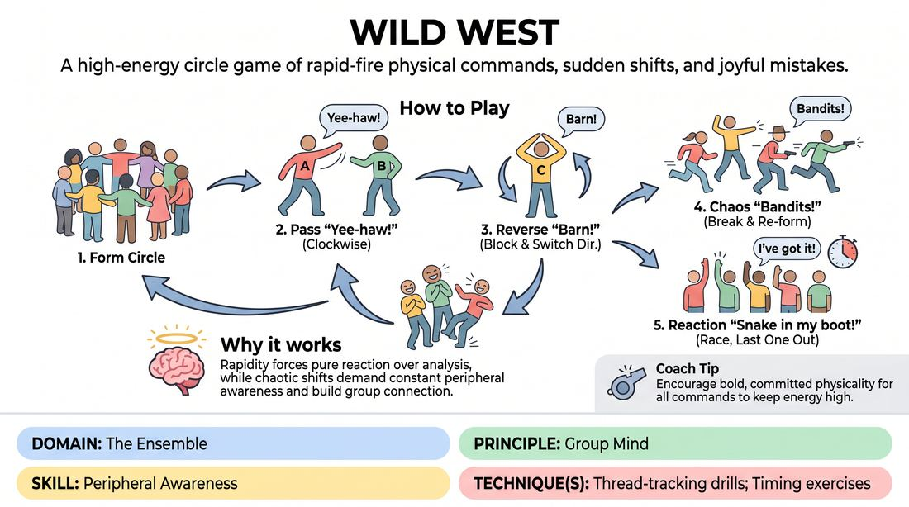

# Wild West

{ .game-hero }

> A high-energy circle game of rapid-fire physical commands, sudden shifts, and joyful mistakes.

## Overview
Players stand in a circle and pass a series of thematic physical and vocal impulses around the group. As the speed increases and new commands are introduced, players must maintain high peripheral awareness and embrace mistakes to keep the momentum alive.

## What It Trains
- **Domain:** D4 — The Ensemble
- **Principle(s):** Group Mind; Fail Joyfully
- **Skill(s):** Peripheral Awareness; Pacing & Rhythm; Unfiltered Spontaneity; Self-Recovery
- **Technique(s):** Thread-tracking drills; Timing exercises; Reframe-the-flub reps
- **Focus:** connection

**Objective:** To build group mind, sharpen peripheral awareness, and practice self-recovery by tracking multiple physical and vocal threads in a high-energy, low-stakes environment.

## Setup
Players stand in a wide circle with plenty of space to move. No props are required.

## How to Play
1. Form a standing circle with all players facing inward.
2. Establish the base impulse: Player A swings an arm across their body toward Player B, shouting 'Yee-haw!' to pass the energy clockwise. Player B passes it to Player C, and so on.
3. Introduce the reverse command: Any player receiving a 'Yee-haw!' can block and reverse the direction by raising their arms overhead to form a roof shape and shouting 'High Barn!'
4. Introduce the chaos command: Any player can shout 'Bandits!' at any time. On this cue, everyone must break the circle, run to a completely new spot, mimic firing imaginary pistols in the air, and reform the circle to resume the game.
5. Introduce the reaction command: Any player can shout 'Snake in my boot!' This triggers a race where everyone must immediately raise one hand and shout 'I've got it!' The last person to do so restarts the 'Yee-haw!' pass.
6. Keep the pace rapid; if someone hesitates, makes a mistake, or stumbles over a command, the group celebrates the error with a quick laugh and immediately restarts the flow without pausing to analyze.

## Facilitation Notes
- Side-coaching cue: 'Keep your eyes on the whole circle, not just your immediate neighbors!'
- Pitfall: Players stopping the game to apologize when they make a mistake. Fix: Coach them to 'fail joyfully' by throwing their hands up, laughing, and immediately launching a new 'Yee-haw!'
- Side-coaching cue: 'Commit fully to the physical shapes—make the barn big and the bandit run high-energy!'
- Pitfall: The rhythm slowing down as players overthink their choices. Fix: Encourage rapid-fire, unfiltered responses; it is better to make a 'wrong' move quickly than a 'right' move slowly.

## Variations
- New Sheriff: Add a command where one player strikes a heroic pose shouting 'New Sheriff in town!' and everyone else must instantly bow.
- Silent Frontier: Play a round entirely in pantomime and silent mouth movements, relying purely on visual tracking and physical cues.
- Saloon Brawl: On the command 'Saloon Brawl!', players must slow-motion mime throwing a punch at the person next to them, who must react in slow-motion before reforming the circle.

## Debrief
- How did your focus shift as we added more commands to track?
- What did you notice about how the group handled mistakes as the game sped up?
- How does keeping your eyes on the entire circle (peripheral awareness) help you react faster than just staring at the person next to you?

## Safety & Inclusion
Ensure the running portion ('Bandits!') is done with awareness of physical boundaries and mobility levels; players can walk quickly or spin in place if running is inaccessible.

## Why It Works
By combining physical gestures with vocal cues, the game engages multiple sensory channels. The rapid-fire nature forces players out of their analytical minds and into a state of pure reaction, while the chaotic 'Bandits' command resets the physical space, preventing stagnation and reinforcing group cohesion.
