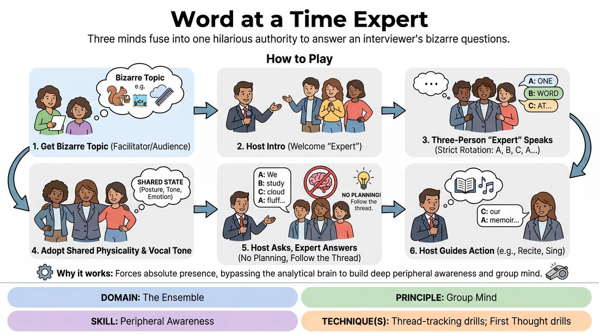

# The Three-Headed Expert

{ .game-hero }

> Three minds fuse into one hilarious authority to answer an interviewer's bizarre questions.

## Overview
A classic improv game where three players stand shoulder-to-shoulder to portray a single, unified expert who speaks one word at a time. A fourth player acts as a talk-show host, interviewing this composite entity about a highly unusual field of expertise. The joy lies in the struggle and triumph of building coherent, funny sentences together without planning ahead.

## What It Trains
- **Domain:** D4 — The Ensemble
- **Principle(s):** The First Thought Is a Gift; Make Your Partner a Genius; Group Mind
- **Skill(s):** Unfiltered Spontaneity; Active Listening; Justification; Peripheral Awareness
- **Technique(s):** First Thought drills; Justify the absurd; Thread-tracking drills
- **Focus:** comedy_game

**Objective:** To develop group mind, active listening, and peripheral awareness by forcing players to track a single linguistic thread and instantly justify the collective direction of a sentence.

## Setup
Four players stand at the front of the playing space. Three players stand shoulder-to-shoulder to form the Expert. The fourth player stands slightly to the side, facing them as the Interviewer. No props or special staging are required.

## How to Play
1. The facilitator or audience provides a bizarre, fictional field of expertise (e.g., underwater basket weaving for squirrels or the history of cloud grooming).
2. The Interviewer begins the scene in the style of a high-energy talk show host, introducing the show and welcoming the Expert.
3. The three players representing the Expert must speak one word at a time, rotating in a strict, continuous sequence (Player A, then B, then C, then A, and so on) to form complete sentences.
4. The Expert players should attempt to adopt a shared physical posture, vocal tone, and emotional state to sell the illusion of being a single person.
5. The Interviewer asks open-ended questions, listens closely to the answers, and treats the Expert's bizarre responses as absolute, logical truth.
6. The Expert players must not plan their words; each player must accept the exact word before theirs and contribute the most obvious next word to keep the sentence grammatically sound.
7. The Interviewer can guide the action by asking the Expert to perform specific tasks, such as reciting a passage from their memoir or singing a short corporate jingle word-by-word.

## Facilitation Notes
- Coaching cue: 'Speak on the breath of the person before you.' Encourage players to eliminate the lag time between words to make the speech sound more natural.
- Pitfall: Players trying to be clever or funny by throwing in curveball words. Fix: Remind them that the humor comes from the collective struggle, not individual cleverness. The most obvious word is always the best word.
- Coaching cue: 'Move as one.' Encourage the three Expert players to share physical gestures. If one raises a hand, the others should follow or support the gesture.
- Pitfall: The Interviewer asking yes/no questions. Fix: Coach the Interviewer to ask 'how' and 'why' questions that force the Expert to elaborate and build a narrative.

## Variations
- Emotional Shifts: The Interviewer can call out different emotions (e.g., sad, terrified, arrogant) that the Expert must instantly adopt mid-sentence.
- Physicalized Expert: The Expert must perform physical tasks together (like demonstrating a tool or showing a dance move) while continuing to speak word-by-word.
- The Translator: Two players speak in a gibberish language word-by-word, while a third player translates their answers into English.

## Debrief
- How did it feel to surrender control of your sentence to two other people?
- What happened when someone tried to force a specific joke instead of saying the most obvious next word?
- How did physical alignment (sharing posture and gestures) help you stay in sync vocally?

## Safety & Inclusion
Ensure players standing shoulder-to-shoulder are comfortable with close physical proximity. If anyone prefers more personal space, they can stand slightly apart or play the Interviewer role. Alternatively, the game can be played with players standing in a semi-circle with clear visual cues instead of physical contact.

## Why It Works
By restricting players to a single word, the game bypasses the analytical brain and forces absolute presence. Players cannot plan ahead; they must track the linguistic thread dynamically. This builds deep peripheral awareness and group mind, as the trio must rely on shared rhythm, physical mirroring, and mutual trust to succeed.
