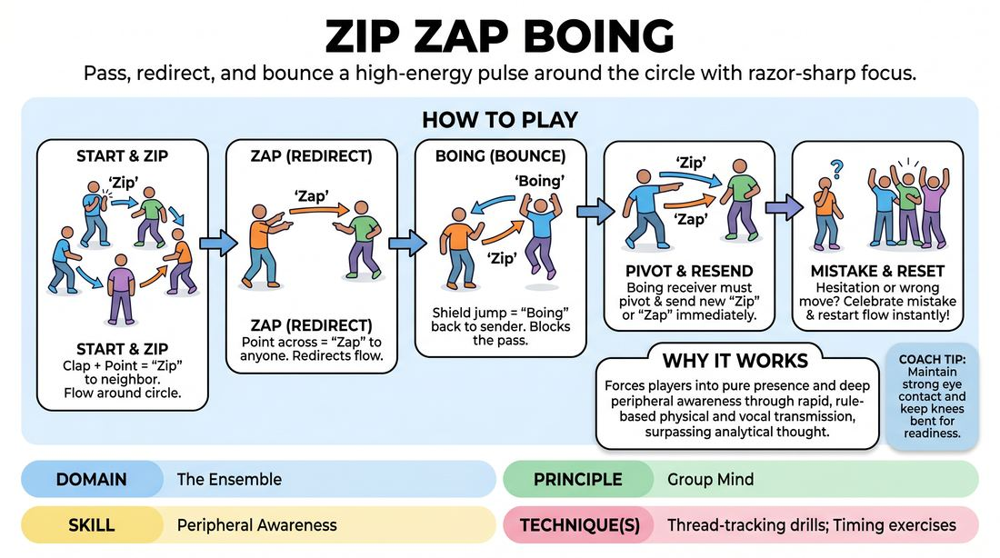

# Zip Zap Boing

{ .game-hero }

> Pass, redirect, and bounce a high-energy pulse around the circle with razor-sharp focus.

## Overview
A high-energy, fast-paced circle warm-up where players pass a vocal and physical impulse using three distinct commands. It demands intense focus, rapid-fire reaction times, and collective rhythm to keep the invisible current of energy moving without dropping the beat.

## What It Trains
- **Domain:** D4 — The Ensemble
- **Principle(s):** Group Mind; Commit 100%; Yes, And
- **Skill(s):** Peripheral Awareness; Pacing & Rhythm; Unfiltered Spontaneity; Active Listening; Offer Reception
- **Technique(s):** Thread-tracking drills; Timing exercises; First Thought drills
- **Focus:** connection

**Objective:** To develop group mind, peripheral awareness, and thread-tracking by training players to receive and pass impulses instantly while maintaining a shared group rhythm.

## Setup
Have all players stand in a clear circle facing inward, with enough space to make eye contact with everyone. No props or materials are required.

## How to Play
1. Stand in a circle and establish a collective, high-energy stance, leaning slightly forward to show readiness.
2. The first player initiates the energy by clapping their hands together, pointing to their immediate neighbor, and saying 'Zip'.
3. The neighbor must immediately pass the energy to their next neighbor in the same direction using the same 'Zip' gesture and vocalization, continuing the flow around the circle.
4. At any point, the player holding the energy can choose to say 'Zap' while making a clear, two-handed pointing gesture across the circle to a specific player, establishing direct eye contact.
5. The player who receives a 'Zap' must immediately take the energy and can choose to pass it to their neighbor with a 'Zip' or send it across the circle with another 'Zap'.
6. Any player targeted by a 'Zip' or 'Zap' can block and return the energy to the sender by jumping slightly, raising their hands like a shield, and saying 'Boing'.
7. If a player receives a 'Boing', they must immediately pivot and send the energy in a new direction using either 'Zip' or 'Zap' to keep the game alive.
8. If a player hesitates, uses the wrong gesture, or speaks out of turn, the group briefly celebrates the mistake, resets the rhythm, and immediately starts a new round.

## Facilitation Notes
- Encourage physical commitment: the gestures should be crisp and deliberate, which helps clarify who is being targeted.
- Watch for 'the lag': if players hesitate when receiving, coach them to make a sound immediately, even if it's the wrong word, to prioritize rhythm over perfection.
- Ensure eye contact: players must look directly at their target when sending a 'Zap' to prevent confusion.
- Keep the energy positive: when a mistake happens, have the group quickly cheer or laugh, then immediately restart to build resilience and keep the pace high.

## Variations
- Double Pulse: Introduce a second, independent 'Zip' moving in the opposite direction, forcing players to track two threads of energy simultaneously.
- Silent Mode: Play the entire game using only the physical gestures and eye contact, completely eliminating the spoken words.
- Gibberish Swap: Replace 'Zip', 'Zap', and 'Boing' with three nonsense words generated by the group on the spot to test adaptability.

## Debrief
- How did your focus shift as the speed of the game increased?
- What did it feel like when the 'group mind' clicked and the rhythm became effortless?
- How does keeping your physical stance active help you receive unexpected offers?

## Safety & Inclusion
Ensure the physical 'Boing' gesture is adaptable; players with mobility limitations can use a simple hand gesture or vocal cue instead of jumping. Encourage clear vocal projection so all players can track the game regardless of visual clarity.

## Why It Works
By combining physical gestures, vocal cues, and rapid decision-making, this game forces players out of their analytical minds and into a state of pure presence. The strict rules of transmission require deep peripheral awareness and active listening, aligning the group's focus into a single, shared 'group mind' thread.
