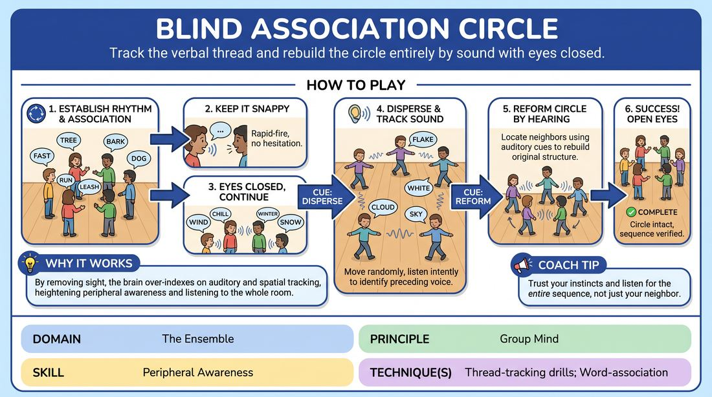

# Sensory Thread Circle

{ .game-hero }

> Track the verbal thread and rebuild the circle entirely by sound with eyes closed.

## Overview
A progressive ensemble drill where players pass a rapid-fire word association around a circle, eventually closing their eyes, dispersing into the space, and attempting to reform their original physical structure purely by tracking the voices of their neighbors. It challenges the group to maintain a shared rhythm and spatial awareness without visual cues.

## What It Trains
- **Domain:** D4 — The Ensemble
- **Principle(s):** Group Mind; The First Thought Is a Gift
- **Skill(s):** Peripheral Awareness; Pacing & Rhythm; Unfiltered Spontaneity; Active Listening
- **Technique(s):** Thread-tracking drills; Word-association
- **Focus:** skill_drill

**Objective:** To develop deep peripheral awareness, active listening, and group mind by forcing players to track a verbal thread and physical positions using only auditory and spatial cues.

## Setup
A large, open room cleared of all obstacles, chairs, and tripping hazards. Players stand in a shoulder-to-shoulder circle.

## How to Play
1. Establish a clear, steady physical circle and initiate a rapid-fire, one-word free association game passing clockwise.
2. Instruct players to keep the rhythm snappy, speaking their associated word immediately after their neighbor without hesitation, trusting their first instinct.
3. Once a steady, uninterrupted rhythm is established, the facilitator gives a verbal cue for all players to close their eyes while continuing the association cycle.
4. On the next cue, players must slowly and carefully begin walking around the room in random directions with their eyes closed, maintaining the verbal association in the exact same sequence.
5. Players must listen intently to identify the voice of the person who precedes them in the sequence, tracking when to speak based entirely on auditory cues.
6. On the final cue, while still keeping their eyes closed and continuing the word association, players must use their hearing to locate their original neighbors and physically reconstruct the circle.
7. The game concludes successfully when the circle is fully reformed, the sequence is intact, and players open their eyes to verify their positions.

## Facilitation Notes
- Coaching cue: 'Listen to the space, not just the words. Track the trajectory of the voice before you.'
- Pitfall: Players moving too fast or running into each other. Fix: Remind them to use 'bumper car hands' (elbows bent, palms out at chest height) and move at a slow, deliberate pace.
- Pitfall: The association chain breaks or stalls when players disperse. Fix: Encourage them to call out their word loudly and keep the rhythm going, even if they miss a turn; the group mind must keep the pulse alive.
- Coaching cue: 'Trust your first instinct. Do not filter or plan your word while wandering.'

## Variations
- Soundscape Shift: Instead of word association, players pass a specific sound or emotional tone, adjusting their physical movement to match the quality of the sound.
- Silent Rebuild: Once dispersed, the word association stops, and players must reform the circle in complete silence, relying purely on physical touch and spatial memory.

## Debrief
- How did your listening shift when you could no longer rely on eye contact to know when it was your turn?
- What strategies did you use to locate your neighbors and reconstruct the circle without sight?
- How does this level of auditory tracking apply to maintaining group mind during a multi-person scene?

## Safety & Inclusion
Ensure the playing area is completely clear of clutter, bags, and furniture before starting. Instruct players to keep their hands up in a defensive, non-threatening posture (palms out, elbows bent) to prevent accidental collisions. Encourage slow, mindful steps. If a player feels disoriented or anxious with eyes closed, they may keep their eyes open but look down at the floor to minimize visual tracking.

## Why It Works
By removing sight, the brain is forced to over-index on auditory and spatial tracking. This heightens peripheral awareness and forces players to listen to the entire room rather than just their immediate surroundings. The physical dispersion breaks the comfort of proximity, requiring deep concentration to maintain the thread, which directly builds the 'group mind' necessary for complex ensemble work.
