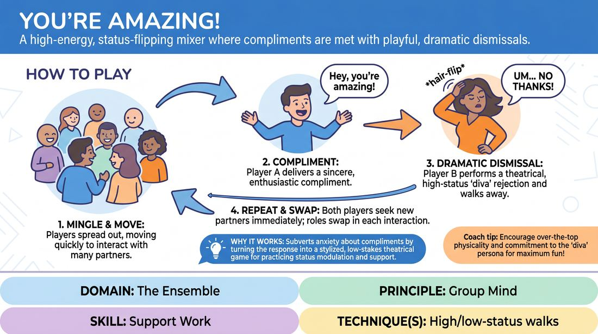

# You're Amazing

{ .game-hero }

> A high-energy, status-flipping mixer where compliments are met with playful, dramatic dismissals.

## Overview
This fast-paced, high-energy closing game invites players to mingle and shower each other with enthusiastic praise, only to be met with over-the-top, high-status rejections. It creates a joyful, laughter-filled atmosphere that subverts social expectations of receiving compliments and celebrates playful failure.

## What It Trains
- **Domain:** D4 — The Ensemble
- **Principle(s):** Group Mind; Make Your Partner a Genius; Fail Joyfully
- **Skill(s):** Support Work; Status Modulation; Unfiltered Spontaneity
- **Technique(s):** High/low-status walks
- **Focus:** connection

**Objective:** To develop status modulation, build ensemble connection, and practice unfiltered spontaneity by turning positive reinforcement into a comedic, low-stakes game of theatrical rejection.

## Setup
An open room with enough space for all participants to move around freely. No props or materials are required.

## How to Play
1. Instruct all players to stand up and spread out across the playing space.
2. Explain that the goal is to mingle and interact with as many different people as possible in a short amount of time.
3. When Player A approaches Player B, Player A must deliver a highly enthusiastic, sincere-sounding compliment: 'Hey, you're amazing!'
4. Upon receiving the compliment, Player B must immediately adopt an exaggerated, high-status 'diva' persona, perform a dramatic hair-flip (or equivalent physical gesture), utter a dismissive 'Pffft!', and confidently strut away.
5. Once Player B walks away, both players must immediately seek out new partners to swap roles, ensuring everyone gets to both give the compliment and perform the dramatic dismissal.
6. Keep the energy high and the pace rapid, encouraging players to move quickly from one interaction to the next.
7. After about two to three minutes of high-intensity mingling, call 'freeze' or 'time' to bring the activity to a joyful close.

## Facilitation Notes
- Coaching cue: 'Commit fully to the diva attitude! Make the dismissive sound as theatrical and confident as possible!'
- Pitfall: Players might feel genuinely rude dismissing their peers. Fix: Remind them that the exaggeration is what makes it safe and funny; the bigger the dismissal, the more supportive it actually feels to the game's comedy.
- Coaching cue: 'Keep moving! Don't linger after the dismissal—immediately find your next target to praise.'
- Pitfall: Physical limitations with the 'hair flip' gesture. Fix: Encourage any high-status physical gesture, such as a dramatic cape-swish, a nose-in-the-air turn, or a royal wave.

## Variations
- The Gracious Diva: Instead of a dismissive 'pffft', the recipient accepts the compliment with an absurdly grandiose, tearful acceptance speech as if winning an award, before immediately walking away.
- Status Swap: The person giving the compliment starts at an extremely low status (begging), and the recipient dismisses them from an ultra-high status, or vice versa.
- Silent Dismissal: Perform the entire interaction using only eye contact, physical gestures, and non-verbal sounds.

## Debrief
- How did it feel to actively reject a compliment with such high status?
- Why does exaggerating our reactions make the fear of rejection or awkwardness disappear?
- How does this game help us practice supporting our scene partners even when we are playing characters who are dismissive or rude?

## Safety & Inclusion
Ensure players know that the physical 'hair flip' can be adapted to any gesture of high-status dismissal (like a shoulder shrug, a hand wave, or a head tilt) to accommodate different physical abilities and hair lengths. Emphasize that the dismissal is playful character work, not personal.

## Why It Works
It subverts the social anxiety of receiving compliments by turning the response into a highly stylized, low-stakes theatrical game. By playing high-status dismissals, players practice status modulation and experience the joy of 'failing' to connect, which paradoxically strengthens the ensemble's trust and group mind.
