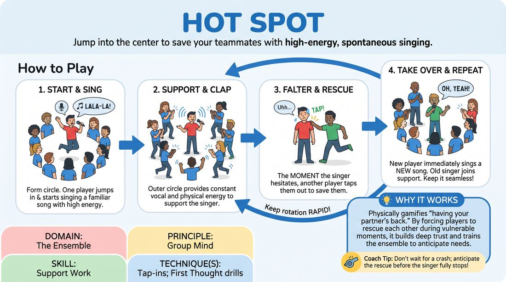

# Hot Spot

{ .game-hero }

> Jump into the center to save your teammates with high-energy, spontaneous singing.

## Overview
A high-energy circle game where players take turns singing familiar songs in the center, relying on their ensemble to rescue them the moment they hesitate or forget the words. It builds a supportive safety net, encouraging players to embrace vulnerability and practice instant support.

## What It Trains
- **Domain:** D4 — The Ensemble
- **Principle(s):** Fail Joyfully; Vulnerability; Group Mind
- **Skill(s):** Unfiltered Spontaneity; Support Work
- **Technique(s):** First Thought drills; Tap-ins
- **Focus:** connection

**Objective:** To develop group mind and support work through physical tap-ins, training players to jump in and rescue teammates before they fail, fostering a sense of collective safety.

## Setup
Players stand in a shoulder-to-shoulder circle in an open space. No props or instruments are needed.

## How to Play
1. Form a tight, supportive circle with all players standing.
2. One player voluntarily steps or jumps into the center of the circle and immediately begins singing a well-known song with high energy.
3. The players in the outer circle clap along, dance, and provide physical and vocal energy to support the singer in the center.
4. The singer in the center continues singing until they forget the lyrics, lose momentum, or feel a wave of hesitation.
5. The moment the singer falters—or even slightly before—another player from the circle must run in, tap them on the shoulder, and take over the center spot.
6. The new player in the center must immediately start singing a completely different, well-known song.
7. The previous singer returns to the outer circle, instantly joining the support team by clapping and cheering.
8. Keep the rotation rapid and seamless, ensuring the center spot is never left empty or silent for more than a split second.

## Facilitation Notes
- Side-coaching cue: 'Don't let them twist in the wind! Save your teammate before they even know they need it!'
- Side-coaching cue: 'Sing loud, proud, and bad! It's about energy, not pitch!'
- Pitfall: Players hesitate to enter because they are trying to think of the 'perfect' song. Fix: Encourage players to step in first and let the song find them, or sing the absolute simplest song they know.
- Pitfall: The singer is left stranded in the center for too long, causing anxiety. Fix: Remind the outer circle that a 'rescue' is an act of love; tap in early and often.

## Variations
- Word Association: The incoming singer must choose a song inspired by a word or theme from the previous singer's lyrics.
- Physical Tag-In: The incoming player must match the physical posture or dance move of the outgoing player before starting their song.
- Genre Shift: The facilitator calls out a musical genre (e.g., opera, country, rap) that the person in the center must instantly adapt their song to.

## Debrief
- How did it feel to be rescued by your ensemble when you forgot the words?
- What did you notice about the timing of the tap-ins? When did the game feel most supportive?
- How does this game change our fear of making mistakes or 'failing' on stage?

## Safety & Inclusion
While not highly sensitive, ensure physical tap-ins are gentle (a light tap on the shoulder or a clear step-in gesture). Offer a non-contact option (stepping in front or calling 'My turn!') for players who prefer not to be touched.

## Why It Works
It physically gamifies the concept of 'having your partner's back.' By forcing players to rescue each other during a highly vulnerable activity (singing), it builds deep trust and teaches the ensemble to anticipate each other's needs, creating a tangible experience of 'group mind.'
