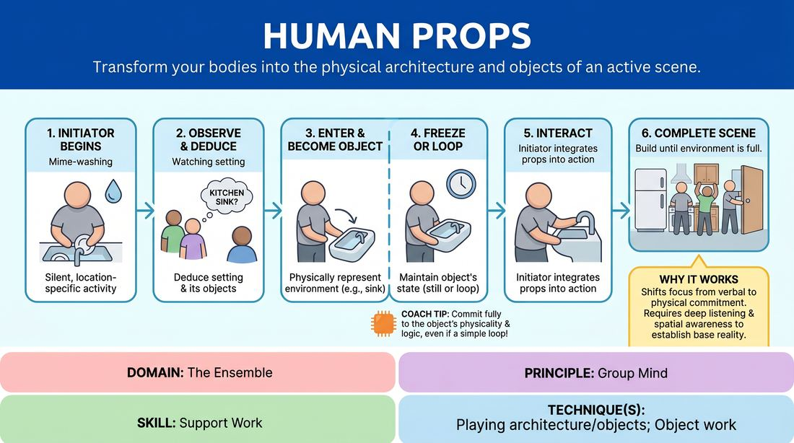

# Living Props

{ .game-hero }

> Transform your bodies into the physical architecture and objects of an active scene.

## Overview
In this physical ensemble exercise, one player initiates a scene by performing a silent, location-specific activity. The remaining players enter the space one by one, using their bodies to physically construct the furniture, appliances, and architecture of the environment to support the initiator.

## What It Trains
- **Domain:** D4 — The Ensemble
- **Principle(s):** Group Mind; Show, Don't Tell; Base Reality First
- **Skill(s):** Support Work; Physicality & Space Work; World-Building
- **Technique(s):** Playing architecture/objects; Object work; C.R.O.W. (Character, Relationship, Objective, Where)
- **Focus:** skill_drill

**Objective:** To develop physical support work, spatial awareness, and group mind by physically manifesting a shared environment, reinforcing the base reality of a scene through collaborative world-building.

## Setup
An open playing space with no physical props or chairs. Players stand in a semi-circle or line at the back of the stage, ready to enter the playing area.

## How to Play
1. One player steps into the playing space and begins a silent, physical activity that clearly implies a specific location (e.g., washing dishes at a sink, browsing books in a library).
2. The remaining players observe the initiator's actions to deduce the setting and identify what physical objects would logically exist in that space.
3. One by one, players enter the space and use their bodies to physically represent the furniture, fixtures, or objects of that environment (e.g., becoming a kitchen counter, a bookshelf, or a refrigerator).
4. Players forming the props must remain frozen or maintain a simple, repetitive physical loop (like a ticking clock or a swinging door) once they have established their position.
5. As the environment fills out, the initiating player begins to actively interact with the newly created human props, integrating them into their physical action.
6. The exercise continues until the environment feels complete, or until all players have integrated themselves into the physical space.

## Facilitation Notes
- Side-coach players to start with the obvious, foundational elements of a room (walls, tables, doors) before adding highly specific details (like a toaster or a desk lamp).
- Encourage the initiating player to physically touch and utilize the human props, validating their classmates' physical choices.
- Pitfall: Players trying to be funny by becoming overly complex or distracting objects. Fix: Remind them that the goal is support work; a solid, simple table is far more useful than a wacky, moving robot.
- Side-coach the 'props' to maintain physical commitment and safety, avoiding positions that cause physical strain or require holding up another player's full weight unless pre-negotiated.

## Variations
- Soundscapes: The human props can add subtle, repetitive ambient sounds (e.g., the hum of a refrigerator, the rustle of wind through a window) to enhance the environment.
- Active Scene Integration: Once the environment is fully built, a second active player enters to perform a fully voiced scene with the initiator, utilizing the human props throughout their dialogue.
- Dynamic Transformation: On a facilitator's clap, the entire group must instantly morph the existing environment into a completely different location (e.g., kitchen to spaceship), maintaining their roles as physical objects.

## Debrief
- How did having physical, human props change the way the initiating player interacted with the space compared to imaginary object work?
- What did it feel like to support the scene purely as an object without speaking or driving the narrative?
- How did we use group mind to ensure we didn't crowd the space or create redundant objects?

## Safety & Inclusion
Ensure players are mindful of physical boundaries and consent. Players acting as furniture should not be sat on or leaned on heavily unless they explicitly consent and are physically prepared to support the weight. Offer low-impact alternatives for players with mobility or joint considerations (e.g., playing a wall or a hanging light fixture).

## Why It Works
This game works because it shifts the focus of support from verbal agreement to physical commitment. By physically embodying the environment, players must practice deep listening and spatial awareness, instantly establishing a rich base reality. It teaches the ensemble that supporting a scene is just as valuable when silent and structural as when verbal and active.
