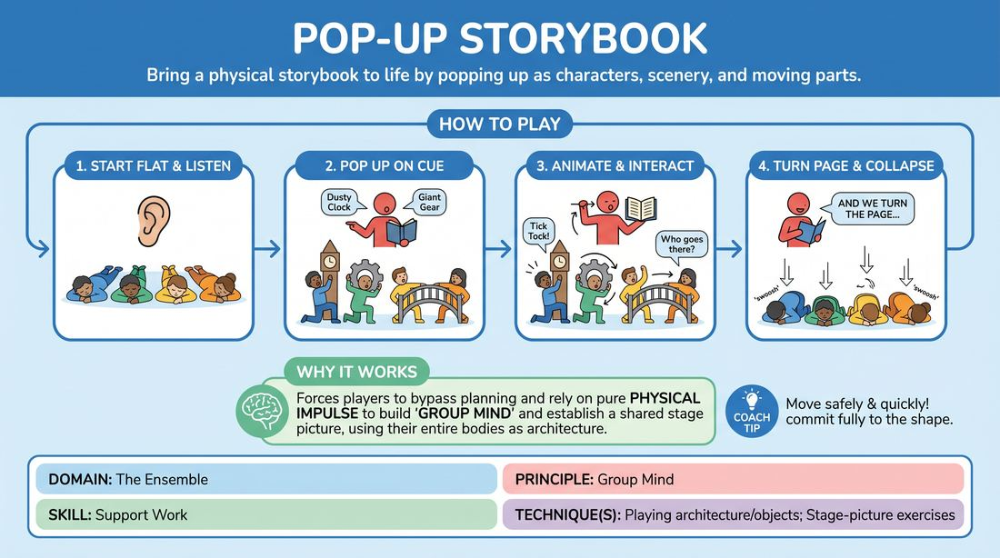

# Pop-Up Storybook

{ .game-hero }

> Bring a physical storybook to life by popping up as characters, scenery, and moving parts.

## Overview
In this physical narrative game, one player acts as the narrator of a storybook while the rest of the ensemble lies flat on the floor. As the narrator 'turns the pages' and describes the scene, the floor-bound players instantly spring up to physically manifest the characters, architecture, and mechanical elements of each page.

## What It Trains
- **Domain:** D4 — The Ensemble
- **Principle(s):** Group Mind; Follow the Follower; Serve the Story
- **Skill(s):** Support Work; Peripheral Awareness; Narrative Architecture; World-Building; Physicality & Space Work; Pacing & Rhythm
- **Technique(s):** Playing architecture/objects; Stage-picture exercises; Object work; Edits (Sweep, Tag-Out, Sound/Light)
- **Focus:** mixed

**Objective:** To develop group mind, physical support work, and spatial awareness by having players instantly transform their bodies into scenery, props, and characters to support a central narrative.

## Setup
A clear performance space with enough room for all players to lie flat on the floor. One player is designated as the Narrator and stands to the side. The remaining players lie down flat on their backs or stomachs in the performance space, representing a closed book.

## How to Play
1. The Narrator introduces the title of the storybook to the audience and mimes opening the front cover.
2. The Narrator turns to the first page and begins describing the setting, including key environmental features and characters (e.g., 'We open to a dusty old clockmaker's shop, dominated by a massive grandfather clock in the corner').
3. As elements are described, players on the floor must instantly 'pop up' (rising quickly and safely) to physically represent those elements, using their bodies to form the grandfather clock, the workbench, or the clockmaker.
4. The Narrator can interact with the page by describing physical mechanisms, such as 'pulling a tab' or 'turning a wheel' (e.g., 'When you slide this lever, the gears inside the clock begin to spin!').
5. The players forming those elements must immediately animate their bodies to match the Narrator's mechanical descriptions.
6. Once the visual page is established, the Narrator can allow the characters to speak or interact briefly, letting a short scene play out.
7. To transition, the Narrator mimes turning the page and says, 'And we turn the page...' On this cue, all players on stage must instantly collapse back down to a flat, neutral position on the floor.
8. The Narrator describes the next page, and players pop up to form the new scene. This cycle repeats until the story reaches its climax and the Narrator closes the book.

## Facilitation Notes
- Coaching cue: 'Listen with your whole body. If someone has already popped up as the main character, immediately become the background environment or a prop.'
- Pitfall: Players hesitating on the floor, trying to plan the perfect shape. Fix: Encourage rapid, intuitive physical choices. A simple, bold physical posture made instantly is always better than a complex one made too late.
- Coaching cue: 'Narrators, give your players physical actions to perform. Pull tabs, spin wheels, slide levers, and watch how they move!'
- Pitfall: The Narrator talking continuously without letting the physical scenes breathe. Fix: Remind the Narrator to pause after describing a page, allowing the players to explore the physical space and speak a few lines of dialogue.

## Variations
- No-Narrator Page Turns: The players themselves decide when to turn the page. Any player can make a sweeping 'page turn' sound effect or gesture, forcing everyone to collapse and instantly rise into a new scene without a dedicated narrator.
- Mechanical Focus: Every page must feature a complex machine with moving parts (gears, levers, conveyor belts) formed by the players' bodies, emphasizing physical cooperation and object work.
- Dialogue-Driven Pages: Once the page pops up, the narrator goes silent, and the characters must improvise a 30-second scene using dialogue before the narrator turns the page.

## Debrief
- How did it feel to transition instantly from complete stillness on the floor to active physical shapes?
- How did we use our bodies to support the narrator's world-building without cluttering the stage?
- Narrators, how did the physical shapes of the players change or inspire the story you were telling?

## Safety & Inclusion
Ensure players are mindful of their physical limitations when rising quickly from the floor. Players who cannot easily lie down or stand up rapidly can sit on chairs or stand at the back, acting as 'pop-up' elements that fold/unfold from a seated or standing position. Maintain spatial awareness to avoid colliding when popping up.

## Why It Works
This game forces players to bypass intellectual planning and rely on pure physical impulse. By starting flat on the floor, players are stripped of their default standing postures, encouraging them to use their entire bodies to build architecture and objects. It perfectly balances 'Follow the Follower' as the narrator's words inspire the physical shapes, and the physical shapes in turn inspire the narrator's next plot point.
