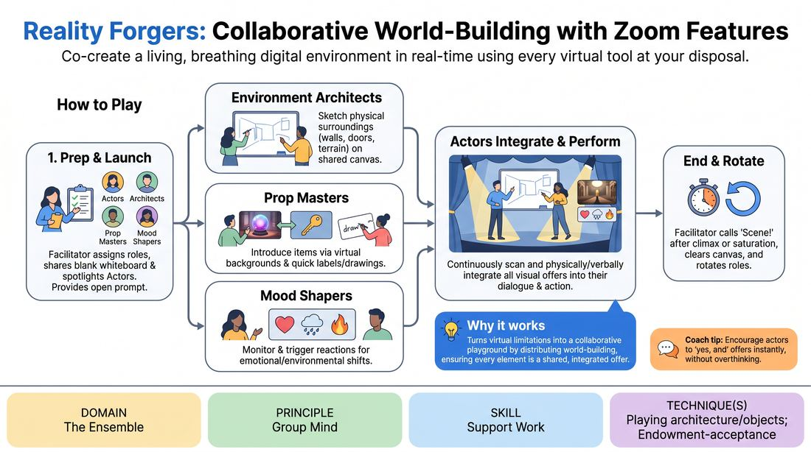

# Reality Architects

{ .game-hero }

> Co-create a living, breathing digital environment in real-time using every virtual tool at your disposal.

## Overview
A virtual-native ensemble game where players use video platform features to build a physical and emotional world in real-time. While two actors perform a scene, other players actively shape the environment by drawing on a shared whiteboard, materializing props via virtual backgrounds, and shifting the mood with reaction emojis. The result is a highly collaborative, multi-sensory narrative where the digital interface itself becomes a malleable stage.

## What It Trains
- **Domain:** D4 — The Ensemble
- **Principle(s):** Yes, And; Show, Don't Tell; Base Reality First; Group Mind
- **Skill(s):** Offer Reception; Active Gifting; World-Building; Peripheral Awareness; Support Work
- **Technique(s):** Endowment-acceptance; Endowment-gifting drills; C.R.O.W. (Character, Relationship, Objective, Where); Thread-tracking drills; Playing architecture/objects
- **Focus:** mixed

**Objective:** To develop advanced support work and group mind by training players to receive, integrate, and build upon multi-modal visual and emotional offers simultaneously.

## Setup
Run this game on a video conferencing platform with screen-sharing, annotation/whiteboard capabilities, virtual backgrounds, and reaction emojis enabled. Have players rename themselves to reflect their assigned roles: 'Actor 1', 'Actor 2', 'Architect 1', 'Architect 2', 'Prop Master 1', 'Prop Master 2', and 'Mood Shaper'. Ensure all players have a few diverse virtual backgrounds ready to use.

## How to Play
1. Assign roles to all players: two Actors, two Environment Architects, two Prop Masters, and one or two Mood Shapers, and have them update their display names accordingly.
2. The facilitator shares a blank digital whiteboard (the 'Reality Canvas') and spotlights the two Actors to establish the primary focus.
3. Provide the Actors with a simple, open-ended starting prompt, such as waking up in an unfamiliar location, to initiate the scene.
4. As the Actors begin their dialogue, the Environment Architects immediately start sketching the physical surroundings (walls, doors, terrain) on the shared whiteboard to visually 'Yes, And' the spoken details.
5. Concurrently, the Prop Masters introduce physical items into the scene by changing their virtual backgrounds to represent objects and drawing a quick label or pointer on the whiteboard to indicate where the item is located.
6. The Mood Shapers monitor the scene and periodically trigger emotional or environmental shifts by deploying specific platform reactions (e.g., a heart reaction forces a wave of affection; a thumbs-up reverses gravity).
7. The Actors must continuously scan the whiteboard, reactions, and backgrounds, physically and verbally integrating every visual and environmental offer into their performance as if the objects and shifts are tangible.
8. The facilitator calls 'Scene!' after a major narrative climax or when the canvas becomes fully saturated, clears the whiteboard, and rotates roles so everyone experiences different functions.

## Facilitation Notes
- Side-coaching cue: 'Actors, look at the canvas! Use what they are drawing right now!' to prevent the performers from ignoring the visual offers.
- Pitfall: The whiteboard becomes a chaotic, unreadable mess of scribbles. Fix: Instruct the Environment Architects to draw simple, clean outlines rather than detailed masterpieces, and have the facilitator selectively clear parts of the canvas if it gets too cluttered.
- Side-coaching cue: 'Prop Masters, make your background changes deliberate and give the actors a moment to react before switching again.'
- Pitfall: High cognitive load causes the scene to stall. Fix: Encourage the Actors to slow down their dialogue, allowing the visual elements to drive the pace of the narrative rather than rushing to fill the silence.
- Side-coaching cue: 'Mood Shapers, wait for a transition point to drop your reaction, and make sure everyone commits to the shift immediately.'

## Variations
- Blind Architects: The Environment Architects turn off their incoming video feeds and can only hear the audio, drawing purely based on the verbal descriptions of the Actors.
- Silent Movie: The Actors are completely muted and must perform their scene entirely through physical pantomime, relying 100% on the Architects and Prop Masters to build the context and narrative.
- Chaos Mode: Remove the designated roles and allow any player to jump in and draw, change backgrounds, or trigger reactions at any time, requiring extreme peripheral awareness.

## Debrief
- How did it feel to have your physical environment constantly changing and appearing in real-time without your direct control?
- For the support roles (Architects/Prop Masters), how did you balance making bold offers with staying out of the way of the main narrative?
- What strategies did you use to manage the high cognitive load of watching the canvas, the backgrounds, and your scene partner all at once?
- How does this multi-modal 'Yes, And' translate to traditional, non-virtual scene work?

## Safety & Inclusion
Ensure that virtual backgrounds used by players are clear, non-flashing, and accessible to all participants to prevent sensory overload or visual triggers. If a player has physical or technical limitations that make rapid drawing or background switching difficult, assign them to the Actor or Mood Shaper roles which require less technical dexterity.

## Why It Works
This game works because it transforms the inherent limitations of virtual performance—such as the lack of shared physical space—into a collaborative playground. By distributing the elements of world-building across specialized roles, it forces the ensemble to operate with a unified Group Mind. The Actors cannot rely solely on their own ideas; they must actively receive and support the physical architecture and objects manifested by their teammates, reinforcing the core improv principle of 'Show, Don't Tell' in a digital landscape.
