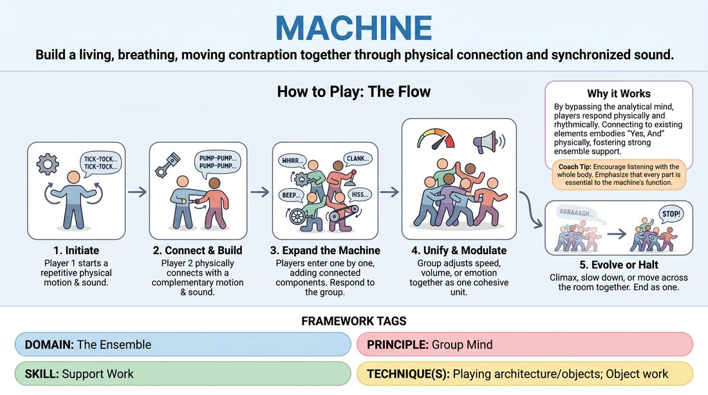

# The Human Machine

{ .game-hero }

> Build a living, breathing, moving contraption together through physical connection and synchronized sound.

## Overview
Players collaborate physically to construct a complex, moving mechanical device or creature. One by one, players step into the space to add a new moving part, complete with a repetitive physical motion and a matching sound effect, until the entire group is integrated into a single, functioning entity.

## What It Trains
- **Domain:** D4 — The Ensemble
- **Principle(s):** Group Mind; Follow the Follower; Commit 100%; Yes, And; Make Your Partner a Genius
- **Skill(s):** Peripheral Awareness; Support Work; Physicality & Space Work; Offer Reception; Active Gifting
- **Technique(s):** Playing architecture/objects; Object work
- **Focus:** connection

**Objective:** To develop group mind, physical support work, and spatial awareness by physically connecting to and building upon the offers of others without verbal planning.

## Setup
An open, spacious room free of obstacles. Players stand in a line or semi-circle along the back wall, facing the open playing space.

## How to Play
1. Ask the group for a suggestion of a complex machine, vehicle, or large animal (e.g., a grandfather clock, a helicopter, or a dinosaur).
2. The first player steps into the center of the playing space and initiates a simple, repetitive physical movement accompanied by a distinct, repetitive sound effect.
3. The next player steps forward and physically connects to the first player's movement, establishing a complementary motion and sound (e.g., acting as a gear, piston, or lever that is driven by or drives the first part).
4. Subsequent players enter one by one, each adding a new physical and vocal component that connects to the existing structure, ensuring they are looking at and responding to the other parts.
5. Once all players have joined, the facilitator encourages the group to experiment with the machine's speed, volume, or emotional state as a single cohesive unit.
6. The machine can be cued to slowly speed up to a chaotic climax, slow down to a complete halt, or even move across the room together.

## Facilitation Notes
- Side-coaching cue: 'Connect physically!' Encourage players to safely make light physical contact (like a hand resting on a shoulder to simulate a piston) or work in very close proximity to show mechanical connection.
- Pitfall: Players standing in isolation without connecting to others. Fix: Remind them that every new part must be directly triggered by or trigger an existing part.
- Side-coaching cue: 'Vary your levels!' Encourage players to go low to the ground, stand tall, or stretch wide to create a visually dynamic machine.
- Pitfall: Overcomplicating the movement or sound, making it hard to sustain. Fix: Coach players to keep their individual loop simple, rhythmic, and highly repeatable.

## Variations
- Morphing Machine: Once the machine is fully operational, the facilitator calls out a new suggestion, and the players must gradually morph their movements and sounds to transition into the new machine without stopping.
- Abstract Machine: Build a machine based on an abstract concept or emotion (e.g., 'The Anxiety Engine' or 'The Joy Factory') rather than a physical object.
- Silent Machine: Build the entire machine in complete silence, relying purely on visual cues, physical rhythm, and shared breath to synchronize.

## Debrief
- How did it feel to step in without a plan and simply support the movement that was already there?
- What did you have to pay attention to in order to make the machine look like a single, unified system?
- How did the group handle transitions or changes in speed without anyone speaking?

## Safety & Inclusion
Ensure players are mindful of physical boundaries and consent when making physical contact. Offer alternatives like 'near-contact' or mime-based connection for those who prefer not to be touched. Remind players to choose physical movements that are sustainable and do not strain their joints.

## Why It Works
This game bypasses the analytical mind by forcing players to respond physically and rhythmically. By requiring each player to connect to an existing element, it embodies the 'Yes, And' principle physically, teaching players to make their partners look good by literally supporting their weight or completing their motion.
