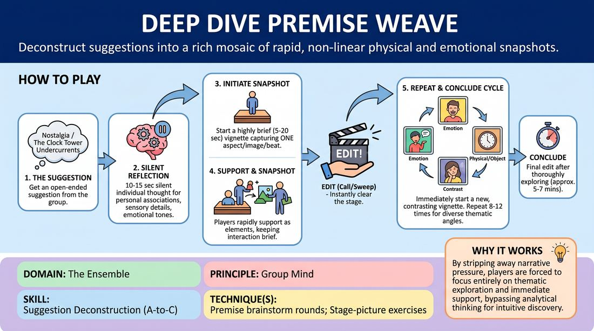

# Premise Kaleidoscope

{ .game-hero }

> Deconstruct suggestions into a rich mosaic of rapid, non-linear physical and emotional snapshots.

## Overview
An active ensemble drill where players dissect a single suggestion through a rapid succession of brief, non-linear vignettes. Instead of building a continuous narrative, the group collaborates to present diverse thematic angles, emotional textures, and physical environments. The result is a shared, multi-dimensional understanding of the premise that serves as a launchpad for deeper scene work.

## What It Trains
- **Domain:** D4 — The Ensemble
- **Principle(s):** Group Mind; Follow the Follower; Serve the Piece
- **Skill(s):** Peripheral Awareness; Support Work; Suggestion Deconstruction (A-to-C); Pacing & Rhythm; Thematic Synthesis
- **Technique(s):** Stage-picture exercises; Thread-tracking drills; Premise brainstorm rounds; Edits (Sweep, Tag-Out, Sound/Light)
- **Focus:** skill_drill

**Objective:** To develop advanced suggestion deconstruction (A-to-C association) and cultivate a unified Group Mind by collectively mapping out the thematic, emotional, and physical possibilities of a single prompt without relying on linear storytelling.

## Setup
An open, moderate-sized playing space. Players stand in a semi-circle or back line facing the stage area. No props or materials are required. The facilitator prepares to act as the primary editor to maintain a brisk tempo.

## How to Play
1. Obtain a single, open-ended suggestion from the group or an external source (such as Nostalgia, The Clock Tower, or Undercurrents).
2. Allow the ensemble 10 to 15 seconds of silent, individual reflection to let personal associations, sensory details, and emotional tones emerge.
3. A player steps forward to initiate a highly brief vignette (lasting 5 to 20 seconds) that captures a single aspect, physical image, or emotional beat of the suggestion.
4. Other players rapidly support the active vignette by entering as supporting characters, environmental elements, or soundscapes, keeping the interaction brief and focused.
5. To transition, a player offstage or the facilitator calls a sharp Edit (or uses a physical sweep or clap) to instantly clear the stage.
6. Immediately following the edit, a new vignette begins, intentionally jumping to a completely different, non-linear perspective of the same suggestion (such as moving from a literal interpretation to a metaphorical or emotional one).
7. Continue this rapid-fire cycle for 8 to 12 vignettes, ensuring each contribution adds a fresh layer—such as a contrasting viewpoint, a physical manifestation, or a subtextual element—rather than repeating what has already been seen.
8. Conclude the cycle with a final edit once the suggestion has been thoroughly explored from multiple angles, typically after 5 to 7 minutes of active play.

## Facilitation Notes
- Side-coach players to resist the urge to build sequential narratives; if a vignette starts turning into a standard two-person scene with a plot, edit it immediately.
- Encourage physical and vocal variety. If the first few vignettes are dialogue-heavy, prompt the next player with: Give us a physical shape or Create a soundscape.
- Pitfall: Players waiting too long to edit or step in. Fix: The facilitator should actively call Edit! or Sweep! every 15 seconds during the first round to establish the expected rapid tempo.
- Remind players to practice A-to-C thinking: don't just play the direct suggestion (A), play the secondary association (B) or the underlying implication (C).

## Variations
- Silent Tapestry: Run the entire sequence of vignettes completely without spoken dialogue, relying solely on physical expression, movement, and non-verbal soundscapes.
- Emotional Arc Progression: Challenge the ensemble to guide the vignettes through a collective emotional shift, starting with high anxiety, transitioning through curiosity, and ending in quiet resolution.
- Thematic Anchor: Restrict all vignettes to a specific stylistic constraint, such as only historical eras or only abstract physical metaphors.
- The Launchpad: Immediately following the final edit of the weave, two players step forward to initiate a fully realized, slow-paced scene inspired by the synthesized themes of the brainstorm.

## Debrief
- What recurring themes, underlying tensions, or emotional patterns emerged across our different vignettes?
- How did letting go of linear narrative progression change how you supported your teammates' offers?
- Which vignette offered the most surprising A-to-C leap, and how did that expand our collective understanding of the suggestion?
- How can we carry this multi-layered, shared perspective into our long-form scene openings?

## Safety & Inclusion
Because this game requires rapid physical entries and exits, ensure the stage area is clear of tripping hazards. Encourage players to use clear vocal cues or gentle physical boundaries if staging high-energy physical vignettes, and remind the ensemble that abstract physicalizations should always respect personal space and physical comfort levels.

## Why It Works
By stripping away the pressure of narrative progression, players are forced to focus entirely on thematic exploration and immediate support. The rapid-fire, non-linear structure bypasses analytical thinking, tapping directly into intuitive Group Mind. This teaches the ensemble to view a suggestion not as a literal plot point, but as a rich, multi-faceted landscape of emotional and physical possibilities.
