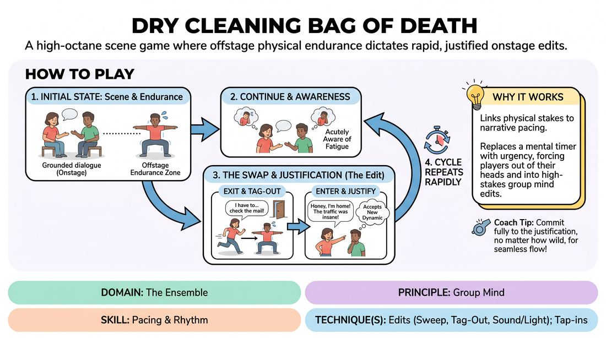

# The Endurance Relay

{ .game-hero }

> A high-octane scene game where offstage physical endurance dictates rapid, justified onstage edits.

## Overview
In this high-energy ensemble game, two players perform a grounded scene while a third teammate holds a strenuous physical pose offstage. To relieve their struggling teammate, an onstage player must organically exit the scene and take over the physical challenge, forcing the freed player to immediately enter the scene. This creates a relentless, high-stakes cycle of physical endurance, rapid edits, and instant narrative justifications.

## What It Trains
- **Domain:** D4 — The Ensemble
- **Principle(s):** Commit 100%; Serve the Story; Group Mind
- **Skill(s):** Physicality & Space Work; Justification; Support Work; Pacing & Rhythm
- **Technique(s):** Edits (Sweep, Tag-Out, Sound/Light); Tap-ins; Justify the absurd
- **Focus:** mixed

**Objective:** Develops group mind, rapid physical editing, and the ability to instantly justify sudden entrances and exits under physical pressure, training players to prioritize the collective pacing of the performance over individual scene comfort.

## Setup
An open performance space with a designated 'Endurance Zone' marked offstage, equipped with a yoga mat or a medicine ball. Three to five players participate, with two starting onstage and the remaining players waiting in the Endurance Zone.

## How to Play
1. Two players enter the stage and begin a grounded, relationship-focused scene based on a simple suggestion.
2. Simultaneously, one offstage player enters the Endurance Zone and begins a strenuous physical challenge, such as a low plank, a wall-sit, or holding a medicine ball at chest height.
3. The onstage players must continue their scene naturally, but they must remain acutely aware of their offstage teammate's physical exertion and fatigue.
4. Before the offstage player reaches physical exhaustion, one of the onstage players must find a logical, narrative reason to exit the scene.
5. The exiting player runs to the Endurance Zone, tags the active player, and immediately assumes the strenuous physical pose.
6. The newly relieved player must instantly enter the onstage scene, immediately justifying their sudden arrival as a new character or a returning character with a fresh, urgent purpose.
7. The remaining onstage player must instantly accept and justify this new dynamic, keeping the narrative flowing seamlessly.
8. This cycle continues continuously, with players rotating between active scene work and the offstage endurance challenge, driving a rapid, high-stakes editing rhythm.

## Facilitation Notes
- Side-coach narrative justification: Remind players not to just abandon the scene. They must give a clear, character-driven reason for their sudden exit.
- Monitor physical safety: Ensure players do not push past their physical limits. Establish a clear 'tap-out' hand signal if a player needs to drop the pose immediately without waiting for an onstage edit.
- Avoid narrative whiplash: Remind entering players to support the existing environment and context rather than completely resetting the scene's reality with every edit.
- Vary the physical challenges: Encourage players to choose poses that match their personal fitness levels, ensuring the game remains challenging yet accessible.

## Variations
- The Digital Screen-Freeze: Played on a video call. The offstage player holds a strenuous pose (like a static push-up or a V-sit) directly on camera in their frame. To edit, an onstage player yells 'Tag!', turns off their camera, and assumes the pose, while the offstage player turns on their camera and enters the scene.
- The Weight of the World: Introduce a safe prop, such as a heavy medicine ball or a kettlebell. The offstage player must hold the object at arm's length. The physical weight translates directly into the emotional stakes of the onstage scene.
- Vocal Endurance: Instead of a silent physical pose, the offstage player must maintain a continuous, low-volume vocal drone or physical sound effect. The onstage players must justify this sound as an environmental element of their scene until they edit.

## Debrief
- How did the physical urgency of your teammate offstage affect the pacing and rhythm of your onstage choices?
- What strategies did you use to make your sudden exits and entrances feel organic and justified rather than forced?
- How did sharing the physical burden build a stronger sense of group mind and mutual support within the ensemble?

## Safety & Inclusion
Physical accessibility is paramount. Players should choose an endurance challenge that fits their physical capabilities (e.g., a wall-sit, a plank, holding a light prop, or even a simple balance pose). No player should ever feel pressured to push past safe physical boundaries. Clear verbal or non-verbal tap-out signals must be established before play begins so any player can safely exit the rotation without penalty.

## Why It Works
This game works by linking physical stakes directly to narrative pacing. By replacing a standard mental countdown with a physical endurance challenge, players are forced out of their heads and into a state of high-stakes urgency. This organic pressure prevents scenes from dragging, demands high physical commitment, and builds deep ensemble trust as players actively rescue one another through rapid, justified edits.
