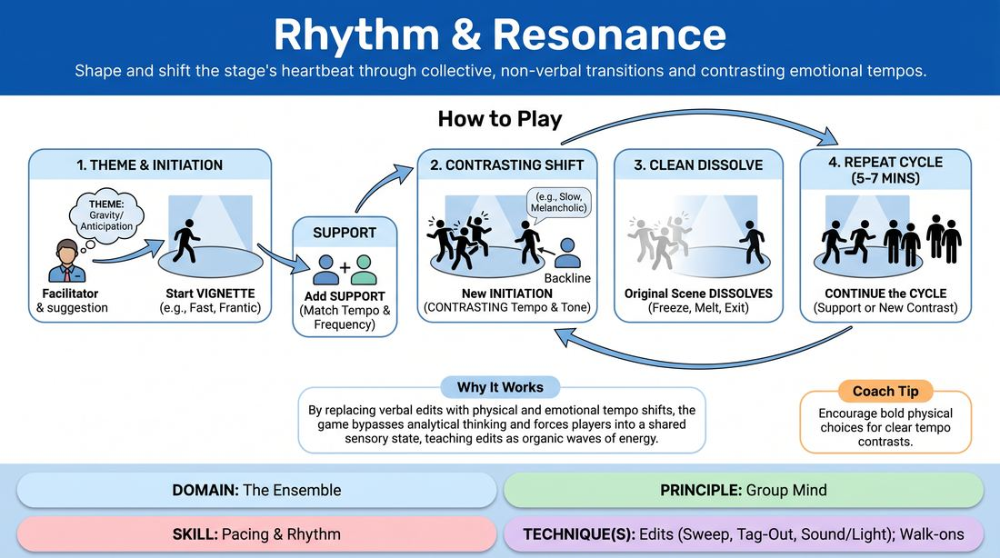

# Rhythmic Resonance

{ .game-hero }

> Shape and shift the stage's heartbeat through collective, non-verbal transitions and contrasting emotional tempos.

## Overview
An ensemble-driven exploration where players weave a tapestry of short, thematic vignettes. Instead of traditional verbal edits, transitions are triggered by shifts in physical pacing and emotional energy. The group must collectively sense, support, and dissolve scenes to maintain a continuous, pulsing flow.

## What It Trains
- **Domain:** D4 — The Ensemble
- **Principle(s):** Group Mind; Follow the Follower; Serve the Piece
- **Skill(s):** Pacing & Rhythm; Peripheral Awareness; Support Work; Thematic Synthesis; Emotional Fluidity
- **Technique(s):** Edits (Sweep, Tag-Out, Sound/Light); Walk-ons; A-to-C drills; Playing architecture/objects
- **Focus:** connection

**Objective:** To develop a heightened sense of group mind and temporal dynamics, training players to use physical pacing, emotional tone, and organic edits to guide a performance without verbal cues.

## Setup
A moderate, open playing space. Players stand in a semi-circle (backline) facing the stage area. No props or chairs are needed. The facilitator secures a single abstract noun or emotional suggestion from the group to inspire the run.

## How to Play
1. The facilitator obtains an abstract suggestion (e.g., 'Gravity' or 'Anticipation') to serve as the thematic anchor for the entire run.
2. One player steps into the space to initiate a brief vignette (30-60 seconds) inspired by the suggestion, immediately establishing a distinct physical tempo (e.g., frantic, sluggish, staccato) and emotional tone.
3. One or two other players may enter the space to support this initial scene, matching its established rhythm and emotional frequency.
4. While the active scene is still running, a player from the backline steps into a different part of the stage to initiate a brand-new, distinct vignette inspired by the same suggestion.
5. This new initiation must deliberately contrast the active scene's tempo and tone (e.g., shifting from a frantic, high-energy argument to a slow, melancholic silence).
6. The players in the original scene must immediately recognize this new initiation, cleanly dissolving their scene by freezing, melting into the background, or walking off stage without pulling focus.
7. The ensemble continues this cycle for 5 to 7 minutes, either entering the active scene to support its current rhythm or initiating a new 'cadence shift' to pivot the stage's energy.

## Facilitation Notes
- Side-coaching cue: 'Feel the pulse of the room. Don't wait for a logical narrative ending; edit when the rhythm demands a contrast.'
- Pitfall: Players lingering in a dead scene or executing slow, messy exits. Fix: Coach players to 'dissolve like smoke'—either freeze instantly as stage architecture or exit with decisive, quiet steps.
- Side-coaching cue: 'Contrast the energy! If they are high and fast, go low and slow.'
- Pitfall: Initiators stepping directly into the physical space of the active players, causing spatial confusion. Fix: Remind players to initiate from a clear, unoccupied area of the stage to establish a distinct visual focal point.

## Variations
- Silent Pulse: Play the entire game completely non-verbally, relying solely on physical movement, breath, and spatial relationships to communicate shifts.
- Soundscape Transitions: Players transition scenes by introducing a vocal rhythm or repetitive sound effect that matches the new scene's tempo, which the active players must adopt before dissolving.
- Rhythmic Arc: The facilitator pre-determines a structural tempo map (e.g., slow to fast to dead silent), and the ensemble must collectively navigate this arc over the course of the run.

## Debrief
- How did it feel to let go of a scene based on a rhythmic shift rather than a narrative punchline?
- What non-verbal cues made it obvious that a new scene was taking over the space?
- How did contrasting tempos help you discover new emotional depths in the original suggestion?

## Safety & Inclusion
Ensure the playing space is clear of obstacles. Since transitions require rapid physical adjustments and spatial awareness, players should move at a safe, controlled speed. Non-verbal physical contact should be agreed upon beforehand, and players can use silent freezes or slow-motion exits to accommodate different physical mobilities.

## Why It Works
By replacing verbal edits with physical and emotional tempo shifts, the game bypasses analytical thinking and forces players into a shared sensory state. It teaches that edits are not just structural interruptions, but organic waves of energy that the entire ensemble must ride together, reinforcing the principle of Group Mind.
