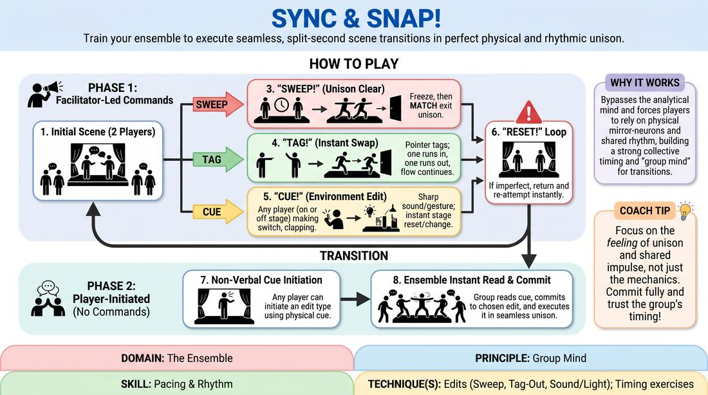

# Ensemble Snap

{ .game-hero }

> Train your ensemble to execute seamless, split-second scene transitions in perfect physical and rhythmic unison.

## Overview
Ensemble Snap is a high-focus training drill that transforms individual scene transitions into collective, synchronized physical actions. Players work together to execute sweeps, tag-outs, and environmental edits in absolute unison, first prompted by a facilitator and later driven entirely by emergent group intuition. The result is a highly polished, visually striking performance flow where the entire team operates as a single organism.

## What It Trains
- **Domain:** D4 — The Ensemble
- **Principle(s):** Group Mind; Follow the Follower; Serve the Piece
- **Skill(s):** Peripheral Awareness; Support Work; Pacing & Rhythm
- **Technique(s):** Edits (Sweep, Tag-Out, Sound/Light); Timing exercises
- **Focus:** skill_drill

**Objective:** To develop a shared group mind and precise rhythmic pacing by training players to instantly recognize, support, and execute physical scene transitions as a unified collective.

## Setup
An open, clear playing space with a designated stage area and an off-stage wings area. No props or materials are required. Players should stand in a semi-circle around the stage area, ready to enter or observe. Begin with a brief physical warm-up such as group mirroring or synchronized clapping to align the group's physical rhythm.

## How to Play
1. Begin with a simple, two-player scene on stage focusing on clear physical actions and relationships, while the remaining players observe from the wings.
2. Introduce Phase 1 (Facilitator-Led): The facilitator observes the active scene and, at a transition point, sharply calls out one of three commands: SWEEP, TAG, or CUE.
3. On the SWEEP command, the active players instantly freeze for one beat, then clear the stage in perfect physical unison, matching each other's speed, posture, and exit direction.
4. On the TAG command, the facilitator points to an off-stage player who must instantly run in to tag an active player. Simultaneously, the tagged player exits, and any other active players on stage must immediately clear the space, leaving only the tagger and their new partner to start a fresh scene in a single, crisp snap moment.
5. On the CUE command, any player (on or off stage) must immediately deliver a sharp vocal sound effect or physical gesture (like flicking a light switch). Instantly, all other players must physically react to this cue, freezing in a new posture or emotional state that matches the implied environment.
6. If an edit lacks precision or unison, the facilitator calls RESET! and the players must immediately return to their positions and re-attempt the transition with sharper timing.
7. Transition to Phase 2 (Player-Initiated): The facilitator stops calling commands. Now, any player on or off stage can initiate an edit using a clear, physical impulse (such as taking a deliberate step forward to sweep, raising a hand to tag, or making a sharp sound).
8. The rest of the ensemble must instantly read this non-verbal cue, commit to the chosen edit type without hesitation, and execute it in perfect unison as a collective.

## Facilitation Notes
- Side-coaching cue: Don't think, react! Encourage players to move on instinct rather than waiting to see what others do. True unison comes from shared impulse, not delayed copying.
- Pitfall: The lag effect where players wait to see who is moving before they move. Fix: Instruct players to commit 100% to the first movement they perceive, even if they aren't sure what it is yet. It is better to make a unified mistake than a fragmented correction.
- Side-coaching cue: Match the weight! Remind players that a sweep isn't just about leaving the stage; it's about matching the emotional weight, speed, and physical posture of the initiator to maintain thematic continuity.
- Use the Reset tool liberally in Phase 1. If a sweep is sloppy or staggered, call Reset, do it again! to build the muscle memory of instantaneous, collective movement.
- For early Phase 2 practice, establish a subtle agreement signal such as a sharp intake of breath or a shared glance to help the ensemble lock into the same rhythm before initiating the physical edit.

## Variations
- Rapid-Fire Cuts: The facilitator or players initiate edits every 15-20 seconds, forcing the ensemble to cycle through scenes and transitions at an intense, high-speed tempo.
- Emotional Tone Shift: When executing a sweep or cue, the ensemble must collectively shift the emotional temperature of the room (e.g., sweeping out a high-energy comedy scene and sweeping in a quiet, tense drama).
- Subtle Impulse Challenge: In Phase 2, challenge players to initiate edits with the smallest possible physical cues—a slight shift in weight, a turn of the head, or a quiet sigh—demanding extreme peripheral awareness.
- Thematic Callbacks: The players entering after a synchronized edit must immediately establish a thematic or narrative connection to the scene that was just cleared, weaving the transition directly into the show's content.

## Debrief
- What physical or non-verbal cues were the easiest to detect when someone initiated an edit in Phase 2?
- How did it feel to surrender your individual control of a scene to support a collective transition?
- What did you notice about the rhythm of the scenes when the transitions became crisp and synchronized?
- How can we apply this level of peripheral awareness to our regular, unprompted scene work?

## Safety & Inclusion
Ensure the playing area is completely clear of tripping hazards, as players will be moving quickly and looking at each other rather than the floor. For players with limited mobility, adapt the Sweep and Tag edits so that synchronization is achieved through vocal cues, upper-body gestures, or shared focus rather than rapid physical movement.

## Why It Works
This game works because it bypasses the analytical mind and forces players to rely on physical mirror-neurons and shared rhythm. By practicing transitions as a collective responsibility rather than an individual choice, the ensemble develops a Group Mind where everyone is equally responsible for the show's pacing. The structured progression builds trust, turning clunky, hesitant scene changes into dynamic, satisfying performance elements.
