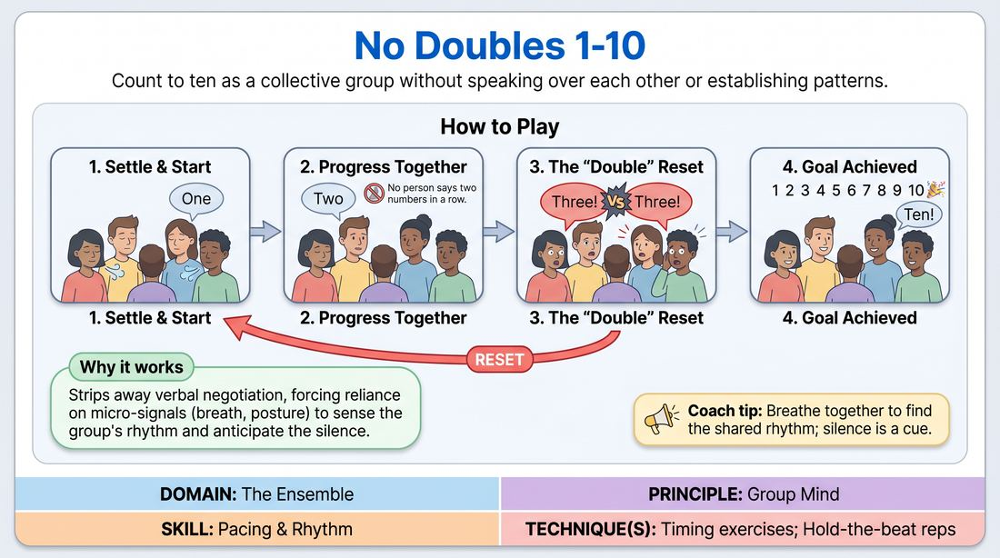

# Shared Count

{ .game-hero }

> Count to ten as a collective group without speaking over each other or establishing patterns.

## Overview
Shared Count is a quiet, focus-building exercise where a group attempts to count from one to ten collectively. Because there is no set order or pattern, players must rely on non-verbal cues, silence, and shared intuition to avoid speaking at the same time. It creates a calm, highly connected atmosphere that tunes the ensemble into a single, shared rhythm.

## What It Trains
- **Domain:** D4 — The Ensemble
- **Principle(s):** Group Mind; Follow the Follower
- **Skill(s):** Pacing & Rhythm; Peripheral Awareness; Active Listening; Silence & Stillness
- **Technique(s):** Timing exercises; Hold-the-beat reps
- **Focus:** connection

**Objective:** To develop deep active listening, peripheral awareness, and group mind by practicing patience, embracing silence, and tuning into the collective rhythm of the room.

## Setup
Players stand in a comfortable circle facing inward. No props or special materials are required. The space should be relatively quiet to allow players to hear subtle auditory cues like breathing.

## How to Play
1. Have the entire group stand in a circle, close their eyes (or look down at the floor to minimize direct visual cues), and take a collective deep breath to settle the energy.
2. Explain the goal: the group must count from 1 to 10 collectively, with only one person speaking at a time.
3. Any player can start the count by speaking the number 'one' aloud.
4. Any other player can say the next consecutive number ('two'), and so on, with no predetermined order, turn-taking, or physical signaling.
5. If two or more players speak a number at the same time, the count immediately resets, and the group must start over at 'one.'
6. Players cannot say two numbers in a row; a different person must speak each consecutive number.
7. The game is successfully completed when the group reaches the target number ten without any overlapping voices.

## Facilitation Notes
- Side-coach the group to listen to the silence between the numbers rather than just waiting for their turn to speak.
- If the group is rushing and constantly clashing, pause and ask them to take a collective breath, slowing down the overall tempo.
- Watch out for predictable patterns, such as counting in alphabetical order of names or going around the circle. Remind them that the order must be completely spontaneous.
- Frame resets not as failures, but as moments of calibration. Encourage the group to find a playful, lighthearted attitude toward restarting.
- If one or two dominant players are doing most of the counting, challenge the group to ensure everyone contributes at least once before reaching the target.

## Variations
- Eyes Closed: Perform the entire exercise with eyes completely closed to rely entirely on breath, vocal resonance, and auditory timing.
- Count to Twenty: Increase the target number to twenty to demand sustained focus, endurance, and deeper patience.
- Non-Verbal Claps: Instead of speaking numbers, the group must clap in unison or pass a single clap around without overlapping, using only physical timing.
- Blind Back-to-Back: Have players stand back-to-back or scattered randomly around the room facing away from each other to eliminate all visual cues.

## Debrief
- What did you have to pay attention to in order to avoid speaking at the same time as someone else?
- How did the quality of the silence change as we got closer to ten?
- How does 'following the follower' apply when there is no designated leader in this exercise?
- What did you notice about your own impulse to speak versus your willingness to wait?

## Safety & Inclusion
While this is a low-physicality, low-risk game, some players may feel anxious about making mistakes or resetting the group. Emphasize a low-stakes, playful attitude toward resets. For players with hearing impairments, allow the game to be played with eyes open, relying on subtle physical gestures or eye contact instead of sound.

## Why It Works
It strips away verbal negotiation and forces players to rely on micro-signals like breath, posture shifts, and the rhythm of silence. By removing the safety net of structure, players must tap into 'group mind' to anticipate when someone else is about to speak, building a shared sense of timing.
