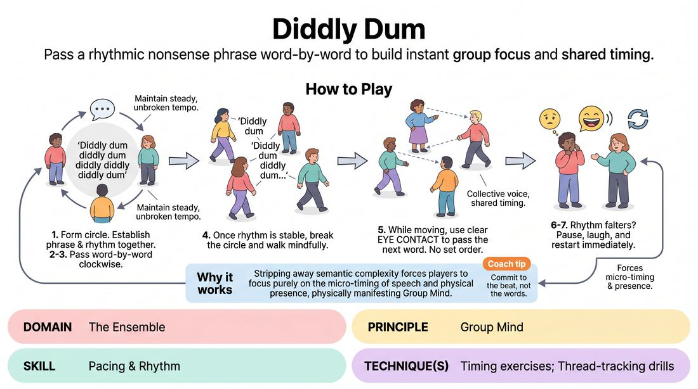

# The Cadence Pass

{ .game-hero }

> Pass a rhythmic nonsense phrase word-by-word to build instant group focus and shared timing.

## Overview
The Cadence Pass is a high-focus ensemble warm-up where players pass a rhythmic nonsense phrase word-by-word. Starting in a structured circle and progressing to free movement, the group must maintain a steady, collective beat using only their voices, eye contact, and shared timing.

## What It Trains
- **Domain:** D4 — The Ensemble
- **Principle(s):** Group Mind; Yes, And
- **Skill(s):** Pacing & Rhythm; Peripheral Awareness; Active Listening
- **Technique(s):** Timing exercises; Thread-tracking drills
- **Focus:** connection

**Objective:** Develops group mind, active listening, and peripheral awareness by training players to align their individual timing with the collective rhythm of the ensemble.

## Setup
Players stand in a circle in an open space with room to move. No props or materials are required.

## How to Play
1. Form a standing circle facing inward.
2. Introduce the target phrase: 'Diddly dum diddly dum diddly diddly diddly dum' and say it together once to establish the rhythm.
3. Begin passing the phrase clockwise around the circle, with each player speaking exactly one word of the phrase in sequence.
4. Maintain a steady, unbroken tempo, treating the phrase as if it is being spoken by a single, collective voice.
5. Once the rhythm is stable, instruct players to break the circle and begin walking mindfully around the room while continuing the word-by-word sequence.
6. While in motion, players must use clear eye contact to 'pass' the next word to another player across the room, rather than following a set physical order.
7. If the rhythm falters, the phrase is dropped, or two players speak at once, the group pauses, laughs, and restarts the phrase immediately from the beginning.

## Facilitation Notes
- Side-coach the group to listen to the silence between the words to keep the underlying beat steady.
- Watch out for players rushing their word or anticipating their turn; remind them to breathe together and feel the collective metronome.
- Encourage players to use their eyes to actively 'throw' the word like a ball when moving through the space.
- If the group gets stuck in a slow, hesitant pace, challenge them to increase the tempo to build playful urgency.

## Variations
- The Counter-Phrase: Introduce a second, contrasting phrase like 'Twiddly dee twiddly dee twiddly twiddly twiddly dee' that runs in the opposite direction or alternates.
- Tempo Shift: The facilitator calls out 'Slow motion' or 'Double time' to challenge the group to collectively scale the tempo up or down without losing the rhythm.
- Silent Pulse: Perform the entire sequence in complete silence, using physical gestures, claps, or steps to represent each word of the phrase.

## Debrief
- How did our connection change when we transitioned from the structured circle to moving freely?
- What did it feel like when the group achieved a perfect, unbroken rhythm?
- How does this exercise help us support each other's timing during an active scene?

## Safety & Inclusion
Ensure the walking phase is accessible to all mobility levels; players can move at a slow, deliberate pace, or remain stationary while others move around them. Encourage soft eye contact to avoid making anyone feel uncomfortable.

## Why It Works
By stripping away semantic complexity, this game forces players to focus purely on the micro-timing of speech and physical presence. Distributing a single sentence across multiple bodies physically manifests the concept of Group Mind, training the ensemble to think and react as a single organism.
